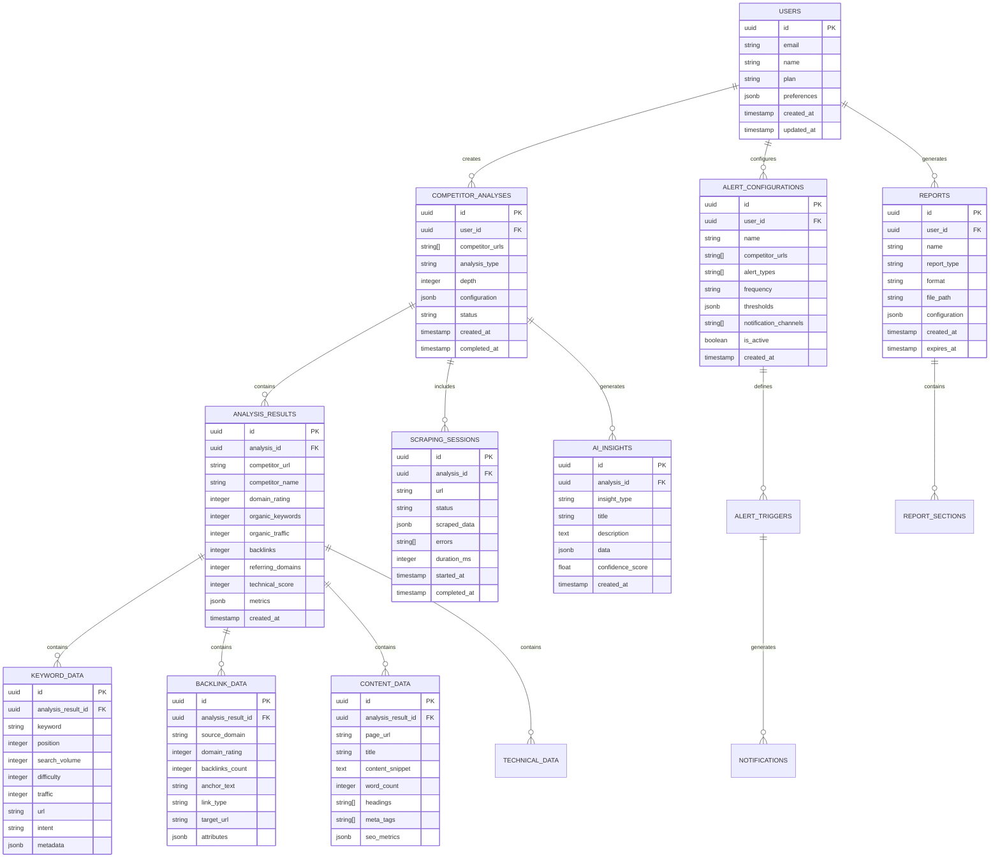

# Arquitectura Técnica: Analizador de Competencia SEO Mejorado

## 1. Architecture Design


## 2. Technology Description

- **Frontend**: Next.js@14 + React@18 + TypeScript + Tailwind CSS + Shadcn/ui + Chart.js + Socket.io-client
- **Backend**: Express.js@4 + TypeScript + Socket.io + Bull Queue + Node-cron
- **Database**: Supabase (PostgreSQL) + Redis for caching and sessions
- **Scraping**: Puppeteer + Playwright + Cheerio + User-Agent rotation
- **AI**: OpenAI GPT-4 + Claude-3 for content analysis and insights
- **File Storage**: Supabase Storage for reports and assets
- **Authentication**: Supabase Auth with JWT tokens
- **Monitoring**: Winston logging + Error tracking

## 3. Route Definitions

| Route | Purpose |
|-------|---------|
| /competitor-analysis | Dashboard principal con métricas y alertas |
| /competitor-analysis/analyze | Configuración y ejecución de análisis avanzado |
| /competitor-analysis/compare | Comparación interactiva entre competidores |
| /competitor-analysis/monitoring | Configuración de monitoreo y alertas |
| /competitor-analysis/keywords | Análisis detallado de keywords compartidas/únicas |
| /competitor-analysis/backlinks | Análisis profundo de perfiles de backlinks |
| /competitor-analysis/content | Análisis de gaps de contenido con IA |
| /competitor-analysis/reports | Generación y gestión de reportes avanzados |
| /competitor-analysis/history | Historial de análisis y tendencias temporales |
| /competitor-analysis/results/[id] | Resultados detallados de análisis específico |
| /competitor-analysis/alerts | Gestión de alertas y notificaciones |

## 4. API Definitions

### 4.1 Core API

**Análisis avanzado de competidores**
```
POST /api/competitor-analysis/advanced-analyze
```

Request:
| Param Name | Param Type | isRequired | Description |
|------------|------------|------------|-------------|
| competitors | string[] | true | URLs de competidores a analizar |
| analysisType | string | true | Tipo: 'full', 'keywords', 'backlinks', 'content', 'technical' |
| depth | number | true | Profundidad del análisis (1-5) |
| includeAI | boolean | false | Incluir análisis con IA |
| includeHistorical | boolean | false | Incluir datos históricos |
| keywordLimit | number | false | Límite de keywords a analizar |
| regions | string[] | false | Regiones para análisis geográfico |
| enableMonitoring | boolean | false | Activar monitoreo continuo |

Response:
| Param Name | Param Type | Description |
|------------|------------|-------------|
| analysisId | string | ID único del análisis |
| status | string | Estado del análisis |
| estimatedTime | number | Tiempo estimado en minutos |
| queuePosition | number | Posición en cola de procesamiento |

**Scraping en tiempo real**
```
POST /api/competitor-analysis/scrape-realtime
```

Request:
| Param Name | Param Type | isRequired | Description |
|------------|------------|------------|-------------|
| url | string | true | URL del competidor |
| dataTypes | string[] | true | Tipos de datos: 'seo', 'content', 'technical', 'social' |
| useProxy | boolean | false | Usar proxy para scraping |
| waitTime | number | false | Tiempo de espera en segundos |

Response:
| Param Name | Param Type | Description |
|------------|------------|-------------|
| scrapingId | string | ID de la sesión de scraping |
| data | object | Datos extraídos en tiempo real |
| metrics | object | Métricas de rendimiento del sitio |
| errors | string[] | Errores encontrados durante el scraping |

**Análisis de contenido con IA**
```
POST /api/competitor-analysis/ai-content-analysis
```

Request:
| Param Name | Param Type | isRequired | Description |
|------------|------------|------------|-------------|
| content | string | true | Contenido a analizar |
| competitorUrl | string | true | URL del competidor |
| analysisType | string | true | Tipo: 'gaps', 'optimization', 'strategy', 'intent' |
| targetKeywords | string[] | false | Keywords objetivo para análisis |

Response:
| Param Name | Param Type | Description |
|------------|------------|-------------|
| insights | object[] | Insights generados por IA |
| contentGaps | object[] | Gaps de contenido identificados |
| optimizationSuggestions | object[] | Sugerencias de optimización |
| competitiveAdvantages | string[] | Ventajas competitivas detectadas |

**Configuración de alertas**
```
POST /api/competitor-analysis/alerts/configure
```

Request:
| Param Name | Param Type | isRequired | Description |
|------------|------------|------------|-------------|
| competitorUrls | string[] | true | URLs a monitorear |
| alertTypes | string[] | true | Tipos: 'ranking_changes', 'new_keywords', 'backlink_changes', 'content_updates' |
| frequency | string | true | Frecuencia: 'daily', 'weekly', 'monthly' |
| thresholds | object | true | Umbrales para disparar alertas |
| notificationChannels | string[] | true | Canales: 'email', 'webhook', 'dashboard' |

Response:
| Param Name | Param Type | Description |
|------------|------------|-------------|
| alertConfigId | string | ID de configuración de alerta |
| status | string | Estado de la configuración |
| nextCheck | string | Fecha/hora del próximo chequeo |

**Generación de reportes avanzados**
```
POST /api/competitor-analysis/reports/generate-advanced
```

Request:
| Param Name | Param Type | isRequired | Description |
|------------|------------|------------|-------------|
| analysisIds | string[] | true | IDs de análisis a incluir |
| reportType | string | true | Tipo: 'executive', 'detailed', 'comparison', 'trends' |
| format | string | true | Formato: 'pdf', 'excel', 'powerpoint' |
| includeCharts | boolean | false | Incluir gráficos |
| customSections | object[] | false | Secciones personalizadas |
| branding | object | false | Configuración de marca |

Response:
| Param Name | Param Type | Description |
|------------|------------|-------------|
| reportId | string | ID del reporte generado |
| downloadUrl | string | URL de descarga |
| expiresAt | string | Fecha de expiración del enlace |

## 5. Server Architecture Diagram


## 6. Data Model

### 6.1 Data Model Definition



### 6.2 Data Definition Language

**Tabla de análisis de competidores (competitor_analyses)**
```sql
-- Crear tabla principal de análisis
CREATE TABLE competitor_analyses (
    id UUID PRIMARY KEY DEFAULT gen_random_uuid(),
    user_id UUID REFERENCES auth.users(id) ON DELETE CASCADE,
    competitor_urls TEXT[] NOT NULL,
    analysis_type VARCHAR(50) NOT NULL CHECK (analysis_type IN ('full', 'keywords', 'backlinks', 'content', 'technical')),
    depth INTEGER NOT NULL CHECK (depth BETWEEN 1 AND 5),
    configuration JSONB DEFAULT '{}',
    status VARCHAR(20) DEFAULT 'pending' CHECK (status IN ('pending', 'processing', 'completed', 'failed')),
    created_at TIMESTAMP WITH TIME ZONE DEFAULT NOW(),
    completed_at TIMESTAMP WITH TIME ZONE,
    updated_at TIMESTAMP WITH TIME ZONE DEFAULT NOW()
);

-- Crear tabla de resultados de análisis
CREATE TABLE analysis_results (
    id UUID PRIMARY KEY DEFAULT gen_random_uuid(),
    analysis_id UUID REFERENCES competitor_analyses(id) ON DELETE CASCADE,
    competitor_url TEXT NOT NULL,
    competitor_name VARCHAR(255),
    domain_rating INTEGER CHECK (domain_rating BETWEEN 0 AND 100),
    organic_keywords INTEGER DEFAULT 0,
    organic_traffic INTEGER DEFAULT 0,
    backlinks INTEGER DEFAULT 0,
    referring_domains INTEGER DEFAULT 0,
    technical_score INTEGER CHECK (technical_score BETWEEN 0 AND 100),
    metrics JSONB DEFAULT '{}',
    created_at TIMESTAMP WITH TIME ZONE DEFAULT NOW()
);

-- Crear tabla de datos de keywords
CREATE TABLE keyword_data (
    id UUID PRIMARY KEY DEFAULT gen_random_uuid(),
    analysis_result_id UUID REFERENCES analysis_results(id) ON DELETE CASCADE,
    keyword TEXT NOT NULL,
    position INTEGER CHECK (position > 0),
    search_volume INTEGER DEFAULT 0,
    difficulty INTEGER CHECK (difficulty BETWEEN 0 AND 100),
    traffic INTEGER DEFAULT 0,
    url TEXT,
    intent VARCHAR(50) CHECK (intent IN ('informational', 'navigational', 'transactional', 'commercial')),
    metadata JSONB DEFAULT '{}'
);

-- Crear tabla de datos de backlinks
CREATE TABLE backlink_data (
    id UUID PRIMARY KEY DEFAULT gen_random_uuid(),
    analysis_result_id UUID REFERENCES analysis_results(id) ON DELETE CASCADE,
    source_domain TEXT NOT NULL,
    domain_rating INTEGER CHECK (domain_rating BETWEEN 0 AND 100),
    backlinks_count INTEGER DEFAULT 1,
    anchor_text TEXT,
    link_type VARCHAR(20) CHECK (link_type IN ('dofollow', 'nofollow')),
    target_url TEXT,
    attributes JSONB DEFAULT '{}'
);

-- Crear tabla de insights de IA
CREATE TABLE ai_insights (
    id UUID PRIMARY KEY DEFAULT gen_random_uuid(),
    analysis_id UUID REFERENCES competitor_analyses(id) ON DELETE CASCADE,
    insight_type VARCHAR(50) NOT NULL,
    title VARCHAR(255) NOT NULL,
    description TEXT,
    data JSONB DEFAULT '{}',
    confidence_score DECIMAL(3,2) CHECK (confidence_score BETWEEN 0 AND 1),
    created_at TIMESTAMP WITH TIME ZONE DEFAULT NOW()
);

-- Crear tabla de configuraciones de alertas
CREATE TABLE alert_configurations (
    id UUID PRIMARY KEY DEFAULT gen_random_uuid(),
    user_id UUID REFERENCES auth.users(id) ON DELETE CASCADE,
    name VARCHAR(255) NOT NULL,
    competitor_urls TEXT[] NOT NULL,
    alert_types TEXT[] NOT NULL,
    frequency VARCHAR(20) CHECK (frequency IN ('daily', 'weekly', 'monthly')),
    thresholds JSONB DEFAULT '{}',
    notification_channels TEXT[] DEFAULT ARRAY['email'],
    is_active BOOLEAN DEFAULT true,
    created_at TIMESTAMP WITH TIME ZONE DEFAULT NOW(),
    updated_at TIMESTAMP WITH TIME ZONE DEFAULT NOW()
);

-- Crear tabla de sesiones de scraping
CREATE TABLE scraping_sessions (
    id UUID PRIMARY KEY DEFAULT gen_random_uuid(),
    analysis_id UUID REFERENCES competitor_analyses(id) ON DELETE CASCADE,
    url TEXT NOT NULL,
    status VARCHAR(20) DEFAULT 'pending' CHECK (status IN ('pending', 'processing', 'completed', 'failed')),
    scraped_data JSONB DEFAULT '{}',
    errors TEXT[],
    duration_ms INTEGER,
    started_at TIMESTAMP WITH TIME ZONE DEFAULT NOW(),
    completed_at TIMESTAMP WITH TIME ZONE
);

-- Crear índices para optimización
CREATE INDEX idx_competitor_analyses_user_id ON competitor_analyses(user_id);
CREATE INDEX idx_competitor_analyses_status ON competitor_analyses(status);
CREATE INDEX idx_competitor_analyses_created_at ON competitor_analyses(created_at DESC);

CREATE INDEX idx_analysis_results_analysis_id ON analysis_results(analysis_id);
CREATE INDEX idx_analysis_results_competitor_url ON analysis_results(competitor_url);

CREATE INDEX idx_keyword_data_analysis_result_id ON keyword_data(analysis_result_id);
CREATE INDEX idx_keyword_data_keyword ON keyword_data(keyword);
CREATE INDEX idx_keyword_data_position ON keyword_data(position);

CREATE INDEX idx_backlink_data_analysis_result_id ON backlink_data(analysis_result_id);
CREATE INDEX idx_backlink_data_source_domain ON backlink_data(source_domain);

CREATE INDEX idx_ai_insights_analysis_id ON ai_insights(analysis_id);
CREATE INDEX idx_ai_insights_insight_type ON ai_insights(insight_type);

CREATE INDEX idx_alert_configurations_user_id ON alert_configurations(user_id);
CREATE INDEX idx_alert_configurations_is_active ON alert_configurations(is_active);

-- Configurar RLS (Row Level Security)
ALTER TABLE competitor_analyses ENABLE ROW LEVEL SECURITY;
ALTER TABLE analysis_results ENABLE ROW LEVEL SECURITY;
ALTER TABLE keyword_data ENABLE ROW LEVEL SECURITY;
ALTER TABLE backlink_data ENABLE ROW LEVEL SECURITY;
ALTER TABLE ai_insights ENABLE ROW LEVEL SECURITY;
ALTER TABLE alert_configurations ENABLE ROW LEVEL SECURITY;
ALTER TABLE scraping_sessions ENABLE ROW LEVEL SECURITY;

-- Políticas de seguridad
CREATE POLICY "Users can view their own analyses" ON competitor_analyses
    FOR SELECT USING (auth.uid() = user_id);

CREATE POLICY "Users can create their own analyses" ON competitor_analyses
    FOR INSERT WITH CHECK (auth.uid() = user_id);

CREATE POLICY "Users can update their own analyses" ON competitor_analyses
    FOR UPDATE USING (auth.uid() = user_id);

-- Permisos para roles
GRANT SELECT ON competitor_analyses TO anon;
GRANT ALL PRIVILEGES ON competitor_analyses TO authenticated;
GRANT ALL PRIVILEGES ON analysis_results TO authenticated;
GRANT ALL PRIVILEGES ON keyword_data TO authenticated;
GRANT ALL PRIVILEGES ON backlink_data TO authenticated;
GRANT ALL PRIVILEGES ON ai_insights TO authenticated;
GRANT ALL PRIVILEGES ON alert_configurations TO authenticated;
GRANT ALL PRIVILEGES ON scraping_sessions TO authenticated;

-- Datos iniciales de ejemplo
INSERT INTO competitor_analyses (user_id, competitor_urls, analysis_type, depth, status)
VALUES 
    ('00000000-0000-0000-0000-000000000000', ARRAY['https://competitor1.com', 'https://competitor2.com'], 'full', 3, 'completed'),
    ('00000000-0000-0000-0000-000000000000', ARRAY['https://competitor3.com'], 'keywords', 2, 'completed');
```