# PRD: Analizador de Competencia SEO Mejorado

## 1. Product Overview

Mejora integral del Analizador de Competencia SEO existente, transformándolo en una herramienta avanzada de inteligencia competitiva que combina scraping real, análisis con IA y monitoreo automatizado para proporcionar insights accionables sobre la estrategia SEO de competidores.

- **Problema a resolver**: Los usuarios necesitan análisis competitivos más profundos y precisos que los datos simulados actuales, con capacidades de monitoreo continuo y alertas automáticas.
- **Usuarios objetivo**: Especialistas SEO, agencias de marketing digital, empresas que buscan ventaja competitiva en búsquedas orgánicas.
- **Valor del mercado**: Posicionamiento como herramienta premium de inteligencia competitiva SEO con capacidades de análisis en tiempo real.

## 2. Core Features

### 2.1 User Roles

| Role | Registration Method | Core Permissions |
|------|---------------------|------------------|
| Free User | Email registration | 2 competidores, 100 keywords, reportes básicos |
| Pro User | Suscripción mensual | 10 competidores, 5,000 keywords, alertas, reportes avanzados |
| Enterprise User | Contrato anual | Ilimitado, API access, análisis en tiempo real, soporte prioritario |

### 2.2 Feature Module

Nuestro Analizador de Competencia SEO mejorado consiste en las siguientes páginas principales:

1. **Dashboard Principal**: métricas generales, comparaciones rápidas, alertas recientes, tendencias.
2. **Análisis Avanzado**: configuración de análisis profundo, scraping en tiempo real, detección automática de competidores.
3. **Comparación Interactiva**: visualizaciones lado a lado, gráficos dinámicos, filtros avanzados.
4. **Monitoreo y Alertas**: configuración de alertas automáticas, notificaciones de cambios, tracking continuo.
5. **Análisis de Keywords**: keywords compartidas/únicas, gaps de oportunidades, análisis de intención.
6. **Análisis de Backlinks**: perfil de enlaces profundo, oportunidades de link building, análisis de autoridad.
7. **Análisis de Contenido**: gaps de contenido con IA, análisis de estructura, optimización sugerida.
8. **Reportes Avanzados**: generación PDF/Excel, reportes automatizados, dashboards personalizados.
9. **Historial y Tendencias**: análisis temporal, comparaciones históricas, predicciones de tendencias.

### 2.3 Page Details

| Page Name | Module Name | Feature description |
|-----------|-------------|---------------------|
| Dashboard Principal | Métricas Overview | Mostrar KPIs principales, comparaciones rápidas entre competidores, alertas recientes, gráficos de tendencias |
| Dashboard Principal | Alertas Recientes | Listar cambios detectados en competidores, notificaciones de nuevas oportunidades, resumen de actividad |
| Análisis Avanzado | Configuración de Análisis | Seleccionar competidores, configurar profundidad de análisis, opciones de scraping, detección automática |
| Análisis Avanzado | Scraping en Tiempo Real | Extraer datos SEO reales con Puppeteer, análizar contenido con IA, validar métricas técnicas |
| Análisis Avanzado | Detección Automática | Identificar competidores automáticamente, sugerir nuevos competidores, análisis de mercado |
| Comparación Interactiva | Visualizaciones Dinámicas | Gráficos comparativos interactivos, filtros por métricas, comparaciones lado a lado |
| Comparación Interactiva | Filtros Avanzados | Filtrar por keywords, backlinks, contenido, métricas técnicas, períodos de tiempo |
| Monitoreo y Alertas | Configuración de Alertas | Definir triggers de alertas, frecuencia de monitoreo, canales de notificación |
| Monitoreo y Alertas | Tracking Continuo | Monitorear cambios automáticamente, detectar nuevas keywords, cambios en rankings |
| Análisis de Keywords | Keywords Compartidas/Únicas | Identificar overlaps de keywords, encontrar gaps únicos, análisis de competitividad |
| Análisis de Keywords | Análisis de Intención | Clasificar keywords por intención, oportunidades de contenido, análisis semántico con IA |
| Análisis de Backlinks | Perfil de Enlaces Profundo | Analizar calidad de backlinks, detectar patrones de link building, métricas de autoridad |
| Análisis de Backlinks | Oportunidades de Link Building | Identificar sitios para outreach, analizar gaps de enlaces, estrategias de competidores |
| Análisis de Contenido | Gaps de Contenido con IA | Detectar oportunidades de contenido usando IA, analizar estructura de contenido, sugerencias de optimización |
| Análisis de Contenido | Análisis de Estructura | Evaluar arquitectura de sitio, análisis de URLs, optimización técnica |
| Reportes Avanzados | Generación PDF/Excel | Crear reportes personalizados, exportar datos, programar reportes automáticos |
| Reportes Avanzados | Dashboards Personalizados | Crear vistas personalizadas, métricas específicas, compartir con equipo |
| Historial y Tendencias | Análisis Temporal | Mostrar evolución de métricas, comparar períodos, identificar tendencias |
| Historial y Tendencias | Predicciones | Usar IA para predecir tendencias, sugerir estrategias futuras, análisis predictivo |

## 3. Core Process

### Flujo de Usuario Free:
1. Usuario accede al Dashboard Principal
2. Configura análisis básico (máximo 2 competidores)
3. Ejecuta análisis con datos limitados
4. Visualiza comparaciones básicas
5. Genera reporte simple
6. Ve sugerencia de upgrade para funciones avanzadas

### Flujo de Usuario Pro:
1. Usuario accede al Dashboard con métricas avanzadas
2. Configura análisis profundo con múltiples competidores
3. Activa monitoreo automático y alertas
4. Analiza keywords y backlinks en detalle
5. Genera reportes avanzados y los programa
6. Recibe alertas automáticas de cambios

### Flujo de Usuario Enterprise:
1. Usuario accede a dashboard completo con API
2. Configura análisis en tiempo real ilimitado
3. Usa integraciones avanzadas (GSC, APIs externas)
4. Accede a análisis predictivo con IA
5. Genera reportes automatizados personalizados
6. Recibe soporte prioritario y consultoría

```mermaid
graph TD
    A[Dashboard Principal] --> B[Análisis Avanzado]
    A --> C[Comparación Interactiva]
    A --> D[Monitoreo y Alertas]
    
    B --> E[Configuración]
    B --> F[Scraping Real]
    B --> G[Detección Automática]
    
    C --> H[Visualizaciones]
    C --> I[Filtros Avanzados]
    
    D --> J[Config Alertas]
    D --> K[Tracking Continuo]
    
    A --> L[Análisis Keywords]
    A --> M[Análisis Backlinks]
    A --> N[Análisis Contenido]
    
    L --> O[Keywords Compartidas]
    L --> P[Análisis Intención]
    
    M --> Q[Perfil Enlaces]
    M --> R[Oportunidades Link Building]
    
    N --> S[Gaps Contenido IA]
    N --> T[Análisis Estructura]
    
    A --> U[Reportes Avanzados]
    A --> V[Historial y Tendencias]
    
    U --> W[Generación PDF/Excel]
    U --> X[Dashboards Personalizados]
    
    V --> Y[Análisis Temporal]
    V --> Z[Predicciones IA]
```

## 4. User Interface Design

### 4.1 Design Style

- **Colores primarios**: Azul profesional (#2563eb), Verde éxito (#16a34a), Rojo alerta (#dc2626)
- **Colores secundarios**: Gris neutro (#64748b), Azul claro (#e0f2fe), Amarillo warning (#f59e0b)
- **Estilo de botones**: Redondeados modernos con sombras sutiles, estados hover animados
- **Tipografía**: Inter para UI (14px-16px), Roboto Mono para datos (12px-14px)
- **Layout**: Dashboard tipo grid responsivo, navegación lateral colapsible, cards con elevación
- **Iconos**: Lucide React con estilo outline, colores temáticos por sección

### 4.2 Page Design Overview

| Page Name | Module Name | UI Elements |
|-----------|-------------|-------------|
| Dashboard Principal | Métricas Overview | Cards con KPIs, gráficos de línea/barras, colores por estado (verde/rojo), animaciones de carga |
| Dashboard Principal | Alertas Recientes | Lista con badges de prioridad, timestamps relativos, iconos de tipo de alerta, botones de acción |
| Análisis Avanzado | Configuración | Formulario multi-step, toggles para opciones, progress bar, validación en tiempo real |
| Análisis Avanzado | Scraping Real | Indicadores de progreso animados, logs en tiempo real, métricas de velocidad, botones de pausa/reanudar |
| Comparación Interactiva | Visualizaciones | Gráficos interactivos (Chart.js/Recharts), tooltips informativos, zoom/pan, exportar imagen |
| Comparación Interactiva | Filtros Avanzados | Sidebar con filtros colapsibles, chips de filtros activos, búsqueda instantánea, reset rápido |
| Monitoreo y Alertas | Configuración | Toggle switches, sliders para frecuencia, dropdowns para canales, preview de alertas |
| Análisis de Keywords | Keywords Compartidas | Tablas con sorting/filtering, badges de dificultad, gráficos de volumen, export CSV |
| Análisis de Backlinks | Perfil Enlaces | Network graphs interactivos, métricas de autoridad con colores, tablas expandibles |
| Análisis de Contenido | Gaps IA | Cards de oportunidades con scores, sugerencias expandibles, botones de acción, tags de categoría |
| Reportes Avanzados | Generación | Builder drag-and-drop, preview en tiempo real, templates predefinidos, scheduling calendar |
| Historial y Tendencias | Análisis Temporal | Gráficos de series temporales, controles de rango de fechas, comparaciones overlay, anotaciones |

### 4.3 Responsiveness

- **Desktop-first** con adaptación completa a mobile y tablet
- **Navegación lateral** que se convierte en bottom navigation en mobile
- **Gráficos responsivos** que se adaptan al tamaño de pantalla
- **Tablas** con scroll horizontal y vista de cards en mobile
- **Touch optimization** para interacciones táctiles en gráficos y filtros
- **Progressive disclosure** para mostrar información gradualmente en pantallas pequeñas