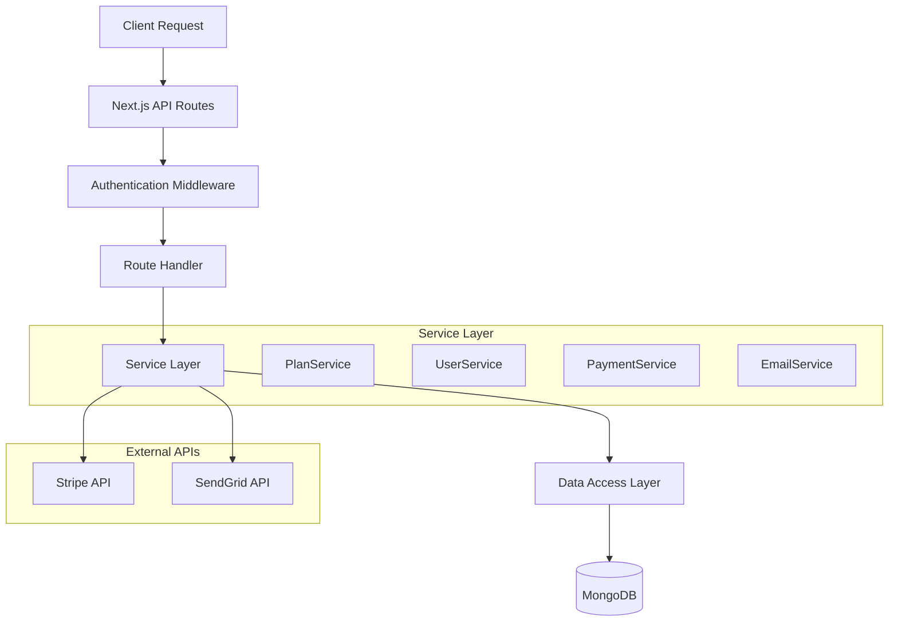
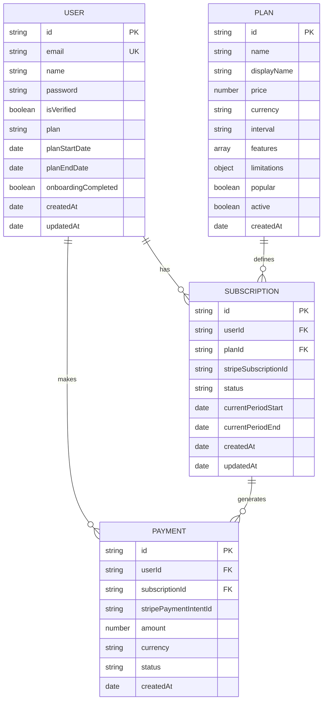

# Arquitectura Técnica - Sistema de Selección de Planes

## 1. Arquitectura General

```mermaid
graph TD
    A[Usuario Browser] --> B[React Frontend Application]
    B --> C[Next.js API Routes]
    C --> D[Express Backend API]
    D --> E[MongoDB Database]
    D --> F[Stripe Payment Service]
    
    subgraph "Frontend Layer"
        B
        G[Plan Selection Components]
        H[Payment Components]
        I[Dashboard Components]
    end
    
    subgraph "API Layer"
        C
        J[/api/plans]
        K[/api/user/select-plan]
        L[/api/payments/process]
    end
    
    subgraph "Backend Layer"
        D
        M[Plan Service]
        N[User Service]
        O[Payment Service]
    end
    
    subgraph "Data Layer"
        E
        P[Users Collection]
        Q[Plans Collection]
        R[Subscriptions Collection]
    end
    
    subgraph "External Services"
        F
        S[Email Service]
        T[Analytics Service]
    end
```

## 2. Stack Tecnológico

- **Frontend**: React@18 + Next.js@14 + TypeScript + Tailwind CSS
- **Backend**: Express@4 + TypeScript + MongoDB
- **Database**: MongoDB con Mongoose ODM
- **Payments**: Stripe API
- **Authentication**: JWT + HTTP-only cookies
- **State Management**: React Context + useState/useEffect
- **UI Components**: Shadcn/ui + Lucide React icons

## 3. Definición de Rutas Frontend

| Ruta | Propósito |
|------|-----------|
| /seleccionar-plan | Página principal para selección de planes disponibles |
| /confirmar-plan | Confirmación de selección y procesamiento de pago |
| /procesando-plan | Estado de carga durante activación del plan |
| /bienvenida | Página de bienvenida personalizada post-activación |
| /dashboard | Dashboard principal adaptado según el plan del usuario |

## 4. Definiciones de API

### 4.1 API de Planes

**Obtener planes disponibles**
```
GET /api/plans
```

Request: No requiere parámetros

Response:
| Parámetro | Tipo | Descripción |
|-----------|------|-------------|
| success | boolean | Estado de la operación |
| plans | Plan[] | Lista de planes disponibles |
| userCurrentPlan | string | Plan actual del usuario autenticado |

Ejemplo:
```json
{
  "success": true,
  "plans": [
    {
      "id": "free",
      "name": "Gratuito",
      "price": 0,
      "features": ["5 análisis/mes", "Soporte básico"],
      "popular": false
    },
    {
      "id": "premium",
      "name": "Premium",
      "price": 29.99,
      "features": ["Análisis ilimitados", "Soporte prioritario"],
      "popular": true
    }
  ],
  "userCurrentPlan": "free"
}
```

### 4.2 API de Selección de Plan

**Seleccionar plan de usuario**
```
POST /api/user/select-plan
```

Request:
| Parámetro | Tipo | Requerido | Descripción |
|-----------|------|-----------|-------------|
| planId | string | true | ID del plan seleccionado |
| paymentMethodId | string | false | ID del método de pago (Stripe) |

Response:
| Parámetro | Tipo | Descripción |
|-----------|------|-------------|
| success | boolean | Estado de la operación |
| requiresPayment | boolean | Si requiere procesamiento de pago |
| clientSecret | string | Secret para confirmar pago (Stripe) |
| user | User | Datos actualizados del usuario |

Ejemplo:
```json
{
  "success": true,
  "requiresPayment": true,
  "clientSecret": "pi_1234567890_secret_abcdef",
  "user": {
    "id": "user123",
    "email": "user@example.com",
    "plan": "premium",
    "planStartDate": "2024-01-15T10:00:00Z"
  }
}
```

### 4.3 API de Procesamiento de Pagos

**Confirmar pago y activar plan**
```
POST /api/payments/confirm
```

Request:
| Parámetro | Tipo | Requerido | Descripción |
|-----------|------|-----------|-------------|
| paymentIntentId | string | true | ID del Payment Intent de Stripe |
| planId | string | true | ID del plan a activar |

Response:
| Parámetro | Tipo | Descripción |
|-----------|------|-------------|
| success | boolean | Estado de la operación |
| message | string | Mensaje descriptivo |
| user | User | Datos actualizados del usuario |
| redirectUrl | string | URL de redirección |

## 5. Arquitectura del Servidor



## 6. Modelo de Datos

### 6.1 Diagrama de Entidades



### 6.2 Definiciones DDL

**Colección Users (Extendida)**
```javascript
// Actualizar esquema de usuario existente
const userSchema = new mongoose.Schema({
  email: { type: String, required: true, unique: true },
  password: { type: String, required: true },
  name: { type: String, trim: true },
  isVerified: { type: Boolean, default: false },
  
  // Nuevos campos para planes
  plan: { 
    type: String, 
    enum: ['free', 'premium', 'trial'], 
    default: 'free' 
  },
  planStartDate: { type: Date },
  planEndDate: { type: Date },
  planFeatures: [{ type: String }],
  onboardingCompleted: { type: Boolean, default: false },
  
  // Campos existentes
  verificationToken: { type: String },
  resetPasswordToken: { type: String },
  resetPasswordExpires: { type: Date }
}, { 
  timestamps: true 
});

// Índices
userSchema.index({ email: 1 });
userSchema.index({ plan: 1 });
userSchema.index({ planEndDate: 1 });
```

**Colección Plans**
```javascript
const planSchema = new mongoose.Schema({
  _id: { type: String, required: true }, // 'free', 'premium', etc.
  name: { type: String, required: true },
  displayName: { type: String, required: true },
  description: { type: String },
  price: { type: Number, required: true },
  currency: { type: String, default: 'USD' },
  interval: { 
    type: String, 
    enum: ['monthly', 'yearly', 'one-time'], 
    default: 'monthly' 
  },
  features: [{ type: String }],
  limitations: {
    maxAnalyses: { type: Number, default: -1 }, // -1 = unlimited
    maxProjects: { type: Number, default: -1 },
    supportLevel: { 
      type: String, 
      enum: ['basic', 'priority', 'premium'],
      default: 'basic'
    }
  },
  popular: { type: Boolean, default: false },
  active: { type: Boolean, default: true },
  stripeProductId: { type: String },
  stripePriceId: { type: String }
}, { 
  timestamps: true 
});

// Datos iniciales
const initialPlans = [
  {
    _id: 'free',
    name: 'free',
    displayName: 'Plan Gratuito',
    description: 'Perfecto para comenzar',
    price: 0,
    features: [
      '5 análisis SEO por mes',
      'Herramientas básicas',
      'Soporte por email'
    ],
    limitations: {
      maxAnalyses: 5,
      maxProjects: 1,
      supportLevel: 'basic'
    },
    popular: false
  },
  {
    _id: 'premium',
    name: 'premium',
    displayName: 'Plan Premium',
    description: 'Para profesionales del SEO',
    price: 29.99,
    features: [
      'Análisis SEO ilimitados',
      'Todas las herramientas',
      'Soporte prioritario',
      'Reportes avanzados',
      'API access'
    ],
    limitations: {
      maxAnalyses: -1,
      maxProjects: -1,
      supportLevel: 'premium'
    },
    popular: true
  }
];
```

**Colección Subscriptions**
```javascript
const subscriptionSchema = new mongoose.Schema({
  userId: { 
    type: mongoose.Schema.Types.ObjectId, 
    ref: 'User', 
    required: true 
  },
  planId: { type: String, required: true },
  stripeSubscriptionId: { type: String },
  stripeCustomerId: { type: String },
  status: {
    type: String,
    enum: ['active', 'canceled', 'past_due', 'unpaid', 'trialing'],
    default: 'active'
  },
  currentPeriodStart: { type: Date },
  currentPeriodEnd: { type: Date },
  cancelAtPeriodEnd: { type: Boolean, default: false },
  metadata: { type: Map, of: String }
}, { 
  timestamps: true 
});

// Índices
subscriptionSchema.index({ userId: 1 });
subscriptionSchema.index({ stripeSubscriptionId: 1 });
subscriptionSchema.index({ status: 1 });
subscriptionSchema.index({ currentPeriodEnd: 1 });
```

## 7. Configuración de Stripe

### 7.1 Productos y Precios
```javascript
// Configuración de productos en Stripe
const stripeProducts = [
  {
    id: 'prod_premium',
    name: 'YA Tools Premium',
    description: 'Plan premium con acceso completo',
    prices: [
      {
        id: 'price_premium_monthly',
        unit_amount: 2999, // $29.99
        currency: 'usd',
        recurring: { interval: 'month' }
      }
    ]
  }
];
```

### 7.2 Webhooks
```javascript
// Endpoints de webhook requeridos
const webhookEndpoints = [
  'customer.subscription.created',
  'customer.subscription.updated',
  'customer.subscription.deleted',
  'invoice.payment_succeeded',
  'invoice.payment_failed'
];
```

## 8. Variables de Entorno

```bash
# Frontend (.env.local)
NEXT_PUBLIC_STRIPE_PUBLISHABLE_KEY=pk_test_...
NEXT_PUBLIC_API_URL=http://localhost:3001

# Backend (.env)
STRIPE_SECRET_KEY=sk_test_...
STRIPE_WEBHOOK_SECRET=whsec_...
MONGODB_URI=mongodb://localhost:27017/yatools
JWT_SECRET=your-jwt-secret
```

## 9. Consideraciones de Deployment

### 9.1 Orden de Despliegue
1. Actualizar esquemas de base de datos
2. Insertar datos iniciales de planes
3. Desplegar backend con nuevas APIs
4. Desplegar frontend con nuevas páginas
5. Configurar webhooks de Stripe

### 9.2 Migraciones Requeridas
```javascript
// Migración para usuarios existentes
db.users.updateMany(
  { plan: { $exists: false } },
  { 
    $set: { 
      plan: 'free',
      planFeatures: [],
      onboardingCompleted: false
    }
  }
);
```