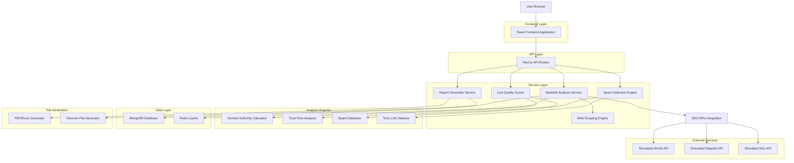
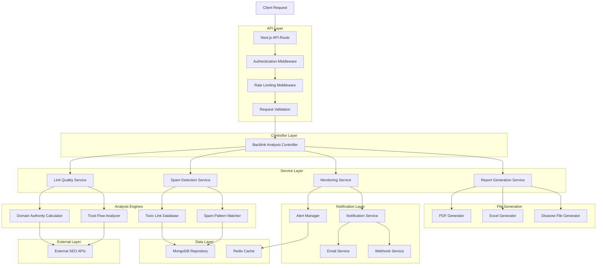
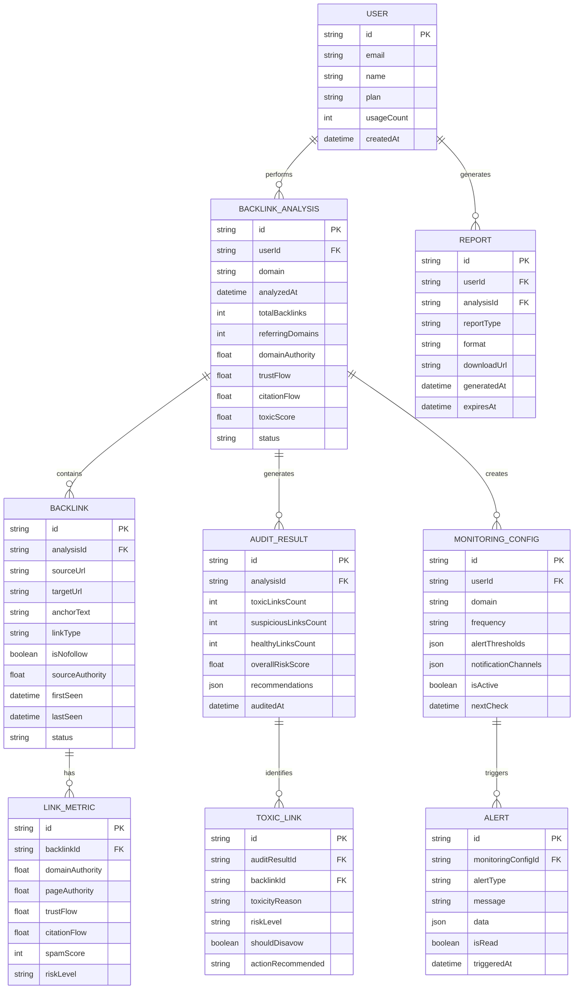

# Backlink Checker Tool - Documentación de Arquitectura Técnica

## 1. Diseño de Arquitectura



## 2. Descripción de Tecnologías

- **Frontend**: React@18 + Next.js@14 + TypeScript + Tailwind CSS + Recharts + React Query
- **Backend**: Next.js API Routes + Node.js
- **Base de Datos**: MongoDB Atlas (datos principales) + Redis (cache y análisis temporales)
- **Servicios Externos**: APIs simuladas de SEO (Ahrefs, Majestic, Moz) + Web Scraping
- **Análisis de Enlaces**: Algoritmos propios de scoring + Base de datos de spam
- **Generación de Archivos**: jsPDF + ExcelJS + Generador de archivos Disavow
- **Autenticación**: NextAuth.js + JWT
- **Monitoreo**: Sistema de alertas + Webhooks + Email notifications

## 3. Definiciones de Rutas

| Ruta | Propósito |
|------|-----------|
| /backlink-checker | Dashboard principal con resumen de métricas de backlinks |
| /backlink-checker/analyze | Formulario de análisis de dominio y configuración |
| /backlink-checker/results/[domain] | Resultados detallados del análisis de backlinks |
| /backlink-checker/audit | Auditoría de backlinks tóxicos y spam |
| /backlink-checker/opportunities | Identificación de oportunidades de link building |
| /backlink-checker/monitoring | Monitoreo de nuevos backlinks y enlaces perdidos |
| /backlink-checker/reports | Generador y historial de reportes |
| /backlink-checker/alerts | Configuración de alertas y notificaciones |
| /backlink-checker/disavow | Generador de archivos de desautorización |

## 4. Definiciones de API

### 4.1 APIs Principales

**Análisis de Backlinks**
```
POST /api/backlink-checker/analyze
```

Request:
| Nombre Parámetro | Tipo Parámetro | Requerido | Descripción |
|------------------|----------------|-----------|-------------|
| domain | string | true | Dominio a analizar (sin protocolo) |
| includeSubdomains | boolean | false | Incluir subdominios en el análisis |
| maxBacklinks | number | false | Límite de backlinks a analizar (default: 10000) |
| includeNofollow | boolean | false | Incluir enlaces nofollow (default: true) |
| freshness | string | false | Frescura de datos: 'live', 'recent', 'historical' |

Response:
| Nombre Parámetro | Tipo Parámetro | Descripción |
|------------------|----------------|-------------|
| analysisId | string | ID único del análisis |
| domain | string | Dominio analizado |
| totalBacklinks | number | Total de backlinks encontrados |
| referringDomains | number | Número de dominios referentes únicos |
| domainAuthority | number | Autoridad de dominio (0-100) |
| trustFlow | number | Trust Flow score (0-100) |
| citationFlow | number | Citation Flow score (0-100) |
| toxicScore | number | Puntuación de toxicidad (0-100) |
| backlinks | BacklinkData[] | Array de backlinks detallados |

Ejemplo Request:
```json
{
  "domain": "example.com",
  "includeSubdomains": true,
  "maxBacklinks": 5000,
  "includeNofollow": true,
  "freshness": "recent"
}
```

**Auditoría de Backlinks Tóxicos**
```
POST /api/backlink-checker/audit
```

Request:
| Nombre Parámetro | Tipo Parámetro | Requerido | Descripción |
|------------------|----------------|-----------|-------------|
| domain | string | true | Dominio a auditar |
| strictness | string | false | Nivel de strictness: 'low', 'medium', 'high' |
| includeWarnings | boolean | false | Incluir enlaces sospechosos (default: true) |

Response:
| Nombre Parámetro | Tipo Parámetro | Descripción |
|------------------|----------------|-------------|
| auditId | string | ID único de la auditoría |
| toxicLinks | ToxicLinkData[] | Enlaces clasificados como tóxicos |
| suspiciousLinks | SuspiciousLinkData[] | Enlaces sospechosos |
| healthyLinks | HealthyLinkData[] | Enlaces saludables |
| riskDistribution | RiskDistribution | Distribución por niveles de riesgo |
| recommendations | string[] | Recomendaciones de acción |

**Oportunidades de Link Building**
```
POST /api/backlink-checker/opportunities
```

Request:
| Nombre Parámetro | Tipo Parámetro | Requerido | Descripción |
|------------------|----------------|-----------|-------------|
| domain | string | true | Dominio objetivo |
| competitors | string[] | true | Array de dominios competidores |
| minDomainAuthority | number | false | DA mínimo para oportunidades (default: 20) |
| industry | string | false | Industria/nicho para filtrar relevancia |

Response:
| Nombre Parámetro | Tipo Parámetro | Descripción |
|------------------|----------------|-------------|
| opportunities | LinkOpportunity[] | Oportunidades identificadas |
| competitorGaps | CompetitorGap[] | Gaps encontrados vs competidores |
| targetSites | TargetSite[] | Sitios objetivo para outreach |
| estimatedValue | number | Valor estimado de las oportunidades |

**Monitoreo de Backlinks**
```
POST /api/backlink-checker/monitoring/setup
```

Request:
| Nombre Parámetro | Tipo Parámetro | Requerido | Descripción |
|------------------|----------------|-----------|-------------|
| domain | string | true | Dominio a monitorear |
| frequency | string | true | Frecuencia: 'daily', 'weekly', 'monthly' |
| alertThresholds | AlertThresholds | true | Umbrales para alertas |
| notificationChannels | string[] | true | Canales: ['email', 'slack', 'webhook'] |

Response:
| Nombre Parámetro | Tipo Parámetro | Descripción |
|------------------|----------------|-------------|
| monitoringId | string | ID único del monitoreo |
| status | string | Estado del monitoreo |
| nextCheck | string | Fecha del próximo chequeo |

**Generación de Archivo Disavow**
```
POST /api/backlink-checker/disavow/generate
```

Request:
| Nombre Parámetro | Tipo Parámetro | Requerido | Descripción |
|------------------|----------------|-----------|-------------|
| domain | string | true | Dominio objetivo |
| toxicLinks | string[] | true | Array de URLs tóxicas |
| includeDomains | boolean | false | Incluir dominios completos (default: false) |
| addComments | boolean | false | Añadir comentarios explicativos |

Response:
| Nombre Parámetro | Tipo Parámetro | Descripción |
|------------------|----------------|-------------|
| disavowId | string | ID único del archivo |
| downloadUrl | string | URL de descarga del archivo |
| fileContent | string | Contenido del archivo disavow |
| totalEntries | number | Número total de entradas |

**Generación de Reportes**
```
POST /api/backlink-checker/reports/generate
```

Request:
| Nombre Parámetro | Tipo Parámetro | Requerido | Descripción |
|------------------|----------------|-----------|-------------|
| analysisId | string | true | ID del análisis base |
| reportType | string | true | Tipo: 'executive', 'technical', 'audit', 'opportunities' |
| format | string | true | Formato: 'pdf', 'excel', 'csv' |
| includeCharts | boolean | false | Incluir gráficos (default: true) |
| customSections | string[] | false | Secciones personalizadas |

Response:
| Nombre Parámetro | Tipo Parámetro | Descripción |
|------------------|----------------|-------------|
| reportId | string | ID único del reporte |
| downloadUrl | string | URL de descarga |
| expiresAt | string | Fecha de expiración |

## 5. Arquitectura del Servidor



## 6. Modelo de Datos

### 6.1 Definición del Modelo de Datos



### 6.2 Lenguaje de Definición de Datos

**Tabla de Análisis de Backlinks (backlink_analyses)**
```sql
-- Crear tabla
CREATE TABLE backlink_analyses (
    id UUID PRIMARY KEY DEFAULT gen_random_uuid(),
    user_id UUID REFERENCES users(id),
    domain VARCHAR(255) NOT NULL,
    analyzed_at TIMESTAMP WITH TIME ZONE DEFAULT NOW(),
    total_backlinks INTEGER DEFAULT 0,
    referring_domains INTEGER DEFAULT 0,
    domain_authority DECIMAL(5,2) DEFAULT 0,
    trust_flow DECIMAL(5,2) DEFAULT 0,
    citation_flow DECIMAL(5,2) DEFAULT 0,
    toxic_score DECIMAL(5,2) DEFAULT 0,
    status VARCHAR(20) DEFAULT 'pending' CHECK (status IN ('pending', 'processing', 'completed', 'failed')),
    created_at TIMESTAMP WITH TIME ZONE DEFAULT NOW(),
    updated_at TIMESTAMP WITH TIME ZONE DEFAULT NOW()
);

-- Crear índices
CREATE INDEX idx_backlink_analyses_user_id ON backlink_analyses(user_id);
CREATE INDEX idx_backlink_analyses_domain ON backlink_analyses(domain);
CREATE INDEX idx_backlink_analyses_analyzed_at ON backlink_analyses(analyzed_at DESC);
```

**Tabla de Backlinks (backlinks)**
```sql
-- Crear tabla
CREATE TABLE backlinks (
    id UUID PRIMARY KEY DEFAULT gen_random_uuid(),
    analysis_id UUID REFERENCES backlink_analyses(id) ON DELETE CASCADE,
    source_url TEXT NOT NULL,
    target_url TEXT NOT NULL,
    anchor_text TEXT,
    link_type VARCHAR(50) DEFAULT 'text',
    is_nofollow BOOLEAN DEFAULT false,
    source_authority DECIMAL(5,2) DEFAULT 0,
    first_seen TIMESTAMP WITH TIME ZONE DEFAULT NOW(),
    last_seen TIMESTAMP WITH TIME ZONE DEFAULT NOW(),
    status VARCHAR(20) DEFAULT 'active' CHECK (status IN ('active', 'lost', 'broken')),
    created_at TIMESTAMP WITH TIME ZONE DEFAULT NOW()
);

-- Crear índices
CREATE INDEX idx_backlinks_analysis_id ON backlinks(analysis_id);
CREATE INDEX idx_backlinks_source_url ON backlinks(source_url);
CREATE INDEX idx_backlinks_target_url ON backlinks(target_url);
CREATE INDEX idx_backlinks_first_seen ON backlinks(first_seen DESC);
```

**Tabla de Métricas de Enlaces (link_metrics)**
```sql
-- Crear tabla
CREATE TABLE link_metrics (
    id UUID PRIMARY KEY DEFAULT gen_random_uuid(),
    backlink_id UUID REFERENCES backlinks(id) ON DELETE CASCADE,
    domain_authority DECIMAL(5,2) DEFAULT 0,
    page_authority DECIMAL(5,2) DEFAULT 0,
    trust_flow DECIMAL(5,2) DEFAULT 0,
    citation_flow DECIMAL(5,2) DEFAULT 0,
    spam_score INTEGER DEFAULT 0 CHECK (spam_score >= 0 AND spam_score <= 100),
    risk_level VARCHAR(20) DEFAULT 'low' CHECK (risk_level IN ('low', 'medium', 'high', 'toxic')),
    calculated_at TIMESTAMP WITH TIME ZONE DEFAULT NOW()
);

-- Crear índices
CREATE INDEX idx_link_metrics_backlink_id ON link_metrics(backlink_id);
CREATE INDEX idx_link_metrics_risk_level ON link_metrics(risk_level);
CREATE INDEX idx_link_metrics_spam_score ON link_metrics(spam_score DESC);
```

**Tabla de Resultados de Auditoría (audit_results)**
```sql
-- Crear tabla
CREATE TABLE audit_results (
    id UUID PRIMARY KEY DEFAULT gen_random_uuid(),
    analysis_id UUID REFERENCES backlink_analyses(id) ON DELETE CASCADE,
    toxic_links_count INTEGER DEFAULT 0,
    suspicious_links_count INTEGER DEFAULT 0,
    healthy_links_count INTEGER DEFAULT 0,
    overall_risk_score DECIMAL(5,2) DEFAULT 0,
    recommendations JSONB,
    audited_at TIMESTAMP WITH TIME ZONE DEFAULT NOW()
);

-- Crear índices
CREATE INDEX idx_audit_results_analysis_id ON audit_results(analysis_id);
CREATE INDEX idx_audit_results_risk_score ON audit_results(overall_risk_score DESC);
```

**Tabla de Enlaces Tóxicos (toxic_links)**
```sql
-- Crear tabla
CREATE TABLE toxic_links (
    id UUID PRIMARY KEY DEFAULT gen_random_uuid(),
    audit_result_id UUID REFERENCES audit_results(id) ON DELETE CASCADE,
    backlink_id UUID REFERENCES backlinks(id) ON DELETE CASCADE,
    toxicity_reason TEXT NOT NULL,
    risk_level VARCHAR(20) NOT NULL CHECK (risk_level IN ('medium', 'high', 'toxic')),
    should_disavow BOOLEAN DEFAULT false,
    action_recommended VARCHAR(100),
    identified_at TIMESTAMP WITH TIME ZONE DEFAULT NOW()
);

-- Crear índices
CREATE INDEX idx_toxic_links_audit_result_id ON toxic_links(audit_result_id);
CREATE INDEX idx_toxic_links_backlink_id ON toxic_links(backlink_id);
CREATE INDEX idx_toxic_links_risk_level ON toxic_links(risk_level);
```

**Tabla de Configuración de Monitoreo (monitoring_configs)**
```sql
-- Crear tabla
CREATE TABLE monitoring_configs (
    id UUID PRIMARY KEY DEFAULT gen_random_uuid(),
    user_id UUID REFERENCES users(id),
    domain VARCHAR(255) NOT NULL,
    frequency VARCHAR(20) DEFAULT 'weekly' CHECK (frequency IN ('daily', 'weekly', 'monthly')),
    alert_thresholds JSONB,
    notification_channels JSONB,
    is_active BOOLEAN DEFAULT true,
    next_check TIMESTAMP WITH TIME ZONE,
    created_at TIMESTAMP WITH TIME ZONE DEFAULT NOW(),
    updated_at TIMESTAMP WITH TIME ZONE DEFAULT NOW()
);

-- Crear índices
CREATE INDEX idx_monitoring_configs_user_id ON monitoring_configs(user_id);
CREATE INDEX idx_monitoring_configs_domain ON monitoring_configs(domain);
CREATE INDEX idx_monitoring_configs_next_check ON monitoring_configs(next_check);
```

**Datos Iniciales**
```sql
-- Insertar datos de ejemplo para testing
INSERT INTO backlink_analyses (user_id, domain, total_backlinks, referring_domains, domain_authority, trust_flow, citation_flow, toxic_score, status)
VALUES 
  ('user-uuid-1', 'example.com', 1250, 340, 65.5, 45.2, 52.8, 15.3, 'completed'),
  ('user-uuid-1', 'testsite.com', 890, 220, 42.1, 38.7, 41.9, 28.6, 'completed'),
  ('user-uuid-2', 'mywebsite.org', 2100, 580, 78.3, 62.4, 71.2, 8.9, 'completed');

-- Insertar configuraciones de monitoreo de ejemplo
INSERT INTO monitoring_configs (user_id, domain, frequency, alert_thresholds, notification_channels, next_check)
VALUES 
  ('user-uuid-1', 'example.com', 'weekly', '{"newBacklinks": 10, "lostBacklinks": 5, "toxicScore": 25}', '["email", "slack"]', NOW() + INTERVAL '7 days'),
  ('user-uuid-2', 'mywebsite.org', 'daily', '{"newBacklinks": 5, "lostBacklinks": 3, "toxicScore": 20}', '["email"]', NOW() + INTERVAL '1 day');
```