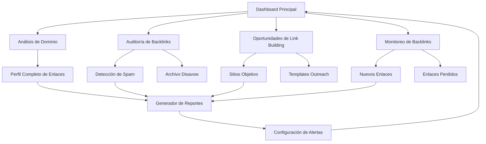

# Backlink Checker Tool - Documento de Requisitos del Producto

## 1. Visión General del Producto

Herramienta avanzada de análisis y auditoría de backlinks que permite a los usuarios analizar, monitorear y optimizar su perfil de enlaces entrantes para mejorar su autoridad de dominio y rankings SEO.

- **Propósito Principal**: Proporcionar análisis completo del perfil de backlinks, detección de enlaces tóxicos y identificación de oportunidades de link building
- **Usuarios Objetivo**: Especialistas SEO, webmasters, agencias digitales y empresas que buscan optimizar su estrategia de link building
- **Valor de Mercado**: Herramienta esencial para mantener un perfil de backlinks saludable que puede incrementar la autoridad de dominio en 20-40%

## 2. Características Principales

### 2.1 Roles de Usuario

| Rol | Método de Registro | Permisos Principales |
|-----|-------------------|---------------------|
| Usuario Básico | Registro por email | Análisis de hasta 1,000 backlinks, 3 dominios por mes |
| Usuario Premium | Upgrade con plan de pago | Análisis de hasta 50,000 backlinks, dominios ilimitados, alertas automáticas |
| Usuario Enterprise | Contacto comercial | Análisis masivo, API access, reportes personalizados, monitoreo 24/7 |

### 2.2 Módulos de Funcionalidad

Nuestra herramienta de análisis de backlinks consta de las siguientes páginas principales:

1. **Dashboard Principal**: Resumen de métricas de backlinks, tendencias y alertas importantes
2. **Análisis de Dominio**: Análisis completo del perfil de backlinks de un dominio específico
3. **Auditoría de Backlinks**: Detección y clasificación de backlinks tóxicos y spam
4. **Oportunidades de Link Building**: Identificación de oportunidades de construcción de enlaces
5. **Monitoreo de Backlinks**: Seguimiento de nuevos backlinks ganados y perdidos
6. **Generador de Reportes**: Creación de reportes personalizados de auditoría
7. **Configuración de Alertas**: Sistema de notificaciones automáticas por cambios

### 2.3 Detalles de Páginas

| Nombre de Página | Nombre del Módulo | Descripción de Funcionalidad |
|------------------|-------------------|------------------------------|
| Dashboard Principal | Resumen de Métricas | Mostrar autoridad de dominio, total de backlinks, dominios referentes, tendencias mensuales |
| Dashboard Principal | Alertas Recientes | Mostrar nuevos backlinks detectados, enlaces perdidos, cambios en métricas importantes |
| Análisis de Dominio | Formulario de Entrada | Ingresar dominio a analizar, configurar parámetros de análisis, seleccionar métricas |
| Análisis de Dominio | Perfil de Backlinks | Mostrar distribución de tipos de enlaces, anchor text, autoridad de páginas referentes |
| Análisis de Dominio | Top Backlinks | Listar los backlinks más valiosos, métricas de calidad, contexto del enlace |
| Auditoría de Backlinks | Detección de Spam | Identificar backlinks tóxicos, enlaces de granjas de enlaces, dominios penalizados |
| Auditoría de Backlinks | Clasificación de Riesgo | Categorizar enlaces por nivel de riesgo, sugerir acciones correctivas |
| Auditoría de Backlinks | Generador de Disavow | Crear archivo de desautorización para Google Search Console |
| Oportunidades de Link Building | Análisis de Competidores | Identificar sitios que enlazan a competidores pero no al usuario |
| Oportunidades de Link Building | Sitios Objetivo | Sugerir sitios relevantes para outreach, métricas de autoridad |
| Oportunidades de Link Building | Templates de Outreach | Proporcionar plantillas de email para solicitud de enlaces |
| Monitoreo de Backlinks | Nuevos Enlaces | Mostrar backlinks recién adquiridos, verificar calidad y relevancia |
| Monitoreo de Backlinks | Enlaces Perdidos | Detectar backlinks perdidos, analizar impacto en métricas |
| Monitoreo de Backlinks | Cambios en Métricas | Seguir evolución de autoridad de dominio, trust flow, citation flow |
| Reportes | Generador de Reportes | Crear reportes ejecutivos, técnicos y de auditoría personalizados |
| Reportes | Exportación de Datos | Exportar datos en CSV/PDF/Excel, integración con herramientas SEO |
| Reportes | Historial de Reportes | Acceder a reportes anteriores, comparar evolución temporal |
| Alertas | Configuración de Monitoreo | Configurar alertas por nuevos backlinks, enlaces perdidos, cambios críticos |
| Alertas | Gestión de Notificaciones | Configurar frecuencia, canales de notificación (email, Slack, webhook) |

## 3. Proceso Principal

### Flujo de Usuario Regular:
1. **Configuración Inicial**: Usuario ingresa dominio a analizar y configura parámetros de análisis
2. **Análisis de Backlinks**: Sistema analiza perfil completo de backlinks del dominio
3. **Revisión de Resultados**: Usuario examina métricas de autoridad, distribución de enlaces y calidad
4. **Auditoría de Calidad**: Identifica backlinks tóxicos y potencialmente dañinos
5. **Identificación de Oportunidades**: Descubre oportunidades de link building y sitios objetivo
6. **Generación de Reportes**: Crea reportes para stakeholders y acciones correctivas
7. **Configuración de Monitoreo**: Establece alertas para seguimiento continuo
8. **Implementación de Estrategias**: Utiliza insights para optimizar estrategia de link building

### Flujo de Usuario Premium:
1. **Análisis Masivo**: Analiza múltiples dominios simultáneamente
2. **Monitoreo Continuo**: Recibe alertas automáticas por cambios importantes
3. **Análisis Competitivo**: Compara perfil de backlinks con competidores
4. **API Integration**: Integra datos con herramientas propias via API
5. **Reportes Automatizados**: Genera reportes periódicos automáticos

## 4. Diseño de Interfaz de Usuario

### 4.1 Estilo de Diseño

- **Colores Primarios**: #2563eb (azul principal), #1e40af (azul secundario)
- **Colores de Estado**: #10b981 (verde - enlaces buenos), #ef4444 (rojo - enlaces tóxicos), #f59e0b (amarillo - enlaces sospechosos)
- **Colores de Métricas**: #8b5cf6 (púrpura - autoridad), #06b6d4 (cian - trust flow)
- **Estilo de Botones**: Redondeados con sombras sutiles, efectos hover suaves
- **Tipografía**: Inter para títulos (16-24px), system fonts para contenido (14-16px)
- **Estilo de Layout**: Dashboard con cards de métricas, tablas de datos, gráficos interactivos
- **Iconos**: Heroicons + iconos específicos de SEO (enlaces, gráficos, alertas, reportes)

### 4.2 Resumen de Diseño de Páginas

| Nombre de Página | Nombre del Módulo | Elementos de UI |
|------------------|-------------------|-----------------|
| Dashboard Principal | Resumen de Métricas | Cards con métricas clave (DA, PA, backlinks totales), gráficos de tendencias, indicadores de salud |
| Dashboard Principal | Alertas Recientes | Lista de alertas con iconos de estado, timestamps, botones de acción rápida |
| Análisis de Dominio | Formulario de Entrada | Input field con validación de dominio, opciones de configuración, botón de análisis prominente |
| Análisis de Dominio | Perfil de Backlinks | Gráficos de dona para distribución, tablas con filtros, métricas visuales con progress bars |
| Análisis de Dominio | Top Backlinks | Tabla sorteable con thumbnails de sitios, badges de calidad, tooltips con métricas |
| Auditoría de Backlinks | Detección de Spam | Lista de enlaces con semáforo de riesgo, filtros por nivel de toxicidad, acciones masivas |
| Auditoría de Backlinks | Clasificación de Riesgo | Cards categorizadas por riesgo, gráficos de distribución, recomendaciones de acción |
| Auditoría de Backlinks | Generador de Disavow | Editor de texto con sintaxis highlighting, preview del archivo, botón de descarga |
| Oportunidades de Link Building | Análisis de Competidores | Tabla comparativa con métricas, gráficos de gaps, botones de análisis detallado |
| Oportunidades de Link Building | Sitios Objetivo | Cards de oportunidades con previews, métricas de autoridad, botones de contacto |
| Oportunidades de Link Building | Templates de Outreach | Galería de templates, editor personalizable, variables dinámicas |
| Monitoreo de Backlinks | Nuevos Enlaces | Timeline de nuevos enlaces, filtros por fecha, badges de calidad |
| Monitoreo de Backlinks | Enlaces Perdidos | Lista con fechas de pérdida, impacto estimado, acciones de recuperación |
| Monitoreo de Backlinks | Cambios en Métricas | Gráficos de líneas temporales, comparativas mes a mes, alertas de cambios significativos |
| Reportes | Generador de Reportes | Wizard de configuración, preview en tiempo real, opciones de personalización |
| Reportes | Exportación de Datos | Botones de descarga con iconos, opciones de formato, historial de exportaciones |
| Reportes | Historial de Reportes | Tabla con fechas, tipos de reporte, botones de descarga y re-generación |
| Alertas | Configuración de Monitoreo | Toggle switches para tipos de alerta, sliders para umbrales, preview de notificaciones |
| Alertas | Gestión de Notificaciones | Configuración de canales, frecuencia, templates de mensajes |

### 4.3 Responsividad

- **Desktop-first** con adaptación completa a mobile y tablet
- **Navegación móvil** con menú hamburguesa y navegación por pestañas
- **Tablas responsivas** con scroll horizontal y vista de cards en móvil
- **Gráficos adaptativos** que se redimensionan automáticamente
- **Touch optimization** para interacciones táctiles en dispositivos móviles
- **Métricas apiladas** en vista móvil para mejor legibilidad