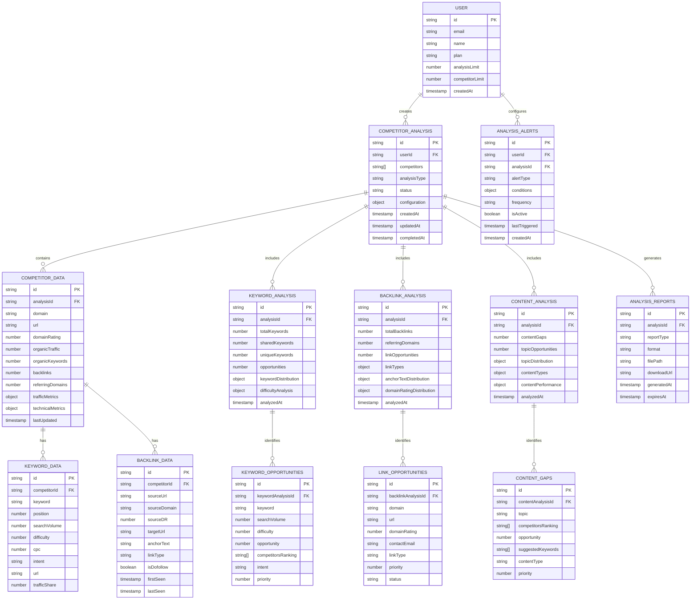

# Competitor Analysis Tool - Documentación de Arquitectura Técnica

## 1. Diseño de Arquitectura


## 2. Descripción de Tecnologías

- **Frontend**: React@18 + Next.js@14 + TypeScript + Tailwind CSS + Recharts + React Query
- **Backend**: Next.js API Routes + Node.js
- **Base de Datos**: MongoDB Atlas (datos principales) + Redis (cache y sesiones)
- **Servicios Externos**: APIs simuladas de SEO + Web Scraping + Google APIs
- **Generación de Reportes**: jsPDF + ExcelJS + React-PDF
- **Autenticación**: NextAuth.js + JWT

## 3. Definiciones de Rutas

| Ruta | Propósito |
|------|-----------|
| /competitor-analysis | Dashboard principal con resumen de competidores monitoreados |
| /competitor-analysis/analyze | Formulario de análisis y configuración de competidores |
| /competitor-analysis/results/[id] | Resultados detallados de análisis específico |
| /competitor-analysis/keywords | Comparación de keywords entre competidores |
| /competitor-analysis/backlinks | Análisis de perfil de backlinks competitivos |
| /competitor-analysis/content | Análisis de gaps de contenido y oportunidades |
| /competitor-analysis/reports | Generador y historial de reportes |
| /competitor-analysis/alerts | Configuración y historial de alertas |
| /competitor-analysis/settings | Configuración de herramienta y preferencias |

## 4. Definiciones de API

### 4.1 APIs Principales

**Análisis de Competidores**
```
POST /api/competitor-analysis/analyze
```

Request:
| Nombre Parámetro | Tipo Parámetro | Requerido | Descripción |
|------------------|----------------|-----------|-------------|
| competitors | string[] | true | Array de URLs o dominios de competidores |
| analysisType | string | true | Tipo de análisis: 'full', 'keywords', 'backlinks', 'content' |
| depth | number | false | Profundidad del análisis (1-5, default: 3) |
| includeHistorical | boolean | false | Incluir datos históricos (default: false) |

Response:
| Nombre Parámetro | Tipo Parámetro | Descripción |
|------------------|----------------|-------------|
| analysisId | string | ID único del análisis |
| status | string | Estado del análisis: 'pending', 'processing', 'completed', 'failed' |
| competitors | CompetitorData[] | Datos de cada competidor analizado |
| summary | AnalysisSummary | Resumen ejecutivo del análisis |

Ejemplo Request:
```json
{
  "competitors": ["https://competitor1.com", "https://competitor2.com"],
  "analysisType": "full",
  "depth": 3,
  "includeHistorical": true
}
```

**Comparación de Keywords**
```
POST /api/competitor-analysis/keywords/compare
```

Request:
| Nombre Parámetro | Tipo Parámetro | Requerido | Descripción |
|------------------|----------------|-----------|-------------|
| analysisId | string | true | ID del análisis base |
| targetDomain | string | true | Dominio objetivo para comparar |
| keywordLimit | number | false | Límite de keywords a analizar (default: 1000) |

Response:
| Nombre Parámetro | Tipo Parámetro | Descripción |
|------------------|----------------|-------------|
| sharedKeywords | KeywordData[] | Keywords compartidas entre competidores |
| uniqueKeywords | KeywordData[] | Keywords únicas por competidor |
| opportunities | OpportunityData[] | Oportunidades de keywords identificadas |
| gaps | GapData[] | Gaps de keywords detectados |

**Análisis de Backlinks**
```
POST /api/competitor-analysis/backlinks/analyze
```

Request:
| Nombre Parámetro | Tipo Parámetro | Requerido | Descripción |
|------------------|----------------|-----------|-------------|
| competitors | string[] | true | Dominios de competidores |
| includeAnchorText | boolean | false | Incluir análisis de anchor text |
| minDomainRating | number | false | Rating mínimo de dominio (default: 20) |

Response:
| Nombre Parámetro | Tipo Parámetro | Descripción |
|------------------|----------------|-------------|
| backlinkProfiles | BacklinkProfile[] | Perfiles de backlinks por competidor |
| linkOpportunities | LinkOpportunity[] | Oportunidades de link building |
| domainMetrics | DomainMetrics[] | Métricas de autoridad de dominio |

**Generación de Reportes**
```
POST /api/competitor-analysis/reports/generate
```

Request:
| Nombre Parámetro | Tipo Parámetro | Requerido | Descripción |
|------------------|----------------|-----------|-------------|
| analysisId | string | true | ID del análisis |
| reportType | string | true | Tipo: 'executive', 'detailed', 'keywords', 'backlinks' |
| format | string | true | Formato: 'pdf', 'excel', 'csv' |
| includeCharts | boolean | false | Incluir gráficos (default: true) |

Response:
| Nombre Parámetro | Tipo Parámetro | Descripción |
|------------------|----------------|-------------|
| reportId | string | ID único del reporte |
| downloadUrl | string | URL de descarga del reporte |
| expiresAt | string | Fecha de expiración del enlace |

## 5. Arquitectura del Servidor


## 6. Modelo de Datos

### 6.1 Definición del Modelo de Datos



### 6.2 Lenguaje de Definición de Datos

**Tabla de Análisis de Competidores (competitor_analysis)**
```sql
-- Crear tabla principal
CREATE TABLE competitor_analysis (
    id UUID PRIMARY KEY DEFAULT gen_random_uuid(),
    user_id UUID NOT NULL REFERENCES users(id),
    competitors TEXT[] NOT NULL,
    analysis_type VARCHAR(50) NOT NULL CHECK (analysis_type IN ('full', 'keywords', 'backlinks', 'content')),
    status VARCHAR(20) DEFAULT 'pending' CHECK (status IN ('pending', 'processing', 'completed', 'failed')),
    configuration JSONB DEFAULT '{}',
    results JSONB DEFAULT '{}',
    created_at TIMESTAMP WITH TIME ZONE DEFAULT NOW(),
    updated_at TIMESTAMP WITH TIME ZONE DEFAULT NOW(),
    completed_at TIMESTAMP WITH TIME ZONE
);

-- Crear índices
CREATE INDEX idx_competitor_analysis_user_id ON competitor_analysis(user_id);
CREATE INDEX idx_competitor_analysis_status ON competitor_analysis(status);
CREATE INDEX idx_competitor_analysis_created_at ON competitor_analysis(created_at DESC);
```

**Tabla de Datos de Competidores (competitor_data)**
```sql
-- Crear tabla de datos de competidores
CREATE TABLE competitor_data (
    id UUID PRIMARY KEY DEFAULT gen_random_uuid(),
    analysis_id UUID NOT NULL REFERENCES competitor_analysis(id) ON DELETE CASCADE,
    domain VARCHAR(255) NOT NULL,
    url TEXT NOT NULL,
    domain_rating INTEGER DEFAULT 0,
    organic_traffic BIGINT DEFAULT 0,
    organic_keywords INTEGER DEFAULT 0,
    backlinks BIGINT DEFAULT 0,
    referring_domains INTEGER DEFAULT 0,
    traffic_metrics JSONB DEFAULT '{}',
    technical_metrics JSONB DEFAULT '{}',
    last_updated TIMESTAMP WITH TIME ZONE DEFAULT NOW()
);

-- Crear índices
CREATE INDEX idx_competitor_data_analysis_id ON competitor_data(analysis_id);
CREATE INDEX idx_competitor_data_domain ON competitor_data(domain);
```

**Tabla de Análisis de Keywords (keyword_analysis)**
```sql
-- Crear tabla de análisis de keywords
CREATE TABLE keyword_analysis (
    id UUID PRIMARY KEY DEFAULT gen_random_uuid(),
    analysis_id UUID NOT NULL REFERENCES competitor_analysis(id) ON DELETE CASCADE,
    total_keywords INTEGER DEFAULT 0,
    shared_keywords INTEGER DEFAULT 0,
    unique_keywords INTEGER DEFAULT 0,
    opportunities INTEGER DEFAULT 0,
    keyword_distribution JSONB DEFAULT '{}',
    difficulty_analysis JSONB DEFAULT '{}',
    analyzed_at TIMESTAMP WITH TIME ZONE DEFAULT NOW()
);

-- Crear índices
CREATE INDEX idx_keyword_analysis_analysis_id ON keyword_analysis(analysis_id);
```

**Tabla de Datos de Keywords (keyword_data)**
```sql
-- Crear tabla de datos de keywords
CREATE TABLE keyword_data (
    id UUID PRIMARY KEY DEFAULT gen_random_uuid(),
    competitor_id UUID NOT NULL REFERENCES competitor_data(id) ON DELETE CASCADE,
    keyword VARCHAR(500) NOT NULL,
    position INTEGER,
    search_volume INTEGER DEFAULT 0,
    difficulty INTEGER DEFAULT 0,
    cpc DECIMAL(10,2) DEFAULT 0,
    intent VARCHAR(50),
    url TEXT,
    traffic_share DECIMAL(5,2) DEFAULT 0
);

-- Crear índices
CREATE INDEX idx_keyword_data_competitor_id ON keyword_data(competitor_id);
CREATE INDEX idx_keyword_data_keyword ON keyword_data(keyword);
CREATE INDEX idx_keyword_data_position ON keyword_data(position);
```

**Datos Iniciales**
```sql
-- Insertar configuraciones predeterminadas
INSERT INTO analysis_configurations (name, type, settings) VALUES
('Análisis Completo Básico', 'full', '{"depth": 3, "includeHistorical": false, "maxKeywords": 1000}'),
('Análisis de Keywords Avanzado', 'keywords', '{"maxKeywords": 5000, "includeCompetitorGaps": true}'),
('Análisis de Backlinks Premium', 'backlinks', '{"minDomainRating": 20, "includeAnchorText": true}'),
('Análisis de Contenido Completo', 'content', '{"includeTopicModeling": true, "contentTypes": ["blog", "landing", "product"]});

-- Insertar alertas predeterminadas
INSERT INTO alert_templates (name, type, conditions) VALUES
('Nuevo Competidor en Top 10', 'ranking_change', '{"position_threshold": 10, "change_type": "new_entry"}'),
('Pérdida de Keywords Importantes', 'keyword_loss', '{"min_search_volume": 1000, "position_drop": 5}'),
('Nuevos Backlinks de Alta Calidad', 'backlink_gain', '{"min_domain_rating": 50, "link_type": "dofollow"}');
```