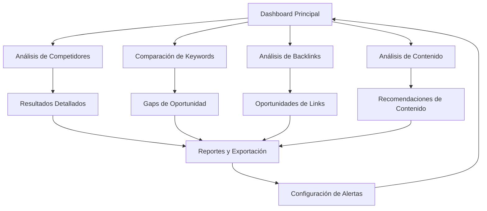

# Competitor Analysis Tool - Documento de Requisitos del Producto

## 1. Visión General del Producto

Herramienta avanzada de análisis competitivo SEO que permite a los usuarios identificar, analizar y superar a sus competidores mediante insights accionables sobre keywords, backlinks, contenido y estrategias SEO.

- **Propósito Principal**: Proporcionar análisis competitivo integral para identificar oportunidades SEO y gaps estratégicos
- **Usuarios Objetivo**: Especialistas SEO, marketers digitales, agencias y empresas que buscan ventaja competitiva
- **Valor de Mercado**: Herramienta esencial para estrategias SEO data-driven que puede incrementar el tráfico orgánico 40-60%

## 2. Características Principales

### 2.1 Roles de Usuario

| Rol | Método de Registro | Permisos Principales |
|-----|-------------------|---------------------|
| Usuario Básico | Registro por email | Análisis de hasta 3 competidores, 100 keywords por análisis |
| Usuario Premium | Upgrade con plan de pago | Análisis ilimitado de competidores, 10,000 keywords, reportes avanzados |
| Usuario Enterprise | Contacto comercial | Análisis masivo, API access, reportes personalizados, alertas automáticas |

### 2.2 Módulos de Funcionalidad

Nuestra herramienta de análisis competitivo consta de las siguientes páginas principales:

1. **Dashboard Principal**: Panel de control con métricas generales, competidores monitoreados y alertas
2. **Análisis de Competidores**: Formulario de entrada, configuración de análisis y resultados detallados
3. **Comparación de Keywords**: Análisis de keywords compartidas, únicas y gaps de oportunidad
4. **Análisis de Backlinks**: Perfil de enlaces, autoridad de dominio y oportunidades de link building
5. **Análisis de Contenido**: Gaps de contenido, temas trending y oportunidades de contenido
6. **Reportes y Exportación**: Generación de reportes personalizados y exportación de datos
7. **Configuración de Alertas**: Monitoreo automático de cambios competitivos

### 2.3 Detalles de Páginas

| Nombre de Página | Nombre del Módulo | Descripción de Funcionalidad |
|------------------|-------------------|------------------------------|
| Dashboard Principal | Panel de Métricas | Mostrar resumen de competidores monitoreados, alertas recientes, métricas clave de rendimiento |
| Dashboard Principal | Lista de Competidores | Gestionar lista de competidores activos, agregar/eliminar competidores, estado de monitoreo |
| Análisis de Competidores | Formulario de Entrada | Ingresar URLs/dominios de competidores, configurar parámetros de análisis, seleccionar métricas |
| Análisis de Competidores | Resultados de Análisis | Mostrar métricas de tráfico, autoridad de dominio, top keywords, backlinks principales |
| Comparación de Keywords | Análisis Comparativo | Identificar keywords compartidas, keywords únicas por competidor, difficulty scores |
| Comparación de Keywords | Gaps de Oportunidad | Detectar keywords donde competidores rankean pero el usuario no, priorizar oportunidades |
| Análisis de Backlinks | Perfil de Enlaces | Analizar calidad y cantidad de backlinks, dominios referentes, anchor text distribution |
| Análisis de Backlinks | Oportunidades de Links | Identificar sitios que enlazan a competidores pero no al usuario, link building prospects |
| Análisis de Contenido | Análisis de Temas | Identificar temas principales de competidores, content gaps, trending topics |
| Análisis de Contenido | Recomendaciones | Sugerir nuevos temas de contenido, optimizaciones de contenido existente |
| Reportes | Generador de Reportes | Crear reportes personalizados, seleccionar métricas, configurar periodicidad |
| Reportes | Exportación de Datos | Exportar datos en CSV/PDF/Excel, compartir reportes, integración con herramientas |
| Alertas | Configuración de Monitoreo | Configurar alertas por cambios en rankings, nuevos backlinks, contenido nuevo |
| Alertas | Historial de Alertas | Ver alertas pasadas, análisis de tendencias, respuestas a cambios competitivos |

## 3. Proceso Principal

### Flujo de Usuario Regular:
1. **Configuración Inicial**: Usuario ingresa al dashboard y configura lista de competidores a monitorear
2. **Análisis Competitivo**: Selecciona competidores específicos y ejecuta análisis completo
3. **Revisión de Resultados**: Examina métricas de tráfico, keywords, backlinks y contenido
4. **Identificación de Oportunidades**: Identifica gaps de keywords, oportunidades de backlinks y temas de contenido
5. **Generación de Reportes**: Crea reportes personalizados para stakeholders
6. **Configuración de Alertas**: Establece monitoreo automático para cambios competitivos
7. **Implementación de Estrategias**: Utiliza insights para optimizar estrategia SEO propia

### Flujo de Usuario Premium:
1. **Análisis Masivo**: Analiza múltiples competidores simultáneamente
2. **Análisis Histórico**: Accede a datos históricos y tendencias temporales
3. **API Integration**: Integra datos con herramientas propias via API
4. **Alertas Avanzadas**: Recibe alertas automáticas por email/Slack
5. **Reportes Automatizados**: Genera reportes periódicos automáticos

## 4. Diseño de Interfaz de Usuario

### 4.1 Estilo de Diseño

- **Colores Primarios**: #2563eb (azul principal), #1e40af (azul secundario)
- **Colores de Acento**: #10b981 (verde éxito), #ef4444 (rojo alerta), #f59e0b (amarillo advertencia)
- **Estilo de Botones**: Redondeados con sombras sutiles, efectos hover suaves
- **Tipografía**: Inter para títulos (16-24px), system fonts para contenido (14-16px)
- **Estilo de Layout**: Dashboard modular con cards, navegación lateral, diseño grid responsivo
- **Iconos**: Heroicons para consistencia, iconos específicos de SEO (gráficos, enlaces, keywords)

### 4.2 Resumen de Diseño de Páginas

| Nombre de Página | Nombre del Módulo | Elementos de UI |
|------------------|-------------------|-----------------|
| Dashboard Principal | Panel de Métricas | Cards con métricas clave, gráficos de líneas para tendencias, indicadores de estado coloridos |
| Dashboard Principal | Lista de Competidores | Tabla con avatars de sitios, badges de estado, botones de acción rápida |
| Análisis de Competidores | Formulario de Entrada | Input fields con validación, dropdowns para configuración, botón CTA prominente |
| Análisis de Competidores | Resultados de Análisis | Layout de 3 columnas, progress bars para métricas, tooltips informativos |
| Comparación de Keywords | Análisis Comparativo | Tabla sorteable con filtros, badges de dificultad, gráficos de barras comparativos |
| Comparación de Keywords | Gaps de Oportunidad | Lista priorizada con scores, botones de acción, modal de detalles |
| Análisis de Backlinks | Perfil de Enlaces | Gráficos de dona para distribución, tabla con thumbnails de sitios |
| Análisis de Backlinks | Oportunidades de Links | Cards de oportunidades con previews, botones de contacto, filtros avanzados |
| Análisis de Contenido | Análisis de Temas | Word cloud interactivo, lista de temas con métricas, filtros por categoría |
| Análisis de Contenido | Recomendaciones | Cards de recomendaciones con prioridad, botones de implementación |
| Reportes | Generador de Reportes | Wizard de configuración, preview en tiempo real, opciones de personalización |
| Reportes | Exportación de Datos | Botones de descarga con iconos, opciones de formato, historial de exportaciones |
| Alertas | Configuración de Monitoreo | Toggle switches, sliders para umbrales, preview de alertas |
| Alertas | Historial de Alertas | Timeline de alertas, filtros por tipo, acciones de respuesta |

### 4.3 Responsividad

- **Desktop-first** con adaptación completa a mobile y tablet
- **Navegación móvil** con menú hamburguesa y navegación por pestañas
- **Tablas responsivas** con scroll horizontal y vista de cards en móvil
- **Gráficos adaptativos** que se redimensionan automáticamente
- **Touch optimization** para interacciones táctiles en dispositivos móviles