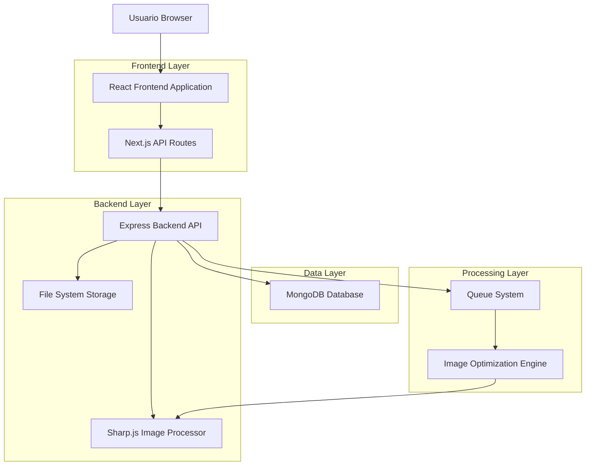
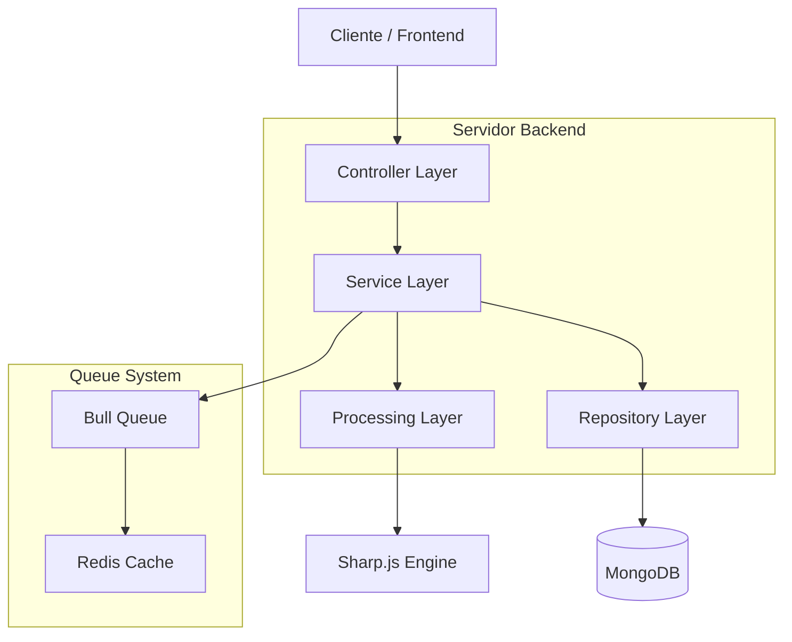
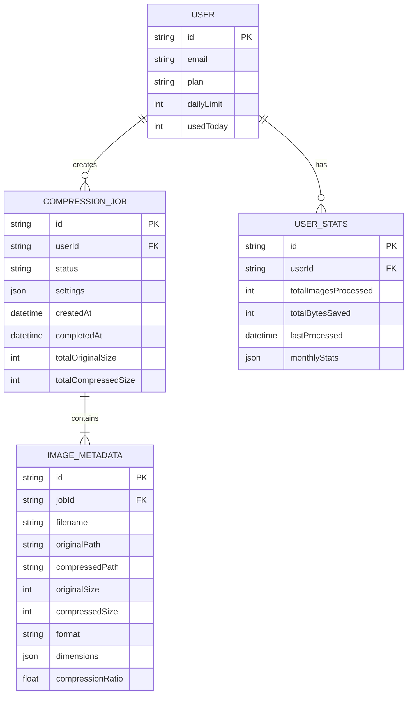

# Compresor de Imágenes SEO - Documento de Arquitectura Técnica

## 1. Diseño de Arquitectura



## 2. Descripción de Tecnologías

- **Frontend**: React@18 + Next.js@14 + TailwindCSS@3 + Framer Motion + React Dropzone
- **Backend**: Express@4 + Sharp.js@0.33 + Multer + Bull Queue
- **Base de Datos**: MongoDB (via Supabase) para metadatos y historial
- **Procesamiento**: Sharp.js para compresión y conversión de formatos
- **Storage**: Sistema de archivos local con limpieza automática

## 3. Definiciones de Rutas

| Ruta | Propósito |
|------|-----------|
| /compresor-imagenes | Página principal del compresor con interfaz de carga |
| /compresor-imagenes/resultados | Página de resultados con comparación y descarga |
| /compresor-imagenes/historial | Historial de imágenes procesadas del usuario |

## 4. Definiciones de API

### 4.1 API Principal

**Subida y procesamiento de imágenes**
```
POST /api/compress-images
```

Request:
| Nombre Parámetro | Tipo Parámetro | Requerido | Descripción |
|------------------|----------------|-----------|-------------|
| images | File[] | true | Array de archivos de imagen (max 10 archivos) |
| quality | number | false | Calidad de compresión 10-100 (default: 80) |
| format | string | false | Formato de salida: 'jpeg', 'png', 'webp' (default: original) |
| resize | object | false | Opciones de redimensionado {width, height, fit} |

Response:
| Nombre Parámetro | Tipo Parámetro | Descripción |
|------------------|----------------|-------------|
| success | boolean | Estado de la operación |
| jobId | string | ID del trabajo de procesamiento |
| estimatedTime | number | Tiempo estimado en segundos |

**Obtener estado del procesamiento**
```
GET /api/compress-images/status/:jobId
```

Response:
| Nombre Parámetro | Tipo Parámetro | Descripción |
|------------------|----------------|-------------|
| status | string | 'processing', 'completed', 'failed' |
| progress | number | Porcentaje de progreso (0-100) |
| results | object[] | Array de resultados cuando está completo |

**Descargar imagen comprimida**
```
GET /api/compress-images/download/:fileId
```

**Obtener historial de usuario**
```
GET /api/compress-images/history
```

Response:
| Nombre Parámetro | Tipo Parámetro | Descripción |
|------------------|----------------|-------------|
| history | object[] | Array de trabajos de compresión anteriores |
| totalSaved | number | Total de MB ahorrados |
| imagesProcessed | number | Total de imágenes procesadas |

### 4.2 Tipos de Datos

```typescript
interface CompressionJob {
  id: string;
  userId: string;
  status: 'pending' | 'processing' | 'completed' | 'failed';
  originalImages: ImageMetadata[];
  compressedImages: ImageMetadata[];
  settings: CompressionSettings;
  createdAt: Date;
  completedAt?: Date;
}

interface ImageMetadata {
  filename: string;
  originalSize: number;
  compressedSize?: number;
  format: string;
  dimensions: { width: number; height: number };
  compressionRatio?: number;
}

interface CompressionSettings {
  quality: number;
  format?: string;
  resize?: {
    width?: number;
    height?: number;
    fit: 'cover' | 'contain' | 'fill';
  };
}
```

## 5. Diagrama de Arquitectura del Servidor



## 6. Modelo de Datos

### 6.1 Definición del Modelo de Datos



### 6.2 Lenguaje de Definición de Datos

**Tabla de Trabajos de Compresión (compression_jobs)**
```sql
-- crear tabla
CREATE TABLE compression_jobs (
    id UUID PRIMARY KEY DEFAULT gen_random_uuid(),
    user_id UUID NOT NULL,
    status VARCHAR(20) DEFAULT 'pending' CHECK (status IN ('pending', 'processing', 'completed', 'failed')),
    settings JSONB NOT NULL,
    total_original_size BIGINT DEFAULT 0,
    total_compressed_size BIGINT DEFAULT 0,
    created_at TIMESTAMP WITH TIME ZONE DEFAULT NOW(),
    completed_at TIMESTAMP WITH TIME ZONE,
    updated_at TIMESTAMP WITH TIME ZONE DEFAULT NOW()
);

-- crear índices
CREATE INDEX idx_compression_jobs_user_id ON compression_jobs(user_id);
CREATE INDEX idx_compression_jobs_status ON compression_jobs(status);
CREATE INDEX idx_compression_jobs_created_at ON compression_jobs(created_at DESC);

-- permisos Supabase
GRANT SELECT ON compression_jobs TO anon;
GRANT ALL PRIVILEGES ON compression_jobs TO authenticated;
```

**Tabla de Metadatos de Imágenes (image_metadata)**
```sql
-- crear tabla
CREATE TABLE image_metadata (
    id UUID PRIMARY KEY DEFAULT gen_random_uuid(),
    job_id UUID NOT NULL REFERENCES compression_jobs(id) ON DELETE CASCADE,
    filename VARCHAR(255) NOT NULL,
    original_path VARCHAR(500),
    compressed_path VARCHAR(500),
    original_size BIGINT NOT NULL,
    compressed_size BIGINT,
    format VARCHAR(10) NOT NULL,
    dimensions JSONB,
    compression_ratio DECIMAL(5,2),
    created_at TIMESTAMP WITH TIME ZONE DEFAULT NOW()
);

-- crear índices
CREATE INDEX idx_image_metadata_job_id ON image_metadata(job_id);
CREATE INDEX idx_image_metadata_filename ON image_metadata(filename);

-- permisos Supabase
GRANT SELECT ON image_metadata TO anon;
GRANT ALL PRIVILEGES ON image_metadata TO authenticated;
```

**Tabla de Estadísticas de Usuario (user_stats)**
```sql
-- crear tabla
CREATE TABLE user_stats (
    id UUID PRIMARY KEY DEFAULT gen_random_uuid(),
    user_id UUID NOT NULL UNIQUE,
    total_images_processed INTEGER DEFAULT 0,
    total_bytes_saved BIGINT DEFAULT 0,
    last_processed TIMESTAMP WITH TIME ZONE,
    monthly_stats JSONB DEFAULT '{}',
    created_at TIMESTAMP WITH TIME ZONE DEFAULT NOW(),
    updated_at TIMESTAMP WITH TIME ZONE DEFAULT NOW()
);

-- crear índices
CREATE INDEX idx_user_stats_user_id ON user_stats(user_id);
CREATE INDEX idx_user_stats_last_processed ON user_stats(last_processed DESC);

-- permisos Supabase
GRANT SELECT ON user_stats TO anon;
GRANT ALL PRIVILEGES ON user_stats TO authenticated;

-- datos iniciales de ejemplo
INSERT INTO compression_jobs (user_id, settings, status) VALUES 
('550e8400-e29b-41d4-a716-446655440000', '{"quality": 80, "format": "webp"}', 'completed');
```