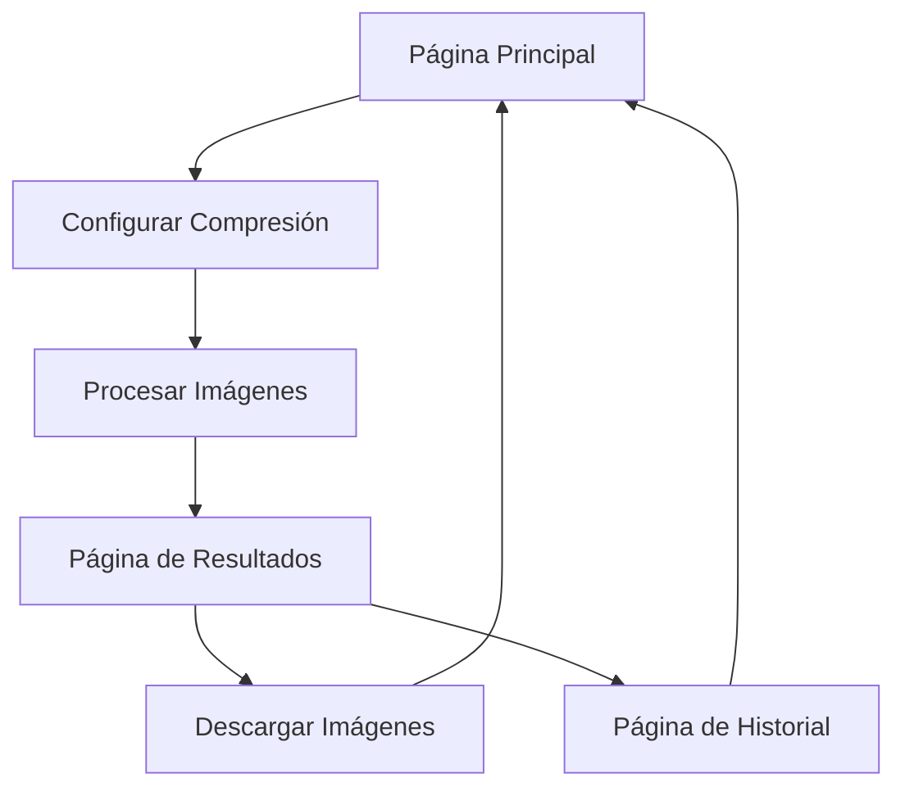

# Compresor de Imágenes SEO - Documento de Requisitos del Producto

## 1. Descripción General del Producto

El **Compresor de Imágenes SEO** es una herramienta profesional que permite a los usuarios optimizar automáticamente el peso y formato de sus imágenes sin comprometer la calidad visual, mejorando significativamente los tiempos de carga web y el posicionamiento SEO.

- **Propósito Principal**: Reducir el tamaño de archivos de imagen manteniendo la calidad visual óptima para mejorar Core Web Vitals y SEO.
- **Usuarios Objetivo**: Desarrolladores web, especialistas SEO, diseñadores, propietarios de sitios web y agencias digitales.
- **Valor de Mercado**: Herramienta esencial para optimización de rendimiento web, directamente impactando en rankings de Google y experiencia de usuario.

## 2. Características Principales

### 2.1 Roles de Usuario

| Rol | Método de Registro | Permisos Principales |
|-----|-------------------|---------------------|
| Usuario Gratuito | Registro por email | Hasta 10 imágenes/día, máx 5MB por imagen |
| Usuario Premium | Upgrade con plan de pago | Hasta 100 imágenes/día, máx 25MB por imagen, descarga en lote |
| Usuario Pro | Plan empresarial | Imágenes ilimitadas, API access, procesamiento prioritario |

### 2.2 Módulos de Funcionalidad

Nuestra herramienta de compresión de imágenes consta de las siguientes páginas principales:

1. **Página Principal**: zona de carga drag & drop, configuración de compresión, vista previa de resultados.
2. **Página de Resultados**: comparación antes/después, métricas de optimización, opciones de descarga.
3. **Página de Historial**: imágenes procesadas anteriormente, re-descarga, estadísticas de uso.

### 2.3 Detalles de Páginas

| Nombre de Página | Nombre del Módulo | Descripción de Funcionalidad |
|------------------|-------------------|------------------------------|
| Página Principal | Zona de Carga | Interfaz drag & drop para subir múltiples imágenes (JPEG, PNG, WebP). Validación de formato y tamaño. |
| Página Principal | Configurador de Compresión | Slider de calidad (10-100%), selección de formato de salida, opciones avanzadas de optimización. |
| Página Principal | Vista Previa | Mostrar imágenes cargadas con información de tamaño original y estimado después de compresión. |
| Página de Resultados | Comparador Visual | Vista lado a lado de imagen original vs comprimida con zoom y métricas detalladas. |
| Página de Resultados | Panel de Métricas | Mostrar reducción de tamaño (%), tiempo de carga estimado, puntuación de optimización SEO. |
| Página de Resultados | Sistema de Descarga | Descarga individual, descarga en lote como ZIP, opciones de renombrado automático. |
| Página de Historial | Lista de Procesados | Historial de imágenes procesadas con filtros por fecha, formato, reducción de tamaño. |
| Página de Historial | Estadísticas de Uso | Gráficos de uso mensual, total de MB ahorrados, imágenes procesadas, límites de plan. |

## 3. Proceso Principal

### Flujo de Usuario Estándar

1. **Carga de Imágenes**: El usuario arrastra y suelta imágenes en la zona designada o utiliza el selector de archivos
2. **Configuración**: Ajusta la calidad de compresión y selecciona el formato de salida deseado
3. **Procesamiento**: El sistema procesa las imágenes en segundo plano mostrando progreso en tiempo real
4. **Revisión**: El usuario revisa los resultados con comparación visual y métricas de optimización
5. **Descarga**: Descarga las imágenes optimizadas individualmente o en lote

### Flujo de Navegación

## 4. Diseño de Interfaz de Usuario

### 4.1 Estilo de Diseño

- **Colores Primarios**: 
  - Azul Tecnológico: `#3B82F6` (tech-blue-500)
  - Verde Éxito: `#10B981` (emerald-500)
  - Naranja Advertencia: `#F59E0B` (amber-500)
- **Colores Secundarios**:
  - Gris Neutro: `#6B7280` (gray-500)
  - Blanco/Negro para contraste
- **Estilo de Botones**: Redondeados con gradientes, efectos hover con escala 1.02x
- **Tipografía**: Inter font, tamaños 14px (texto), 18px (títulos), 24px (encabezados)
- **Estilo de Layout**: Diseño de tarjetas con sombras suaves, navegación superior fija
- **Iconos**: Lucide React icons con estilo minimalista, tamaño 20px-24px

### 4.2 Resumen de Diseño de Páginas

| Nombre de Página | Nombre del Módulo | Elementos de UI |
|------------------|-------------------|-----------------|
| Página Principal | Zona de Carga | Área drag & drop con borde punteado azul, icono de nube, texto "Arrastra imágenes aquí", botón secundario "Seleccionar archivos" |
| Página Principal | Configurador | Slider de calidad con valores numéricos, radio buttons para formato, toggle para opciones avanzadas |
| Página Principal | Vista Previa | Grid de tarjetas con thumbnails, badges de formato, indicadores de tamaño, botones de eliminar |
| Página de Resultados | Comparador | Layout split-screen, controles de zoom, overlay con métricas, botones de navegación |
| Página de Resultados | Métricas | Cards con iconos, números grandes para porcentajes, barras de progreso, colores semafóricos |
| Página de Resultados | Descarga | Botones primarios con iconos de descarga, checkbox para selección múltiple, progress bars |

### 4.3 Responsividad

- **Diseño Mobile-First**: Optimizado para dispositivos móviles con adaptación a desktop
- **Breakpoints**: 
  - Mobile: 320px-768px (stack vertical, botones full-width)
  - Tablet: 768px-1024px (grid 2 columnas)
  - Desktop: 1024px+ (grid 3-4 columnas, sidebar)
- **Interacciones Táctiles**: Botones mínimo 44px, gestos swipe para navegación, feedback haptic