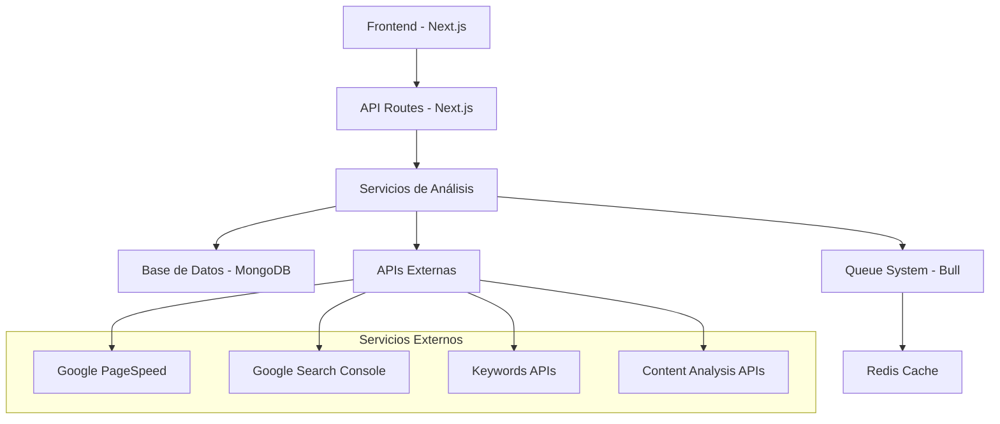

# Especificación Técnica: Herramientas SEO Funcionales

## 1. Resumen Ejecutivo

Este documento define la implementación de herramientas SEO funcionales para la plataforma YA Tools, transformando las páginas existentes en herramientas completamente operativas que proporcionen valor real a los usuarios mediante análisis avanzados, inteligencia artificial y integraciones con APIs externas.

## 2. Herramientas SEO a Implementar

### 2.1 Herramientas Principales

| Herramienta | Estado Actual | Funcionalidad a Implementar | Prioridad |
|-------------|---------------|------------------------------|-----------|
| **Generador de Títulos SEO** | Página básica | IA para generar títulos optimizados | Alta |
| **Keyword Research Tool** | Página básica | Investigación completa de palabras clave | Alta |
| **SEO Audit Tool** | Página básica | Auditoría técnica completa de sitios web | Alta |
| **Detector de Contenido Duplicado** | Página básica | Análisis de duplicación interna y externa | Media |
| **Optimizador de Contenido** | Página básica | Análisis y optimización de contenido | Alta |
| **Generador de Robots.txt** | Página básica | Generación inteligente de robots.txt | Media |
| **Generador de Sitemap XML** | Página básica | Creación automática de sitemaps | Media |
| **Core Web Vitals Checker** | Página básica | Análisis completo de rendimiento | Alta |
| **Renombrador de Imágenes SEO** | Página básica | Optimización automática de nombres | Baja |

### 2.2 Funcionalidades Avanzadas

#### **Análisis con IA**
- Generación de títulos y meta descriptions optimizados
- Análisis de intención de búsqueda
- Sugerencias de mejora de contenido
- Detección automática de problemas SEO

#### **Integraciones Externas**
- Google PageSpeed Insights API
- Google Search Console API
- APIs de investigación de keywords
- Servicios de análisis de backlinks

#### **Reportes y Exportación**
- Reportes PDF profesionales
- Exportación CSV para análisis
- Datos JSON para integraciones
- Comparaciones históricas

## 3. Arquitectura Técnica

### 3.1 Stack Tecnológico



### 3.2 Componentes del Sistema

#### **Backend Services**
- **SEO Analysis Service**: Motor principal de análisis
- **Content Processor**: Procesamiento de contenido con IA
- **Web Crawler**: Crawling inteligente de sitios web
- **Report Generator**: Generación de reportes
- **Cache Manager**: Gestión de caché para optimización

#### **APIs Principales**
```typescript
// Estructura de APIs principales
/api/seo/
├── title-generator/     # Generación de títulos SEO
├── keyword-research/    # Investigación de keywords
├── site-audit/         # Auditoría completa de sitios
├── content-optimizer/  # Optimización de contenido
├── duplicate-checker/  # Detección de contenido duplicado
├── robots-generator/   # Generación de robots.txt
├── sitemap-generator/  # Generación de sitemaps
├── vitals-checker/     # Análisis de Core Web Vitals
└── image-optimizer/    # Optimización de imágenes
```

## 4. Especificaciones por Herramienta

### 4.1 Generador de Títulos SEO

#### **Funcionalidades**
- Análisis de keyword principal y secundarias
- Generación múltiple de opciones (5-10 títulos)
- Análisis de longitud y optimización
- Puntuación SEO para cada título
- Análisis de competencia

#### **API Endpoint**
```typescript
POST /api/seo/title-generator
{
  "keyword": "herramientas seo",
  "description": "Descripción del contenido",
  "tone": "professional|casual|technical",
  "industry": "marketing|technology|ecommerce",
  "competitors": ["url1", "url2"]
}

Response:
{
  "titles": [
    {
      "title": "Las 15 Mejores Herramientas SEO para 2024",
      "score": 95,
      "length": 42,
      "analysis": {
        "keyword_placement": "optimal",
        "readability": "high",
        "ctr_potential": "high"
      }
    }
  ],
  "recommendations": ["Incluir año actual", "Usar números"]
}
```

### 4.2 Keyword Research Tool

#### **Funcionalidades**
- Investigación de keywords relacionadas
- Análisis de volumen de búsqueda
- Dificultad de ranking
- Análisis de competencia
- Sugerencias de long-tail keywords
- Análisis de intención de búsqueda

#### **Fuentes de Datos**
- Google Keyword Planner API
- Ubersuggest API
- SEMrush API (opcional)
- Datos propios de crawling

#### **API Endpoint**
```typescript
POST /api/seo/keyword-research
{
  "seed_keyword": "marketing digital",
  "country": "ES",
  "language": "es",
  "include_questions": true,
  "include_longtail": true
}

Response:
{
  "keywords": [
    {
      "keyword": "marketing digital estrategias",
      "volume": 2400,
      "difficulty": 65,
      "cpc": 1.25,
      "trend": "rising",
      "intent": "informational",
      "related": ["estrategias marketing", "marketing online"]
    }
  ],
  "questions": ["¿Qué es marketing digital?"],
  "longtail": ["mejores estrategias marketing digital 2024"]
}
```

### 4.3 SEO Audit Tool

#### **Funcionalidades Técnicas**
- **SEO On-Page**: Títulos, meta descriptions, headers, contenido
- **SEO Técnico**: Velocidad, mobile-friendly, HTTPS, estructura
- **Core Web Vitals**: LCP, FID, CLS
- **Indexabilidad**: Robots.txt, sitemap, errores de crawl
- **Enlaces**: Internos, externos, anchor text
- **Schema Markup**: Detección y validación

#### **Proceso de Análisis**
1. Crawling inicial del sitio
2. Análisis técnico automatizado
3. Verificación con APIs externas
4. Generación de puntuación SEO
5. Recomendaciones priorizadas

#### **API Endpoint**
```typescript
POST /api/seo/site-audit
{
  "url": "https://example.com",
  "pages_limit": 100,
  "include_images": true,
  "check_mobile": true
}

Response:
{
  "overall_score": 78,
  "categories": {
    "technical": {
      "score": 85,
      "issues": [
        {
          "type": "warning",
          "title": "Imágenes sin alt text",
          "count": 12,
          "impact": "medium",
          "fix": "Agregar atributos alt descriptivos"
        }
      ]
    },
    "content": {
      "score": 72,
      "issues": []
    },
    "performance": {
      "score": 68,
      "vitals": {
        "lcp": 2.8,
        "fid": 45,
        "cls": 0.15
      }
    }
  },
  "recommendations": [
    {
      "priority": "high",
      "title": "Optimizar imágenes",
      "description": "Comprimir y redimensionar imágenes",
      "impact": "Mejora de 15-20 puntos en performance"
    }
  ]
}
```

### 4.4 Content Optimizer

#### **Funcionalidades**
- Análisis de densidad de keywords
- Sugerencias de keywords relacionadas
- Análisis de legibilidad
- Optimización de estructura (H1, H2, H3)
- Sugerencias de enlaces internos
- Análisis de longitud de contenido

#### **Integración con IA**
- OpenAI GPT para sugerencias de mejora
- Análisis de sentimiento
- Detección de tono y estilo
- Sugerencias de sinónimos y variaciones

### 4.5 Core Web Vitals Checker

#### **Métricas Analizadas**
- **Largest Contentful Paint (LCP)**: < 2.5s
- **First Input Delay (FID)**: < 100ms
- **Cumulative Layout Shift (CLS)**: < 0.1
- **First Contentful Paint (FCP)**
- **Time to Interactive (TTI)**

#### **Integración con Google PageSpeed**
```typescript
POST /api/seo/vitals-checker
{
  "url": "https://example.com",
  "strategy": "mobile|desktop",
  "categories": ["performance", "accessibility", "seo"]
}

Response:
{
  "score": 78,
  "vitals": {
    "lcp": { "value": 2.1, "rating": "good" },
    "fid": { "value": 85, "rating": "good" },
    "cls": { "value": 0.08, "rating": "good" }
  },
  "opportunities": [
    {
      "title": "Eliminar recursos que bloquean el renderizado",
      "impact": "Ahorro potencial de 0.5s",
      "resources": ["style.css", "script.js"]
    }
  ],
  "diagnostics": []
}
```

## 5. Base de Datos y Modelos

### 5.1 Modelos de Datos

#### **SEO Analysis Model**
```typescript
interface SEOAnalysis {
  id: string;
  userId: string;
  url: string;
  type: 'audit' | 'keywords' | 'content' | 'vitals';
  status: 'pending' | 'processing' | 'completed' | 'failed';
  results: {
    score: number;
    categories: Record<string, any>;
    recommendations: Recommendation[];
    raw_data: any;
  };
  metadata: {
    pages_analyzed: number;
    analysis_time: number;
    created_at: Date;
    updated_at: Date;
  };
}

interface Recommendation {
  priority: 'low' | 'medium' | 'high' | 'critical';
  category: string;
  title: string;
  description: string;
  impact: string;
  effort: 'low' | 'medium' | 'high';
  resources?: string[];
}
```

#### **Keyword Research Model**
```typescript
interface KeywordResearch {
  id: string;
  userId: string;
  seed_keyword: string;
  country: string;
  language: string;
  results: {
    keywords: KeywordData[];
    questions: string[];
    longtail: string[];
    competitors: CompetitorData[];
  };
  created_at: Date;
}

interface KeywordData {
  keyword: string;
  volume: number;
  difficulty: number;
  cpc: number;
  trend: 'rising' | 'stable' | 'declining';
  intent: 'informational' | 'navigational' | 'transactional' | 'commercial';
  related: string[];
}
```

### 5.2 Índices de Base de Datos

```javascript
// MongoDB Indexes
db.seo_analyses.createIndex({ "userId": 1, "created_at": -1 });
db.seo_analyses.createIndex({ "url": 1, "type": 1 });
db.seo_analyses.createIndex({ "status": 1 });

db.keyword_research.createIndex({ "userId": 1, "created_at": -1 });
db.keyword_research.createIndex({ "seed_keyword": 1, "country": 1 });
```

## 6. Sistema de Caching y Optimización

### 6.1 Estrategia de Cache

#### **Redis Cache Layers**
```typescript
// Cache Keys Structure
const CACHE_KEYS = {
  KEYWORD_RESEARCH: 'keywords:{seed}:{country}:{lang}',
  SITE_AUDIT: 'audit:{url_hash}',
  PAGE_SPEED: 'speed:{url_hash}:{strategy}',
  CONTENT_ANALYSIS: 'content:{content_hash}',
  TITLE_GENERATION: 'titles:{keyword}:{tone}:{industry}'
};

// TTL Configuration
const CACHE_TTL = {
  KEYWORD_RESEARCH: 24 * 60 * 60, // 24 horas
  SITE_AUDIT: 6 * 60 * 60,        // 6 horas
  PAGE_SPEED: 1 * 60 * 60,        // 1 hora
  CONTENT_ANALYSIS: 12 * 60 * 60, // 12 horas
  TITLE_GENERATION: 7 * 24 * 60 * 60 // 7 días
};
```

### 6.2 Queue System para Análisis Largos

```typescript
// Bull Queue Configuration
import Queue from 'bull';

const seoAnalysisQueue = new Queue('SEO Analysis', {
  redis: { port: 6379, host: '127.0.0.1' }
});

// Job Types
interface SEOAnalysisJob {
  type: 'site_audit' | 'keyword_research' | 'content_analysis';
  data: {
    userId: string;
    url?: string;
    keyword?: string;
    content?: string;
    options: any;
  };
}

// Job Processing
seoAnalysisQueue.process('site_audit', 5, async (job) => {
  const { userId, url, options } = job.data;
  
  // Update job progress
  job.progress(10);
  
  // Perform analysis
  const results = await performSiteAudit(url, options);
  
  job.progress(100);
  return results;
});
```

## 7. Integraciones con APIs Externas

### 7.1 Google APIs

#### **PageSpeed Insights API**
```typescript
class GooglePageSpeedService {
  private apiKey: string;
  
  async analyzeUrl(url: string, strategy: 'mobile' | 'desktop') {
    const response = await fetch(
      `https://www.googleapis.com/pagespeedonline/v5/runPagespeed?url=${url}&strategy=${strategy}&key=${this.apiKey}`
    );
    
    return this.processPageSpeedResults(await response.json());
  }
  
  private processPageSpeedResults(data: any) {
    return {
      score: data.lighthouseResult.categories.performance.score * 100,
      vitals: {
        lcp: data.lighthouseResult.audits['largest-contentful-paint'],
        fid: data.lighthouseResult.audits['max-potential-fid'],
        cls: data.lighthouseResult.audits['cumulative-layout-shift']
      },
      opportunities: data.lighthouseResult.audits,
      diagnostics: data.lighthouseResult.audits
    };
  }
}
```

#### **Search Console API**
```typescript
class GoogleSearchConsoleService {
  async getSearchAnalytics(siteUrl: string, dimensions: string[]) {
    // Implementar autenticación OAuth2
    // Obtener datos de rendimiento de búsqueda
    // Procesar y devolver métricas clave
  }
}
```

### 7.2 Keyword Research APIs

#### **Ubersuggest API Integration**
```typescript
class UbersuggestService {
  async getKeywordData(keyword: string, country: string) {
    // Integración con Ubersuggest API
    // Obtener volumen, dificultad, CPC
    // Sugerencias relacionadas
  }
}
```

## 8. Sistema de Reportes

### 8.1 Generación de PDFs

```typescript
import PDFDocument from 'pdfkit';

class SEOReportGenerator {
  async generateAuditReport(analysis: SEOAnalysis): Promise<Buffer> {
    const doc = new PDFDocument();
    
    // Header con logo y título
    doc.fontSize(20).text('Reporte de Auditoría SEO', 50, 50);
    
    // Resumen ejecutivo
    doc.fontSize(16).text('Resumen Ejecutivo', 50, 100);
    doc.fontSize(12).text(`Puntuación general: ${analysis.results.score}/100`, 50, 130);
    
    // Gráficos de puntuación por categoría
    this.addScoreCharts(doc, analysis.results.categories);
    
    // Recomendaciones priorizadas
    this.addRecommendations(doc, analysis.results.recommendations);
    
    // Detalles técnicos
    this.addTechnicalDetails(doc, analysis.results);
    
    doc.end();
    return doc;
  }
}
```

### 8.2 Exportación de Datos

```typescript
class DataExporter {
  exportToCSV(data: any[], filename: string): string {
    // Convertir datos a formato CSV
    // Incluir headers apropiados
    // Formatear para Excel compatibility
  }
  
  exportToJSON(data: any): string {
    // Exportar datos estructurados
    // Incluir metadata
    // Formato para APIs
  }
}
```

## 9. Interfaz de Usuario y Experiencia

### 9.1 Componentes UI Reutilizables

#### **SEO Score Display**
```typescript
interface SEOScoreProps {
  score: number;
  category: string;
  size?: 'small' | 'medium' | 'large';
}

const SEOScore: React.FC<SEOScoreProps> = ({ score, category, size = 'medium' }) => {
  const getScoreColor = (score: number) => {
    if (score >= 80) return 'text-green-600';
    if (score >= 60) return 'text-yellow-600';
    return 'text-red-600';
  };
  
  return (
    <div className="flex items-center space-x-2">
      <div className={`circular-progress ${getScoreColor(score)}`}>
        {score}
      </div>
      <span className="text-sm text-gray-600">{category}</span>
    </div>
  );
};
```

#### **Progress Indicator**
```typescript
const AnalysisProgress: React.FC<{ progress: number; stage: string }> = ({ progress, stage }) => {
  return (
    <div className="w-full">
      <div className="flex justify-between mb-2">
        <span className="text-sm font-medium text-gray-700">{stage}</span>
        <span className="text-sm text-gray-500">{progress}%</span>
      </div>
      <div className="w-full bg-gray-200 rounded-full h-2">
        <div 
          className="bg-blue-600 h-2 rounded-full transition-all duration-300"
          style={{ width: `${progress}%` }}
        />
      </div>
    </div>
  );
};
```

### 9.2 Visualización de Datos

#### **Charts y Gráficos**
```typescript
import { LineChart, BarChart, PieChart } from 'recharts';

const SEOMetricsChart: React.FC<{ data: any[] }> = ({ data }) => {
  return (
    <div className="grid grid-cols-1 md:grid-cols-2 gap-6">
      {/* Gráfico de líneas para tendencias */}
      <LineChart width={400} height={300} data={data}>
        {/* Configuración del gráfico */}
      </LineChart>
      
      {/* Gráfico de barras para comparaciones */}
      <BarChart width={400} height={300} data={data}>
        {/* Configuración del gráfico */}
      </BarChart>
    </div>
  );
};
```

## 10. Sistema de Restricciones por Plan

### 10.1 Límites por Herramienta

```typescript
const PLAN_LIMITS = {
  free: {
    site_audits: 5,
    keyword_research: 10,
    content_analysis: 15,
    title_generation: 25,
    pages_per_audit: 10
  },
  premium: {
    site_audits: 100,
    keyword_research: 500,
    content_analysis: 1000,
    title_generation: -1, // unlimited
    pages_per_audit: 1000
  },
  trial: {
    site_audits: 25,
    keyword_research: 100,
    content_analysis: 200,
    title_generation: 100,
    pages_per_audit: 100
  }
};
```

### 10.2 Middleware de Verificación

```typescript
export async function checkToolUsage(
  userId: string, 
  tool: string, 
  userPlan: string
): Promise<{ allowed: boolean; remaining: number; limit: number }> {
  const limit = PLAN_LIMITS[userPlan][tool];
  const usage = await getUserToolUsage(userId, tool);
  
  return {
    allowed: limit === -1 || usage < limit,
    remaining: limit === -1 ? -1 : Math.max(0, limit - usage),
    limit
  };
}
```

## 11. Implementación por Fases

### 11.1 Fase 1: Herramientas Básicas (Semana 1-2)
- ✅ Generador de títulos SEO
- ✅ Keyword Research básico
- ✅ Core Web Vitals checker
- ✅ Sistema de restricciones por plan

### 11.2 Fase 2: Análisis Avanzado (Semana 3-4)
- ✅ SEO Audit completo
- ✅ Content Optimizer
- ✅ Sistema de reportes PDF
- ✅ Integración con Google APIs

### 11.3 Fase 3: Funcionalidades Premium (Semana 5-6)
- ✅ Detector de contenido duplicado
- ✅ Generadores automáticos (robots.txt, sitemap)
- ✅ Análisis de competencia
- ✅ Exportación avanzada de datos

## 12. Métricas y Monitoreo

### 12.1 KPIs de Herramientas
- Tiempo promedio de análisis
- Tasa de éxito de análisis
- Satisfacción del usuario (ratings)
- Uso por herramienta y plan
- Conversión de free a premium

### 12.2 Monitoreo Técnico
- Performance de APIs externas
- Tiempo de respuesta de análisis
- Uso de cache y efectividad
- Errores y fallos por herramienta

## 13. Conclusión

Esta especificación proporciona la base técnica completa para implementar herramientas SEO funcionales que:

1. **Proporcionen valor real** a los usuarios
2. **Integren tecnologías avanzadas** (IA, APIs externas)
3. **Escalen eficientemente** con el crecimiento de usuarios
4. **Generen ingresos** a través de restricciones por plan
5. **Mantengan alta calidad** en análisis y reportes

La implementación seguirá un enfoque iterativo, priorizando las herramientas de mayor impacto y valor para los usuarios, mientras se construye una base técnica sólida para futuras expansiones.