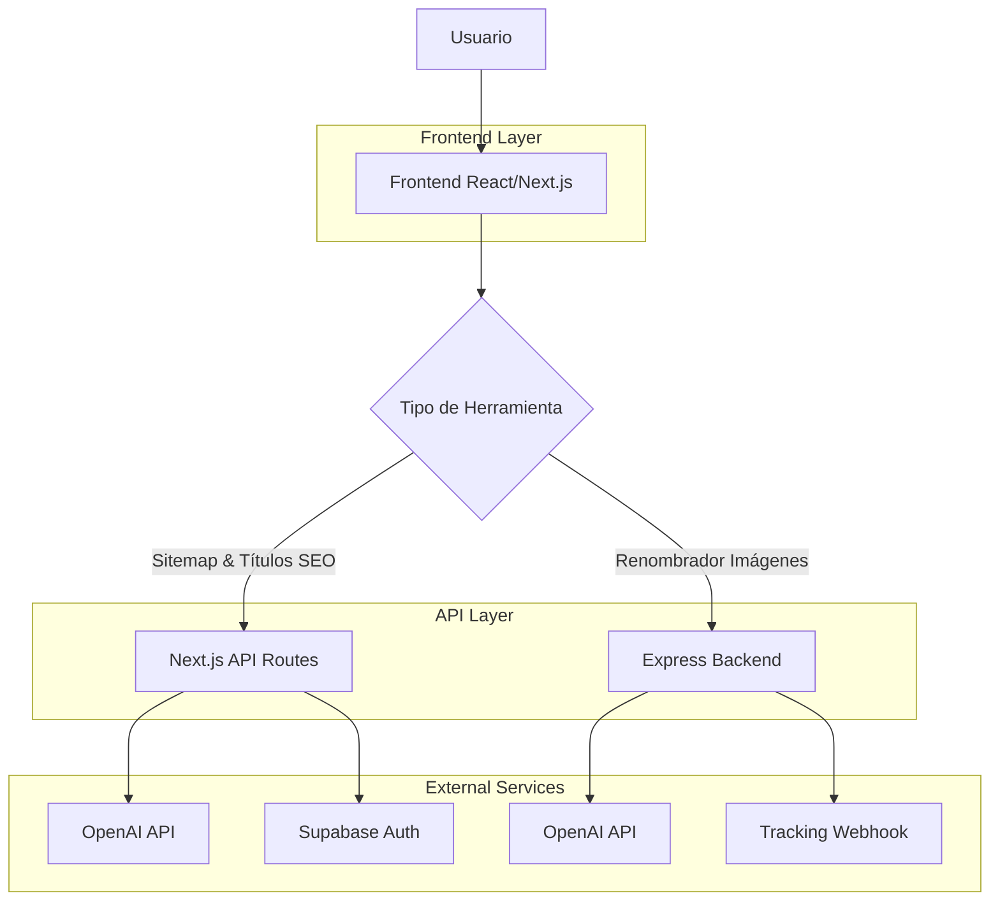
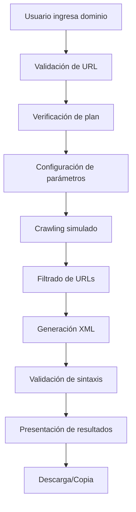
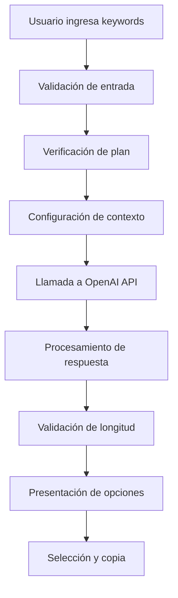
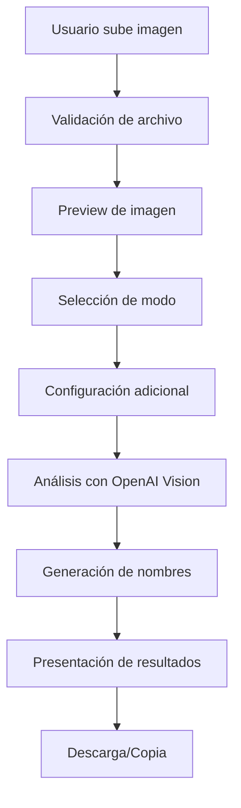

# Implementación Completa de Herramientas SEO Prioritarias

## 1. Arquitectura General



## 2. Descripción de Tecnologías

- **Frontend**: React 18 + Next.js 14 + TypeScript + Tailwind CSS
- **API Routes**: Next.js API Routes (Sitemap & Títulos SEO)
- **Backend**: Express.js + TypeScript (Renombrador de Imágenes)
- **Base de Datos**: Supabase (PostgreSQL)
- **IA**: OpenAI GPT-4 API
- **Autenticación**: Supabase Auth
- **Tracking**: Webhook personalizado

## 3. Herramientas a Completar

### 3.1 Generador de Sitemap XML

**Estado Actual**: ✅ Interfaz completa, ✅ API implementada
**Ruta**: `/generador-sitemap-xml/`
**API**: `/apps/web/app/api/seo/sitemap-generator/route.ts`

| Componente | Estado | Descripción |
|------------|--------|-------------|
| Frontend | ✅ Completo | Interfaz con configuración, validación y descarga |
| API | ✅ Implementada | Generación XML, validación, estadísticas |
| Autenticación | ✅ Integrada | Control de planes y límites |
| Tracking | ✅ Configurado | Registro de uso de herramienta |

**Funcionalidades**:
- Configuración de sitemap (frecuencia, prioridad, exclusiones)
- Crawling simulado de URLs
- Generación de XML válido
- Validación de sintaxis
- Descarga y copia al portapapeles
- Estadísticas de URLs procesadas

### 3.2 Generador de Títulos SEO

**Estado Actual**: ✅ Interfaz completa, ✅ API implementada
**Ruta**: `/generar-titulo-seo/`
**API**: `/apps/web/app/api/generar-titulos-seo/route.ts`

| Componente | Estado | Descripción |
|------------|--------|-------------|
| Frontend | ✅ Completo | Formulario con keywords, contexto y tono |
| API | ✅ Implementada | Integración con OpenAI para generación |
| Autenticación | ✅ Integrada | Control de planes y límites |
| Tracking | ✅ Configurado | Registro de uso de herramienta |

**Funcionalidades**:
- Input de keywords principales
- Contexto del negocio/página
- Selección de tono (profesional, casual, técnico)
- Generación de múltiples opciones de títulos
- Generación de meta descripciones
- Análisis de longitud óptima

### 3.3 Renombrador de Imágenes

**Estado Actual**: ✅ Interfaz completa, ✅ API implementada
**Ruta**: `/renombrador-images/`
**API**: `/packages/api/tools/renombrar/index.ts` (Express Backend)

| Componente | Estado | Descripción |
|------------|--------|-------------|
| Frontend | ✅ Completo | Upload, preview, modos de optimización |
| API | ✅ Implementada | Análisis de imagen con OpenAI Vision |
| Autenticación | ⚠️ Pendiente | Integrar control de planes |
| Tracking | ✅ Configurado | Registro de uso de herramienta |

**Funcionalidades**:
- Upload de imágenes (JPG, PNG, WEBP)
- Preview de imagen
- Modos: Web, E-commerce, SEO Local
- Análisis visual con IA
- Generación de nombres SEO
- Generación de texto alternativo
- Optimización por contexto geográfico

## 4. Definiciones de API

### 4.1 Sitemap Generator API

```typescript
POST /api/seo/sitemap-generator

Request:
{
  domain: string;
  maxUrls?: number;
  changeFreq?: 'always' | 'hourly' | 'daily' | 'weekly' | 'monthly' | 'yearly' | 'never';
  priority?: number;
  excludePatterns?: string[];
}

Response:
{
  success: boolean;
  sitemap?: string;
  stats?: {
    totalUrls: number;
    processedUrls: number;
    excludedUrls: number;
  };
  error?: string;
}
```

### 4.2 SEO Title Generator API

```typescript
POST /api/generar-titulos-seo

Request:
{
  keywords: string;
  context?: string;
  tone?: 'profesional' | 'casual' | 'tecnico';
}

Response:
{
  success: boolean;
  titles?: string[];
  descriptions?: string[];
  error?: string;
}
```

### 4.3 Image Renamer API

```typescript
POST /api/renombrar (Express Backend - Port 3001)

Request: FormData
{
  image: File;
  modo: 'web' | 'ecommerce' | 'local';
  keyword?: string;
  ciudad?: string;
}

Response:
{
  nombre_seo: string;
  alt_text: string;
}
```

## 5. Flujo de Procesos

### 5.1 Flujo del Generador de Sitemap



### 5.2 Flujo del Generador de Títulos SEO



### 5.3 Flujo del Renombrador de Imágenes



## 6. Diseño de Interfaz

### 6.1 Estilo de Diseño

- **Colores Primarios**: 
  - Primary: `hsl(var(--primary))` - Azul principal
  - Secondary: `hsl(var(--secondary))` - Gris secundario
  - Success: `hsl(var(--success))` - Verde para éxito
  - Destructive: `hsl(var(--destructive))` - Rojo para errores

- **Tipografía**: 
  - Títulos: `font-bold text-4xl md:text-5xl`
  - Subtítulos: `text-lg text-muted-foreground`
  - Código: `font-mono text-sm`

- **Componentes**:
  - Botones: Redondeados con sombras y transiciones
  - Cards: Bordes suaves, sombras sutiles
  - Inputs: Bordes con focus states
  - Loading: Spinners animados

### 6.2 Elementos de UI por Herramienta

| Herramienta | Elementos Clave | Estilo Específico |
|-------------|-----------------|-------------------|
| Sitemap Generator | Configuración avanzada, progress bar, XML preview | Cards expandibles, código con syntax highlighting |
| SEO Title Generator | Formulario multi-step, opciones múltiples | Grid de resultados, badges de longitud |
| Image Renamer | Drag & drop, preview, modos visuales | Upload zone destacada, cards de modo |

## 7. Modelo de Datos

### 7.1 Tracking de Uso

```sql
-- Tabla para tracking de herramientas
CREATE TABLE tool_usage (
    id UUID PRIMARY KEY DEFAULT gen_random_uuid(),
    tool_name VARCHAR(100) NOT NULL,
    tool_slug VARCHAR(100) NOT NULL,
    user_id UUID REFERENCES auth.users(id),
    used_at TIMESTAMP WITH TIME ZONE DEFAULT NOW(),
    user_agent TEXT,
    language VARCHAR(10),
    metadata JSONB,
    created_at TIMESTAMP WITH TIME ZONE DEFAULT NOW()
);

-- Índices para optimización
CREATE INDEX idx_tool_usage_tool_slug ON tool_usage(tool_slug);
CREATE INDEX idx_tool_usage_user_id ON tool_usage(user_id);
CREATE INDEX idx_tool_usage_used_at ON tool_usage(used_at DESC);
```

### 7.2 Configuración de Herramientas

```sql
-- Tabla para configuraciones de usuario
CREATE TABLE user_tool_configs (
    id UUID PRIMARY KEY DEFAULT gen_random_uuid(),
    user_id UUID REFERENCES auth.users(id),
    tool_slug VARCHAR(100) NOT NULL,
    config JSONB NOT NULL,
    created_at TIMESTAMP WITH TIME ZONE DEFAULT NOW(),
    updated_at TIMESTAMP WITH TIME ZONE DEFAULT NOW()
);

-- Índice único por usuario y herramienta
CREATE UNIQUE INDEX idx_user_tool_configs_unique ON user_tool_configs(user_id, tool_slug);
```

## 8. Plan de Implementación

### Fase 1: Verificación y Testing ✅
- [x] Verificar APIs existentes
- [x] Confirmar integración frontend-backend
- [x] Validar flujos de autenticación

### Fase 2: Mejoras y Optimización 🔄
- [ ] Mejorar manejo de errores
- [ ] Optimizar tiempos de respuesta
- [ ] Añadir validaciones adicionales
- [ ] Implementar caché cuando sea apropiado

### Fase 3: Testing Integral 📋
- [ ] Testing de cada herramienta individualmente
- [ ] Testing de integración con autenticación
- [ ] Testing de límites de plan
- [ ] Testing de tracking de uso

### Fase 4: Documentación y Deploy 🚀
- [ ] Documentación de usuario
- [ ] Guías de troubleshooting
- [ ] Deploy y monitoreo

## 9. Consideraciones Técnicas

### 9.1 Seguridad
- Validación de archivos subidos (tipo, tamaño)
- Sanitización de URLs y inputs
- Rate limiting en APIs
- Autenticación en todas las rutas protegidas

### 9.2 Performance
- Optimización de imágenes en frontend
- Caché de resultados cuando sea apropiado
- Lazy loading de componentes pesados
- Compresión de respuestas API

### 9.3 Escalabilidad
- Separación clara entre frontend y backend
- APIs stateless
- Manejo eficiente de archivos temporales
- Monitoreo de uso de recursos

## 10. Métricas de Éxito

- **Funcionalidad**: 100% de herramientas operativas
- **Performance**: Tiempo de respuesta < 3 segundos
- **Usabilidad**: Flujo completo sin errores
- **Tracking**: Registro correcto de todas las interacciones
- **Escalabilidad**: Soporte para múltiples usuarios concurrentes