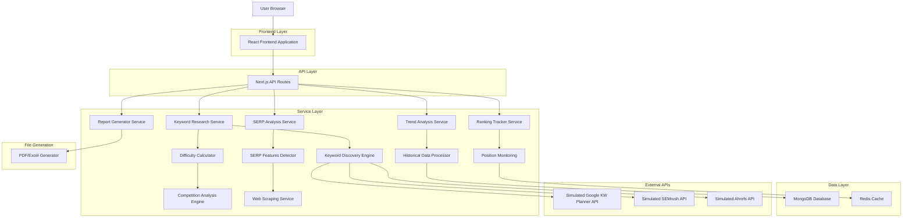
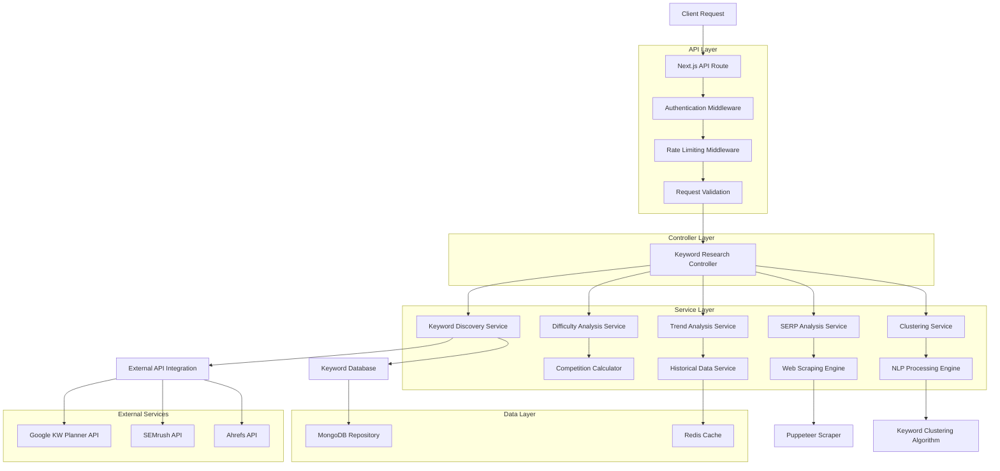
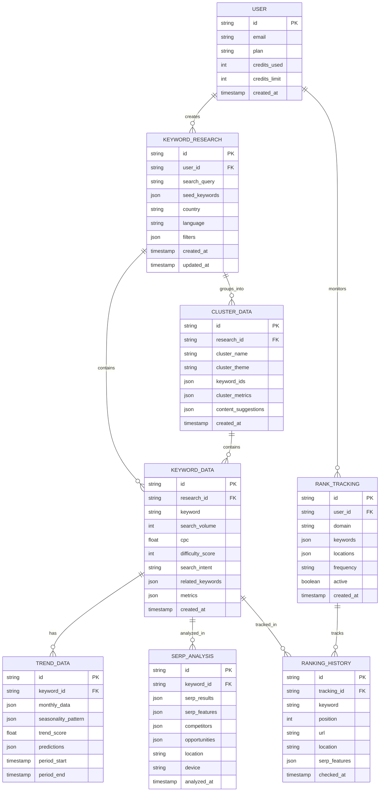

# Keyword Research Tool - Documentación de Arquitectura Técnica

## 1. Diseño de Arquitectura



## 2. Descripción de Tecnologías

- **Frontend**: React@18 + Next.js@14 + TypeScript + Tailwind CSS + Recharts + React Query + Framer Motion
- **Backend**: Next.js API Routes + Node.js + Express middleware
- **Base de Datos**: MongoDB Atlas (datos principales) + Redis (cache y rankings en tiempo real)
- **Servicios Externos**: APIs simuladas de Google KW Planner + SEMrush + Ahrefs + Web Scraping
- **Generación de Reportes**: jsPDF + ExcelJS + Chart.js para gráficos
- **Autenticación**: NextAuth.js + JWT + Rate limiting
- **Análisis de Datos**: Natural Language Processing para clustering + Machine Learning para predicciones

## 3. Definiciones de Rutas

| Ruta | Propósito |
|------|-----------|
| /keyword-research | Dashboard principal con métricas y keywords monitoreadas |
| /keyword-research/discover | Investigación y descubrimiento de nuevas keywords |
| /keyword-research/difficulty | Análisis detallado de dificultad de keywords |
| /keyword-research/trends | Análisis de tendencias temporales y estacionalidad |
| /keyword-research/clustering | Agrupación automática de keywords por temas |
| /keyword-research/serp-analysis | Análisis detallado de SERP features y competidores |
| /keyword-research/rank-tracking | Seguimiento de posiciones de keywords |
| /keyword-research/reports | Generador y historial de reportes |
| /keyword-research/alerts | Configuración y historial de alertas |
| /keyword-research/settings | Configuración de herramienta y preferencias |

## 4. Definiciones de API

### 4.1 APIs Principales

**Investigación de Keywords**
```
POST /api/keyword-research/discover
```

Request:
| Nombre Parámetro | Tipo Parámetro | Requerido | Descripción |
|------------------|----------------|-----------|-------------|
| seedKeywords | string[] | true | Array de keywords semilla para investigación |
| country | string | false | Código de país (default: 'US') |
| language | string | false | Código de idioma (default: 'en') |
| includeRelated | boolean | false | Incluir keywords relacionadas (default: true) |
| includeLongTail | boolean | false | Incluir keywords de cola larga (default: true) |
| minVolume | number | false | Volumen mínimo de búsqueda (default: 10) |
| maxDifficulty | number | false | Dificultad máxima (1-100, default: 100) |

Response:
| Nombre Parámetro | Tipo Parámetro | Descripción |
|------------------|----------------|-------------|
| keywords | KeywordData[] | Array de keywords con métricas completas |
| totalFound | number | Total de keywords encontradas |
| searchId | string | ID único de la búsqueda para cache |
| suggestions | SuggestionData[] | Sugerencias adicionales de keywords |

Ejemplo Request:
```json
{
  "seedKeywords": ["seo tools", "keyword research"],
  "country": "US",
  "language": "en",
  "includeRelated": true,
  "includeLongTail": true,
  "minVolume": 100,
  "maxDifficulty": 70
}
```

**Análisis de Dificultad**
```
POST /api/keyword-research/difficulty/analyze
```

Request:
| Nombre Parámetro | Tipo Parámetro | Requerido | Descripción |
|------------------|----------------|-----------|-------------|
| keywords | string[] | true | Array de keywords para analizar |
| includeSerp | boolean | false | Incluir análisis SERP (default: true) |
| includeCompetitors | boolean | false | Incluir análisis de competidores (default: true) |

Response:
| Nombre Parámetro | Tipo Parámetro | Descripción |
|------------------|----------------|-------------|
| difficultyScores | DifficultyData[] | Scores de dificultad por keyword |
| serpAnalysis | SerpData[] | Análisis de SERP por keyword |
| opportunities | OpportunityData[] | Oportunidades identificadas |
| recommendations | RecommendationData[] | Recomendaciones estratégicas |

**Análisis de Tendencias**
```
POST /api/keyword-research/trends/analyze
```

Request:
| Nombre Parámetro | Tipo Parámetro | Requerido | Descripción |
|------------------|----------------|-----------|-------------|
| keywords | string[] | true | Keywords para análisis de tendencias |
| timeRange | string | false | Rango temporal: '3m', '6m', '12m', '24m' (default: '12m') |
| includeSeasonality | boolean | false | Incluir análisis de estacionalidad (default: true) |
| includePredictions | boolean | false | Incluir predicciones (default: false) |

Response:
| Nombre Parámetro | Tipo Parámetro | Descripción |
|------------------|----------------|-------------|
| trendData | TrendData[] | Datos históricos de tendencias |
| seasonalityPatterns | SeasonalityData[] | Patrones de estacionalidad detectados |
| predictions | PredictionData[] | Predicciones de volumen futuro |
| insights | InsightData[] | Insights automáticos sobre tendencias |

**Clustering de Keywords**
```
POST /api/keyword-research/clustering/generate
```

Request:
| Nombre Parámetro | Tipo Parámetro | Requerido | Descripción |
|------------------|----------------|-----------|-------------|
| keywords | KeywordInput[] | true | Keywords con métricas para clustering |
| clusteringMethod | string | false | Método: 'semantic', 'intent', 'difficulty' (default: 'semantic') |
| maxClusters | number | false | Número máximo de clusters (default: 20) |
| minClusterSize | number | false | Tamaño mínimo de cluster (default: 3) |

Response:
| Nombre Parámetro | Tipo Parámetro | Descripción |
|------------------|----------------|-------------|
| clusters | ClusterData[] | Clusters generados con keywords agrupadas |
| clusterMetrics | ClusterMetrics[] | Métricas agregadas por cluster |
| recommendations | ClusterRecommendation[] | Recomendaciones de contenido por cluster |

**Análisis SERP**
```
POST /api/keyword-research/serp/analyze
```

Request:
| Nombre Parámetro | Tipo Parámetro | Requerido | Descripción |
|------------------|----------------|-----------|-------------|
| keyword | string | true | Keyword para análisis SERP |
| location | string | false | Ubicación geográfica (default: 'US') |
| device | string | false | Dispositivo: 'desktop', 'mobile' (default: 'desktop') |
| includeFeatures | boolean | false | Incluir SERP features (default: true) |

Response:
| Nombre Parámetro | Tipo Parámetro | Descripción |
|------------------|----------------|-------------|
| serpResults | SerpResult[] | Top 10 resultados orgánicos |
| serpFeatures | SerpFeature[] | Features detectadas (snippets, PAA, etc.) |
| competitors | CompetitorData[] | Análisis de competidores en SERP |
| opportunities | SerpOpportunity[] | Oportunidades identificadas |

**Seguimiento de Rankings**
```
POST /api/keyword-research/rank-tracking/setup
```

Request:
| Nombre Parámetro | Tipo Parámetro | Requerido | Descripción |
|------------------|----------------|-----------|-------------|
| domain | string | true | Dominio para trackear |
| keywords | string[] | true | Keywords para monitorear |
| locations | string[] | false | Ubicaciones para trackeo (default: ['US']) |
| frequency | string | false | Frecuencia: 'daily', 'weekly' (default: 'daily') |

Response:
| Nombre Parámetro | Tipo Parámetro | Descripción |
|------------------|----------------|-------------|
| trackingId | string | ID único del tracking configurado |
| estimatedCredits | number | Créditos estimados por mes |
| trackingStatus | string | Estado de la configuración |

**Generación de Reportes**
```
POST /api/keyword-research/reports/generate
```

Request:
| Nombre Parámetro | Tipo Parámetro | Requerido | Descripción |
|------------------|----------------|-----------|-------------|
| reportType | string | true | Tipo: 'discovery', 'difficulty', 'trends', 'comprehensive' |
| keywords | string[] | true | Keywords para incluir en el reporte |
| format | string | true | Formato: 'pdf', 'excel', 'csv' |
| includeCharts | boolean | false | Incluir gráficos (default: true) |
| customSections | string[] | false | Secciones personalizadas a incluir |

Response:
| Nombre Parámetro | Tipo Parámetro | Descripción |
|------------------|----------------|-------------|
| reportId | string | ID único del reporte |
| downloadUrl | string | URL de descarga del reporte |
| expiresAt | string | Fecha de expiración del enlace |

## 5. Arquitectura del Servidor



## 6. Modelo de Datos

### 6.1 Definición del Modelo de Datos



### 6.2 Lenguaje de Definición de Datos

**Tabla de Investigación de Keywords (keyword_research)**
```sql
-- Crear tabla
CREATE TABLE keyword_research (
    id UUID PRIMARY KEY DEFAULT gen_random_uuid(),
    user_id UUID NOT NULL,
    search_query VARCHAR(500) NOT NULL,
    seed_keywords JSONB NOT NULL,
    country VARCHAR(2) DEFAULT 'US',
    language VARCHAR(2) DEFAULT 'en',
    filters JSONB DEFAULT '{}',
    total_keywords INTEGER DEFAULT 0,
    status VARCHAR(20) DEFAULT 'completed',
    created_at TIMESTAMP WITH TIME ZONE DEFAULT NOW(),
    updated_at TIMESTAMP WITH TIME ZONE DEFAULT NOW()
);

-- Crear índices
CREATE INDEX idx_keyword_research_user_id ON keyword_research(user_id);
CREATE INDEX idx_keyword_research_created_at ON keyword_research(created_at DESC);
CREATE INDEX idx_keyword_research_country ON keyword_research(country);

-- Datos iniciales
INSERT INTO keyword_research (user_id, search_query, seed_keywords, country, total_keywords) VALUES
('550e8400-e29b-41d4-a716-446655440000', 'SEO Tools Research', '["seo tools", "keyword research", "backlink checker"]', 'US', 150),
('550e8400-e29b-41d4-a716-446655440001', 'E-commerce Keywords', '["online store", "buy online", "ecommerce platform"]', 'US', 200);
```

**Tabla de Datos de Keywords (keyword_data)**
```sql
-- Crear tabla
CREATE TABLE keyword_data (
    id UUID PRIMARY KEY DEFAULT gen_random_uuid(),
    research_id UUID NOT NULL REFERENCES keyword_research(id),
    keyword VARCHAR(200) NOT NULL,
    search_volume INTEGER DEFAULT 0,
    cpc DECIMAL(10,2) DEFAULT 0.00,
    difficulty_score INTEGER DEFAULT 0 CHECK (difficulty_score >= 0 AND difficulty_score <= 100),
    search_intent VARCHAR(20) DEFAULT 'informational',
    related_keywords JSONB DEFAULT '[]',
    metrics JSONB DEFAULT '{}',
    created_at TIMESTAMP WITH TIME ZONE DEFAULT NOW()
);

-- Crear índices
CREATE INDEX idx_keyword_data_research_id ON keyword_data(research_id);
CREATE INDEX idx_keyword_data_keyword ON keyword_data(keyword);
CREATE INDEX idx_keyword_data_search_volume ON keyword_data(search_volume DESC);
CREATE INDEX idx_keyword_data_difficulty ON keyword_data(difficulty_score);

-- Datos iniciales
INSERT INTO keyword_data (research_id, keyword, search_volume, cpc, difficulty_score, search_intent) VALUES
('550e8400-e29b-41d4-a716-446655440010', 'seo tools', 12000, 3.45, 65, 'commercial'),
('550e8400-e29b-41d4-a716-446655440010', 'keyword research tool', 8500, 4.20, 58, 'commercial'),
('550e8400-e29b-41d4-a716-446655440010', 'backlink checker free', 5200, 2.80, 45, 'commercial');
```

**Tabla de Datos de Tendencias (trend_data)**
```sql
-- Crear tabla
CREATE TABLE trend_data (
    id UUID PRIMARY KEY DEFAULT gen_random_uuid(),
    keyword_id UUID NOT NULL REFERENCES keyword_data(id),
    monthly_data JSONB NOT NULL,
    seasonality_pattern JSONB DEFAULT '{}',
    trend_score DECIMAL(5,2) DEFAULT 0.00,
    predictions JSONB DEFAULT '{}',
    period_start DATE NOT NULL,
    period_end DATE NOT NULL,
    created_at TIMESTAMP WITH TIME ZONE DEFAULT NOW()
);

-- Crear índices
CREATE INDEX idx_trend_data_keyword_id ON trend_data(keyword_id);
CREATE INDEX idx_trend_data_period ON trend_data(period_start, period_end);
CREATE INDEX idx_trend_data_trend_score ON trend_data(trend_score DESC);

-- Datos iniciales
INSERT INTO trend_data (keyword_id, monthly_data, trend_score, period_start, period_end) VALUES
('550e8400-e29b-41d4-a716-446655440020', '[{"month": "2024-01", "volume": 11000}, {"month": "2024-02", "volume": 12500}]', 15.5, '2024-01-01', '2024-12-31');
```

**Tabla de Análisis SERP (serp_analysis)**
```sql
-- Crear tabla
CREATE TABLE serp_analysis (
    id UUID PRIMARY KEY DEFAULT gen_random_uuid(),
    keyword_id UUID NOT NULL REFERENCES keyword_data(id),
    serp_results JSONB NOT NULL,
    serp_features JSONB DEFAULT '[]',
    competitors JSONB DEFAULT '[]',
    opportunities JSONB DEFAULT '[]',
    location VARCHAR(10) DEFAULT 'US',
    device VARCHAR(10) DEFAULT 'desktop',
    analyzed_at TIMESTAMP WITH TIME ZONE DEFAULT NOW()
);

-- Crear índices
CREATE INDEX idx_serp_analysis_keyword_id ON serp_analysis(keyword_id);
CREATE INDEX idx_serp_analysis_location ON serp_analysis(location);
CREATE INDEX idx_serp_analysis_analyzed_at ON serp_analysis(analyzed_at DESC);

-- Datos iniciales
INSERT INTO serp_analysis (keyword_id, serp_results, serp_features, location) VALUES
('550e8400-e29b-41d4-a716-446655440020', '[{"position": 1, "url": "https://ahrefs.com", "title": "Ahrefs SEO Tools"}]', '["featured_snippet", "people_also_ask"]', 'US');
```

**Tabla de Clusters (cluster_data)**
```sql
-- Crear tabla
CREATE TABLE cluster_data (
    id UUID PRIMARY KEY DEFAULT gen_random_uuid(),
    research_id UUID NOT NULL REFERENCES keyword_research(id),
    cluster_name VARCHAR(100) NOT NULL,
    cluster_theme VARCHAR(200),
    keyword_ids JSONB NOT NULL,
    cluster_metrics JSONB DEFAULT '{}',
    content_suggestions JSONB DEFAULT '[]',
    created_at TIMESTAMP WITH TIME ZONE DEFAULT NOW()
);

-- Crear índices
CREATE INDEX idx_cluster_data_research_id ON cluster_data(research_id);
CREATE INDEX idx_cluster_data_cluster_name ON cluster_data(cluster_name);

-- Datos iniciales
INSERT INTO cluster_data (research_id, cluster_name, cluster_theme, keyword_ids) VALUES
('550e8400-e29b-41d4-a716-446655440010', 'SEO Tools Cluster', 'Commercial SEO Software', '["550e8400-e29b-41d4-a716-446655440020", "550e8400-e29b-41d4-a716-446655440021"]');
```

**Tabla de Seguimiento de Rankings (rank_tracking)**
```sql
-- Crear tabla
CREATE TABLE rank_tracking (
    id UUID PRIMARY KEY DEFAULT gen_random_uuid(),
    user_id UUID NOT NULL,
    domain VARCHAR(255) NOT NULL,
    keywords JSONB NOT NULL,
    locations JSONB DEFAULT '["US"]',
    frequency VARCHAR(10) DEFAULT 'daily',
    active BOOLEAN DEFAULT true,
    created_at TIMESTAMP WITH TIME ZONE DEFAULT NOW(),
    updated_at TIMESTAMP WITH TIME ZONE DEFAULT NOW()
);

-- Crear índices
CREATE INDEX idx_rank_tracking_user_id ON rank_tracking(user_id);
CREATE INDEX idx_rank_tracking_domain ON rank_tracking(domain);
CREATE INDEX idx_rank_tracking_active ON rank_tracking(active);

-- Datos iniciales
INSERT INTO rank_tracking (user_id, domain, keywords, frequency) VALUES
('550e8400-e29b-41d4-a716-446655440000', 'example.com', '["seo tools", "keyword research"]', 'daily');
```

**Tabla de Historial de Rankings (ranking_history)**
```sql
-- Crear tabla
CREATE TABLE ranking_history (
    id UUID PRIMARY KEY DEFAULT gen_random_uuid(),
    tracking_id UUID NOT NULL REFERENCES rank_tracking(id),
    keyword VARCHAR(200) NOT NULL,
    position INTEGER DEFAULT 0,
    url VARCHAR(500),
    location VARCHAR(10) DEFAULT 'US',
    serp_features JSONB DEFAULT '[]',
    checked_at TIMESTAMP WITH TIME ZONE DEFAULT NOW()
);

-- Crear índices
CREATE INDEX idx_ranking_history_tracking_id ON ranking_history(tracking_id);
CREATE INDEX idx_ranking_history_keyword ON ranking_history(keyword);
CREATE INDEX idx_ranking_history_checked_at ON ranking_history(checked_at DESC);
CREATE INDEX idx_ranking_history_position ON ranking_history(position);

-- Datos iniciales
INSERT INTO ranking_history (tracking_id, keyword, position, url, checked_at) VALUES
('550e8400-e29b-41d4-a716-446655440030', 'seo tools', 15, 'https://example.com/seo-tools', NOW() - INTERVAL '1 day'),
('550e8400-e29b-41d4-a716-446655440030', 'seo tools', 12, 'https://example.com/seo-tools', NOW());
```