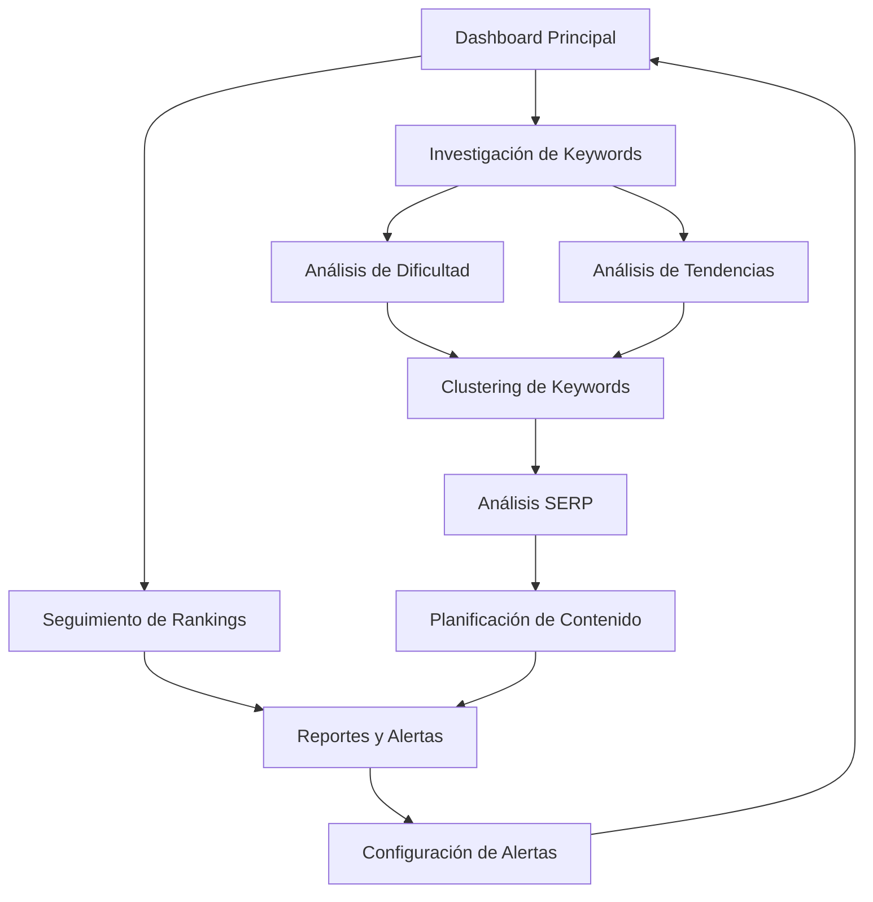

# Keyword Research Tool - Documento de Requisitos del Producto

## 1. Visión General del Producto

Herramienta avanzada de investigación de palabras clave que permite a los usuarios descubrir, analizar y optimizar keywords para maximizar su estrategia SEO y PPC mediante datos precisos de volumen, dificultad y tendencias.

- **Propósito Principal**: Proporcionar investigación completa de keywords con métricas avanzadas para optimizar estrategias de contenido y SEO
- **Usuarios Objetivo**: Especialistas SEO, content marketers, agencias digitales y empresas que buscan dominar nichos específicos
- **Valor de Mercado**: Herramienta fundamental para estrategias de contenido data-driven que puede incrementar el tráfico orgánico 50-80%

## 2. Características Principales

### 2.1 Roles de Usuario

| Rol | Método de Registro | Permisos Principales |
|-----|-------------------|---------------------|
| Usuario Básico | Registro por email | Investigación de hasta 50 keywords/día, datos básicos de volumen |
| Usuario Premium | Upgrade con plan de pago | Investigación ilimitada, datos históricos, análisis SERP, exportación |
| Usuario Enterprise | Contacto comercial | API access, análisis masivo, alertas automáticas, reportes personalizados |

### 2.2 Módulos de Funcionalidad

Nuestra herramienta de investigación de keywords consta de las siguientes páginas principales:

1. **Dashboard Principal**: Panel de control con métricas de keywords monitoreadas, tendencias y alertas
2. **Investigación de Keywords**: Descubrimiento de nuevas keywords con sugerencias y métricas
3. **Análisis de Dificultad**: Evaluación detallada de competitividad y oportunidades de ranking
4. **Análisis de Tendencias**: Estacionalidad, tendencias temporales y predicciones de volumen
5. **Clustering de Keywords**: Agrupación automática por temas y intención de búsqueda
6. **Análisis SERP**: Análisis detallado de resultados de búsqueda y features
7. **Seguimiento de Rankings**: Monitoreo de posiciones para keywords objetivo
8. **Generador de Reportes**: Creación de reportes personalizados y exportación de datos
9. **Configuración de Alertas**: Notificaciones automáticas por cambios en métricas

### 2.3 Detalles de Páginas

| Nombre de Página | Nombre del Módulo | Descripción de Funcionalidad |
|------------------|-------------------|------------------------------|
| Dashboard Principal | Panel de Métricas | Mostrar resumen de keywords monitoreadas, cambios recientes, alertas activas |
| Dashboard Principal | Tendencias Generales | Visualizar tendencias de volumen, nuevas oportunidades, keywords trending |
| Investigación de Keywords | Formulario de Búsqueda | Ingresar seed keywords, configurar filtros de país/idioma, seleccionar métricas |
| Investigación de Keywords | Resultados y Sugerencias | Mostrar keywords relacionadas, volumen de búsqueda, CPC, dificultad, intención |
| Análisis de Dificultad | Evaluación de Competitividad | Analizar top 10 SERP, métricas de autoridad, análisis de contenido competidor |
| Análisis de Dificultad | Oportunidades de Ranking | Identificar gaps de contenido, keywords de baja competencia, nichos sin explotar |
| Análisis de Tendencias | Datos Históricos | Mostrar tendencias de 12 meses, estacionalidad, picos de búsqueda |
| Análisis de Tendencias | Predicciones | Proyecciones de volumen, identificación de tendencias emergentes |
| Clustering de Keywords | Agrupación Automática | Agrupar keywords por temas, intención, dificultad similar |
| Clustering de Keywords | Gestión de Clusters | Editar grupos, asignar prioridades, planificar contenido por cluster |
| Análisis SERP | Features de Búsqueda | Identificar featured snippets, PAA, imágenes, videos, local pack |
| Análisis SERP | Análisis Competitivo | Analizar competidores en top 10, gaps de contenido, oportunidades |
| Seguimiento de Rankings | Configuración de Tracking | Agregar keywords para monitoreo, configurar frecuencia, seleccionar ubicaciones |
| Seguimiento de Rankings | Dashboard de Posiciones | Visualizar rankings actuales, cambios históricos, distribución de posiciones |
| Reportes | Generador Personalizado | Crear reportes por proyecto, seleccionar métricas, configurar periodicidad |
| Reportes | Exportación de Datos | Exportar en CSV/Excel/PDF, compartir reportes, integración con herramientas |
| Alertas | Configuración de Monitoreo | Configurar alertas por cambios de volumen, nuevas keywords, cambios de dificultad |
| Alertas | Historial de Notificaciones | Ver alertas pasadas, análisis de cambios, respuestas automáticas |

## 3. Proceso Principal

### Flujo de Usuario Regular:
1. **Investigación Inicial**: Usuario ingresa seed keywords y configura parámetros de búsqueda
2. **Análisis de Resultados**: Examina sugerencias de keywords con métricas de volumen, dificultad y CPC
3. **Evaluación de Dificultad**: Analiza competitividad y oportunidades de ranking para keywords seleccionadas
4. **Análisis de Tendencias**: Revisa datos históricos y estacionalidad para planificación temporal
5. **Clustering de Keywords**: Agrupa keywords por temas para estrategia de contenido
6. **Análisis SERP**: Examina features de búsqueda y competidores en resultados
7. **Configuración de Tracking**: Establece seguimiento para keywords prioritarias
8. **Generación de Reportes**: Crea reportes para stakeholders y planificación

### Flujo de Usuario Premium:
1. **Investigación Masiva**: Analiza miles de keywords simultáneamente
2. **Análisis Histórico Avanzado**: Accede a datos de 24+ meses y tendencias detalladas
3. **Clustering Automático**: Utiliza IA para agrupación inteligente de keywords
4. **Alertas Avanzadas**: Recibe notificaciones automáticas por cambios críticos
5. **API Integration**: Integra datos con herramientas propias via API
6. **Reportes Automatizados**: Genera reportes periódicos automáticos

## 4. Diseño de Interfaz de Usuario

### 4.1 Estilo de Diseño

- **Colores Primarios**: #2563eb (azul principal), #1e40af (azul secundario)
- **Colores de Métricas**: #10b981 (verde alto volumen), #f59e0b (amarillo medio), #ef4444 (rojo baja oportunidad)
- **Estilo de Botones**: Redondeados con gradientes sutiles, efectos hover animados
- **Tipografía**: Inter para títulos (16-28px), system fonts para datos (12-16px)
- **Estilo de Layout**: Dashboard con cards modulares, tablas de datos prominentes, gráficos interactivos
- **Iconos**: Heroicons + iconos específicos de SEO (lupa, gráficos, keywords, tendencias)

### 4.2 Resumen de Diseño de Páginas

| Nombre de Página | Nombre del Módulo | Elementos de UI |
|------------------|-------------------|-----------------|
| Dashboard Principal | Panel de Métricas | Cards con números grandes, gráficos de líneas para tendencias, heat map de oportunidades |
| Dashboard Principal | Tendencias Generales | Gráficos de área para volúmenes, lista de keywords trending con badges |
| Investigación de Keywords | Formulario de Búsqueda | Input con autocompletado, filtros avanzados en sidebar, botón de búsqueda prominente |
| Investigación de Keywords | Resultados y Sugerencias | Tabla sorteable con métricas coloridas, badges de intención, gráficos sparkline |
| Análisis de Dificultad | Evaluación de Competitividad | Medidor circular de dificultad, tabla de competidores con thumbnails |
| Análisis de Dificultad | Oportunidades de Ranking | Cards de oportunidades con scores, filtros por dificultad, botones de acción |
| Análisis de Tendencias | Datos Históricos | Gráfico de líneas interactivo, selector de rango temporal, indicadores de estacionalidad |
| Análisis de Tendencias | Predicciones | Gráficos con proyecciones, badges de confianza, alertas de tendencias |
| Clustering de Keywords | Agrupación Automática | Vista de clusters con tags coloridos, drag & drop para reorganizar |
| Clustering de Keywords | Gestión de Clusters | Acordeón de grupos, métricas agregadas, botones de planificación |
| Análisis SERP | Features de Búsqueda | Grid de SERP features con iconos, porcentajes de aparición |
| Análisis SERP | Análisis Competitivo | Lista de competidores con métricas, preview de contenido, gaps identificados |
| Seguimiento de Rankings | Configuración de Tracking | Formulario multi-step, preview de configuración, estimación de créditos |
| Seguimiento de Rankings | Dashboard de Posiciones | Tabla con cambios coloridos, gráficos de distribución, filtros avanzados |
| Reportes | Generador Personalizado | Wizard de configuración, preview en tiempo real, templates predefinidos |
| Reportes | Exportación de Datos | Botones de descarga con iconos, opciones de formato, historial de exports |
| Alertas | Configuración de Monitoreo | Toggle switches, sliders para umbrales, preview de condiciones |
| Alertas | Historial de Notificaciones | Timeline de alertas, filtros por tipo, acciones de respuesta rápida |

### 4.3 Responsividad

- **Desktop-first** con adaptación completa a mobile y tablet
- **Tablas responsivas** con scroll horizontal y vista de cards en móvil
- **Gráficos adaptativos** que se redimensionan y simplifican en pantallas pequeñas
- **Navegación móvil** con menú hamburguesa y acceso rápido a funciones principales
- **Touch optimization** para interacciones táctiles en filtros y configuraciones
- **Modo compacto** para visualización de grandes volúmenes de datos en móvil