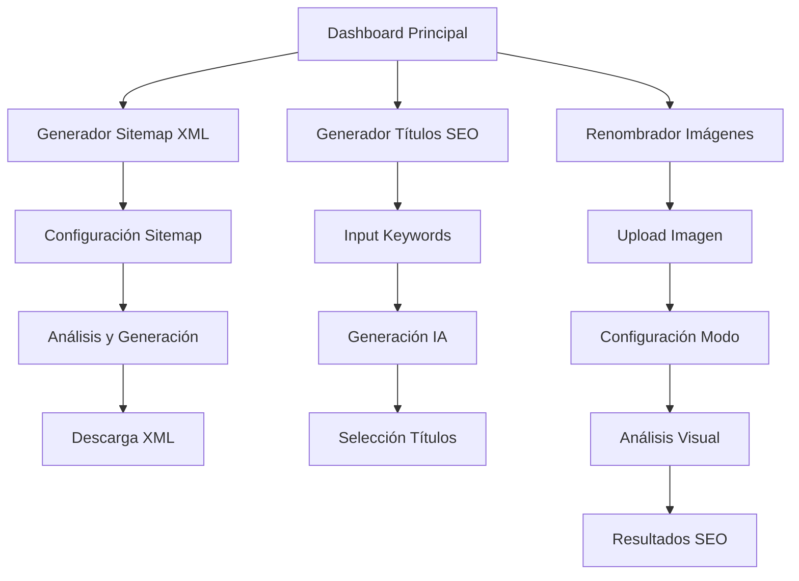

# PRD: Herramientas SEO Prioritarias - Implementación Final

## 1. Resumen del Producto

Este documento especifica la implementación final de tres herramientas SEO de alta prioridad en nuestra plataforma de herramientas de IA. Estas herramientas están diseñadas para proporcionar soluciones completas y profesionales para optimización SEO, dirigidas a marketers digitales, desarrolladores web y propietarios de sitios web que buscan mejorar su posicionamiento en buscadores.

**Objetivo**: Completar la implementación de tres herramientas SEO críticas que ofrezcan funcionalidad profesional, interfaz intuitiva y resultados de alta calidad impulsados por IA.

**Valor del mercado**: Estas herramientas abordan necesidades fundamentales en SEO técnico, optimización de contenido y gestión de assets digitales, con un mercado objetivo de más de 4.7 millones de profesionales SEO globalmente.

## 2. Características Principales

### 2.1 Roles de Usuario

| Rol | Método de Registro | Permisos Principales |
|-----|-------------------|---------------------|
| Usuario Gratuito | Registro por email | Acceso limitado a herramientas (5 usos/mes por herramienta) |
| Usuario Premium | Upgrade de plan | Acceso ilimitado a todas las herramientas y funciones avanzadas |
| Usuario Empresarial | Contacto comercial | Acceso completo + API access + soporte prioritario |

### 2.2 Módulos de Funcionalidad

Nuestros requisitos consisten en las siguientes páginas principales:

1. **Generador de Sitemap XML**: configuración avanzada, crawling inteligente, validación automática, descarga directa
2. **Generador de Títulos SEO**: análisis por IA, múltiples opciones, optimización de longitud, contexto personalizable
3. **Renombrador de Imágenes**: análisis visual por IA, modos especializados, generación de alt text, optimización SEO

### 2.3 Detalles de Páginas

| Nombre de Página | Nombre del Módulo | Descripción de Funcionalidad |
|------------------|-------------------|------------------------------|
| Generador Sitemap XML | Configuración de Sitemap | Configurar dominio, frecuencia de cambio, prioridades, patrones de exclusión |
| Generador Sitemap XML | Motor de Crawling | Simular crawling de sitio web, detectar URLs automáticamente, aplicar filtros |
| Generador Sitemap XML | Generador XML | Crear XML válido según estándares, validar sintaxis, mostrar estadísticas |
| Generador Sitemap XML | Exportación | Descargar archivo XML, copiar al portapapeles, preview del contenido |
| Generador Títulos SEO | Formulario de Input | Ingresar keywords, contexto del negocio, seleccionar tono de comunicación |
| Generador Títulos SEO | Motor de IA | Procesar con OpenAI GPT-4, generar múltiples opciones, optimizar longitud |
| Generador Títulos SEO | Resultados | Mostrar títulos generados, meta descripciones, análisis de longitud |
| Generador Títulos SEO | Gestión de Resultados | Copiar títulos, guardar favoritos, exportar lista completa |
| Renombrador Imágenes | Upload de Imagen | Drag & drop, preview, validación de formato y tamaño |
| Renombrador Imágenes | Configuración | Seleccionar modo (Web/E-commerce/Local), agregar keywords, configurar ubicación |
| Renombrador Imágenes | Análisis Visual | Procesar imagen con OpenAI Vision, analizar contenido, extraer contexto |
| Renombrador Imágenes | Generación de Nombres | Crear nombres SEO optimizados, generar alt text, aplicar mejores prácticas |

## 3. Proceso Principal

### Flujo del Usuario Premium

El usuario accede a cualquiera de las tres herramientas desde el dashboard principal. Para el **Generador de Sitemap XML**, ingresa el dominio de su sitio web, configura parámetros avanzados como frecuencia de cambio y prioridades, ejecuta el análisis que simula un crawling del sitio, revisa las URLs detectadas y filtradas, genera el archivo XML válido, y finalmente descarga o copia el sitemap generado.

Para el **Generador de Títulos SEO**, el usuario ingresa sus keywords principales y contexto del negocio, selecciona el tono deseado (profesional, casual, técnico), ejecuta la generación con IA que produce múltiples opciones de títulos y meta descripciones, revisa las sugerencias con análisis de longitud óptima, y selecciona y copia los títulos preferidos.

En el **Renombrador de Imágenes**, el usuario sube una imagen mediante drag & drop, selecciona el modo de optimización (Web, E-commerce, o SEO Local), agrega keywords relevantes y ubicación si es necesario, ejecuta el análisis visual con IA, recibe nombres SEO optimizados y texto alternativo, y utiliza los resultados para renombrar sus archivos.

### Flujo de Navegación

## 4. Diseño de Interfaz de Usuario

### 4.1 Estilo de Diseño

- **Colores Primarios**: 
  - Azul principal (#3B82F6) para acciones primarias y elementos interactivos
  - Verde éxito (#10B981) para confirmaciones y resultados positivos
- **Colores Secundarios**:
  - Gris neutro (#6B7280) para texto secundario y elementos de soporte
  - Rojo alerta (#EF4444) para errores y advertencias
- **Estilo de Botones**: Redondeados (8px border-radius) con efectos de hover y sombras sutiles
- **Tipografía**: 
  - Títulos: Inter Bold, 32-40px para headers principales
  - Cuerpo: Inter Regular, 16px para contenido general
  - Código: JetBrains Mono, 14px para elementos técnicos
- **Layout**: Diseño basado en cards con espaciado generoso, navegación superior fija
- **Iconografía**: Lucide React icons con estilo minimalista y consistente

### 4.2 Resumen de Diseño de Páginas

| Nombre de Página | Nombre del Módulo | Elementos de UI |
|------------------|-------------------|-----------------|
| Generador Sitemap XML | Configuración Principal | Card principal con formulario estructurado, inputs con labels claros, botones de acción prominentes, color azul primario |
| Generador Sitemap XML | Área de Resultados | Progress bar animado durante procesamiento, tabla de URLs con filtros, preview del XML con syntax highlighting |
| Generador Sitemap XML | Panel de Descarga | Botones de descarga y copia estilizados, estadísticas en cards pequeñas, iconos de estado verde/rojo |
| Generador Títulos SEO | Formulario de Input | Layout de dos columnas, textarea expandible, selector de tono con radio buttons, botón de generación destacado |
| Generador Títulos SEO | Resultados | Grid de cards para cada título generado, badges de longitud con colores semafóricos, botones de copia individuales |
| Renombrador Imágenes | Zona de Upload | Área de drag & drop con bordes punteados, preview de imagen centrado, botón de eliminación en esquina superior |
| Renombrador Imágenes | Configuración | Cards de selección de modo con iconos distintivos, inputs condicionales, layout responsive para móvil |
| Renombrador Imágenes | Resultados | Display de nombres generados en cajas de código, texto alt en formato destacado, botones de copia con feedback visual |

### 4.3 Responsividad

El producto está diseñado con enfoque mobile-first y adaptación completa para desktop. Incluye optimización táctil para dispositivos móviles con botones de tamaño adecuado (mínimo 44px), gestos de swipe para navegación entre resultados, y layouts que se adaptan desde 320px hasta 1920px de ancho. Las interacciones táctiles están optimizadas con feedback visual inmediato y animaciones suaves.

## 5. Especificaciones Técnicas

### 5.1 Requisitos de Performance

- Tiempo de carga inicial: < 2 segundos
- Tiempo de respuesta de APIs: < 3 segundos
- Procesamiento de imágenes: < 5 segundos
- Generación de sitemap: < 10 segundos para sitios de hasta 1000 URLs

### 5.2 Límites por Plan

| Funcionalidad | Plan Gratuito | Plan Premium | Plan Empresarial |
|---------------|---------------|--------------|------------------|
| Generación de Sitemaps | 5/mes | Ilimitado | Ilimitado + API |
| Títulos SEO | 10/mes | Ilimitado | Ilimitado + API |
| Renombrado de Imágenes | 5/mes | Ilimitado | Ilimitado + Batch |
| Tamaño máximo de imagen | 2MB | 10MB | 50MB |
| URLs por sitemap | 100 | 10,000 | 50,000 |

### 5.3 Integración con IA

- **OpenAI GPT-4**: Para generación de títulos SEO y análisis de contexto
- **OpenAI Vision**: Para análisis visual de imágenes y generación de alt text
- **Prompts optimizados**: Específicos para cada caso de uso con contexto SEO
- **Fallbacks**: Sistemas de respaldo en caso de fallas de API externa

## 6. Criterios de Aceptación

### 6.1 Funcionalidad Básica
- ✅ Todas las herramientas deben procesar inputs correctamente
- ✅ Resultados deben generarse en tiempo esperado
- ✅ Errores deben manejarse graciosamente con mensajes claros
- ✅ Tracking de uso debe registrarse correctamente

### 6.2 Experiencia de Usuario
- ✅ Interfaces deben ser intuitivas sin necesidad de tutorial
- ✅ Loading states deben ser claros y informativos
- ✅ Resultados deben ser fáciles de copiar y usar
- ✅ Responsive design debe funcionar en todos los dispositivos

### 6.3 Calidad Técnica
- ✅ APIs deben manejar errores y edge cases
- ✅ Validaciones de input deben ser robustas
- ✅ Performance debe cumplir con métricas establecidas
- ✅ Seguridad debe estar implementada en todos los endpoints

## 7. Roadmap de Lanzamiento

### Semana 1: Finalización Técnica
- Completar testing integral de las tres herramientas
- Optimizar performance y manejo de errores
- Implementar mejoras de UX identificadas

### Semana 2: Testing y QA
- Testing de usuario con casos reales
- Verificación de límites de plan
- Testing de carga y performance

### Semana 3: Documentación y Deploy
- Crear documentación de usuario
- Preparar materiales de marketing
- Deploy a producción con monitoreo

### Semana 4: Lanzamiento y Monitoreo
- Lanzamiento oficial de las herramientas
- Monitoreo de métricas de uso
- Recolección de feedback inicial

## 8. Métricas de Éxito

- **Adopción**: 70% de usuarios registrados usan al menos una herramienta en el primer mes
- **Satisfacción**: Rating promedio > 4.5/5 en feedback de usuario
- **Performance**: 95% de requests completados exitosamente
- **Retención**: 60% de usuarios regresan a usar las herramientas en 30 días
- **Conversión**: 15% de usuarios gratuitos upgraden a premium después de usar las herramientas