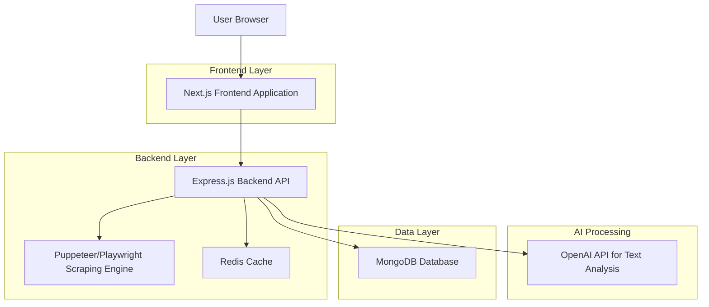
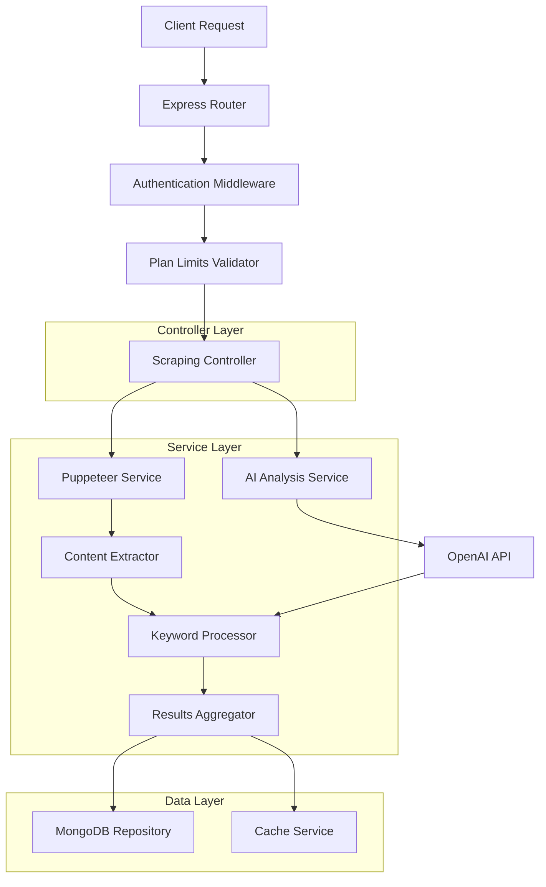
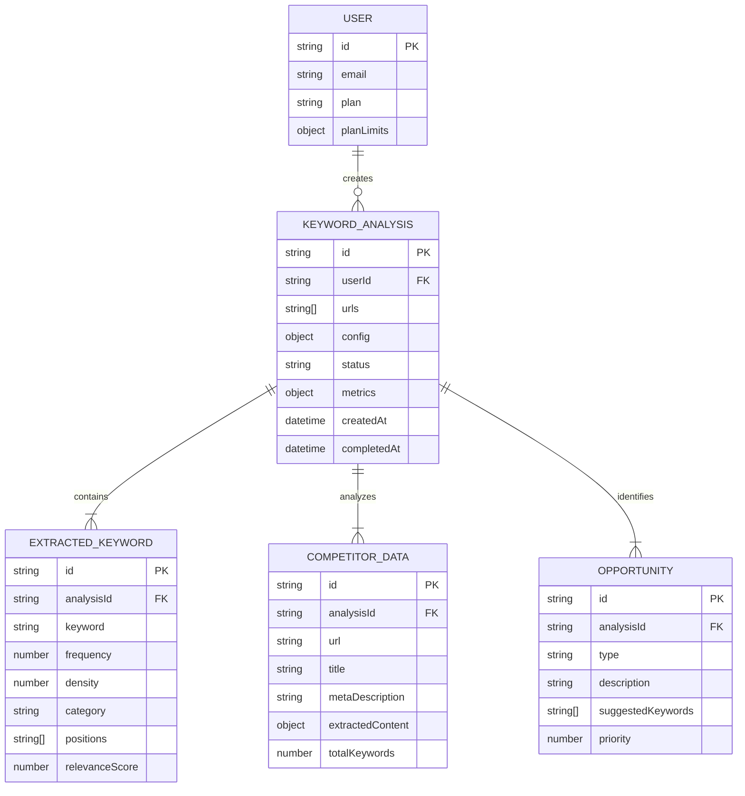

# Scraper de Palabras Clave SEO - Arquitectura Técnica

## 1. Architecture design



## 2. Technology Description

- Frontend: Next.js@14 + TypeScript + Tailwind CSS + Lucide React + Chart.js
- Backend: Express.js@4 + TypeScript + Puppeteer + OpenAI SDK
- Database: MongoDB (via Supabase)
- Cache: Redis para optimización de scraping
- AI Processing: OpenAI GPT-4 para análisis semántico

## 3. Route definitions

| Route | Purpose |
|-------|---------|
| /keyword-scraper | Página principal del scraper con formulario de entrada |
| /keyword-scraper/results/[id] | Página de resultados de análisis específico |
| /keyword-scraper/compare | Página de comparación entre múltiples competidores |
| /keyword-scraper/history | Historial de análisis del usuario |
| /keyword-scraper/export/[id] | Descarga de resultados en CSV/PDF |

## 4. API definitions

### 4.1 Core API

**Iniciar análisis de scraping**
```
POST /api/keyword-scraper/analyze
```

Request:
| Param Name | Param Type | isRequired | Description |
|------------|------------|------------|-------------|
| urls | string[] | true | Array de URLs a analizar (máx 10) |
| depth | number | false | Profundidad de scraping (1-5, default: 1) |
| language | string | false | Idioma de análisis (es, en, default: auto) |
| includeMetaTags | boolean | false | Incluir meta tags en análisis |
| includeHeadings | boolean | false | Incluir headings H1-H6 |
| includeContent | boolean | false | Incluir contenido de párrafos |

Response:
| Param Name | Param Type | Description |
|------------|------------|-------------|
| analysisId | string | ID único del análisis |
| status | string | Estado del procesamiento |
| estimatedTime | number | Tiempo estimado en segundos |

**Obtener resultados de análisis**
```
GET /api/keyword-scraper/results/{analysisId}
```

Response:
| Param Name | Param Type | Description |
|------------|------------|-------------|
| keywords | KeywordData[] | Array de palabras clave extraídas |
| metrics | AnalysisMetrics | Métricas generales del análisis |
| opportunities | Opportunity[] | Oportunidades SEO identificadas |
| competitors | CompetitorData[] | Datos de competidores analizados |

**Exportar resultados**
```
GET /api/keyword-scraper/export/{analysisId}?format={csv|pdf}
```

Request:
| Param Name | Param Type | isRequired | Description |
|------------|------------|------------|-------------|
| format | string | true | Formato de exportación (csv, pdf) |
| includeMetrics | boolean | false | Incluir métricas en exportación |

## 5. Server architecture diagram



## 6. Data model

### 6.1 Data model definition



### 6.2 Data Definition Language

**Keyword Analysis Table**
```sql
-- create table
CREATE TABLE keyword_analyses (
    id UUID PRIMARY KEY DEFAULT gen_random_uuid(),
    user_id UUID NOT NULL,
    urls TEXT[] NOT NULL,
    config JSONB DEFAULT '{}',
    status VARCHAR(20) DEFAULT 'pending' CHECK (status IN ('pending', 'processing', 'completed', 'failed')),
    metrics JSONB DEFAULT '{}',
    created_at TIMESTAMP WITH TIME ZONE DEFAULT NOW(),
    completed_at TIMESTAMP WITH TIME ZONE,
    updated_at TIMESTAMP WITH TIME ZONE DEFAULT NOW()
);

-- create indexes
CREATE INDEX idx_keyword_analyses_user_id ON keyword_analyses(user_id);
CREATE INDEX idx_keyword_analyses_status ON keyword_analyses(status);
CREATE INDEX idx_keyword_analyses_created_at ON keyword_analyses(created_at DESC);

-- Extracted Keywords Table
CREATE TABLE extracted_keywords (
    id UUID PRIMARY KEY DEFAULT gen_random_uuid(),
    analysis_id UUID NOT NULL REFERENCES keyword_analyses(id) ON DELETE CASCADE,
    keyword VARCHAR(255) NOT NULL,
    frequency INTEGER DEFAULT 0,
    density DECIMAL(5,2) DEFAULT 0.0,
    category VARCHAR(50) DEFAULT 'primary' CHECK (category IN ('primary', 'secondary', 'long-tail', 'brand')),
    positions TEXT[] DEFAULT '{}',
    relevance_score DECIMAL(3,2) DEFAULT 0.0,
    source_url TEXT,
    created_at TIMESTAMP WITH TIME ZONE DEFAULT NOW()
);

-- create indexes
CREATE INDEX idx_extracted_keywords_analysis_id ON extracted_keywords(analysis_id);
CREATE INDEX idx_extracted_keywords_category ON extracted_keywords(category);
CREATE INDEX idx_extracted_keywords_relevance_score ON extracted_keywords(relevance_score DESC);

-- Competitor Data Table
CREATE TABLE competitor_data (
    id UUID PRIMARY KEY DEFAULT gen_random_uuid(),
    analysis_id UUID NOT NULL REFERENCES keyword_analyses(id) ON DELETE CASCADE,
    url TEXT NOT NULL,
    title TEXT,
    meta_description TEXT,
    extracted_content JSONB DEFAULT '{}',
    total_keywords INTEGER DEFAULT 0,
    processing_time INTEGER DEFAULT 0,
    created_at TIMESTAMP WITH TIME ZONE DEFAULT NOW()
);

-- create indexes
CREATE INDEX idx_competitor_data_analysis_id ON competitor_data(analysis_id);
CREATE INDEX idx_competitor_data_url ON competitor_data(url);

-- Opportunities Table
CREATE TABLE opportunities (
    id UUID PRIMARY KEY DEFAULT gen_random_uuid(),
    analysis_id UUID NOT NULL REFERENCES keyword_analyses(id) ON DELETE CASCADE,
    type VARCHAR(50) NOT NULL CHECK (type IN ('gap', 'optimization', 'expansion', 'trending')),
    description TEXT NOT NULL,
    suggested_keywords TEXT[] DEFAULT '{}',
    priority INTEGER DEFAULT 1 CHECK (priority BETWEEN 1 AND 5),
    confidence_score DECIMAL(3,2) DEFAULT 0.0,
    created_at TIMESTAMP WITH TIME ZONE DEFAULT NOW()
);

-- create indexes
CREATE INDEX idx_opportunities_analysis_id ON opportunities(analysis_id);
CREATE INDEX idx_opportunities_priority ON opportunities(priority DESC);
CREATE INDEX idx_opportunities_type ON opportunities(type);

-- init data
INSERT INTO keyword_analyses (user_id, urls, config, status, metrics)
VALUES 
  ('user-demo-123', ARRAY['https://example.com'], '{"depth": 1, "language": "es"}', 'completed', '{"totalKeywords": 45, "processingTime": 12000}'),
  ('user-demo-123', ARRAY['https://competitor1.com', 'https://competitor2.com'], '{"depth": 2, "language": "en"}', 'completed', '{"totalKeywords": 89, "processingTime": 25000}');
```