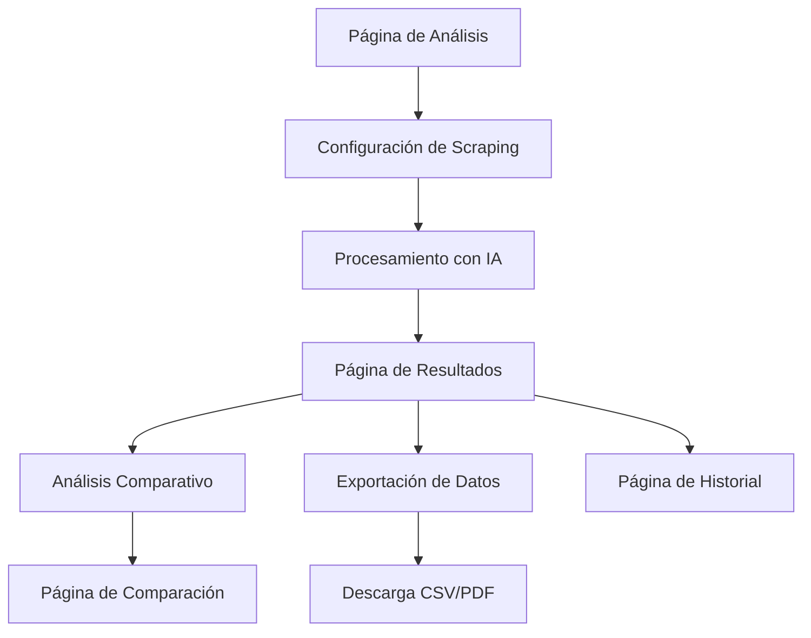

# Scraper de Palabras Clave SEO - PRD

## 1. Product Overview

Herramienta avanzada de scraping que extrae y analiza palabras clave de páginas web de competidores utilizando inteligencia artificial para identificar oportunidades SEO y optimizar estrategias de contenido.

- Permite a los usuarios analizar el contenido de sitios web competidores para descubrir las palabras clave que están utilizando y su estrategia SEO.
- Dirigido a especialistas en SEO, marketers digitales, creadores de contenido y propietarios de sitios web que buscan mejorar su posicionamiento orgánico.

## 2. Core Features

### 2.1 User Roles

| Role | Registration Method | Core Permissions |
|------|---------------------|------------------|
| Free User | Email registration | Hasta 5 URLs por análisis, 10 análisis/mes |
| Pro User | Subscription upgrade | Hasta 50 URLs por análisis, 100 análisis/mes, exportación PDF |
| Enterprise User | Custom plan | URLs ilimitadas, análisis ilimitados, API access |

### 2.2 Feature Module

Nuestro scraper de palabras clave consiste en las siguientes páginas principales:

1. **Página de análisis**: interfaz de entrada de URLs, configuración de scraping, inicio de análisis.
2. **Página de resultados**: visualización de keywords extraídas, métricas, filtros y categorización.
3. **Página de comparación**: análisis comparativo entre múltiples competidores.
4. **Página de historial**: análisis previos, exportaciones y estadísticas del usuario.

### 2.3 Page Details

| Page Name | Module Name | Feature description |
|-----------|-------------|---------------------|
| Análisis | Entrada de URLs | Ingresar hasta 10 URLs de competidores, configurar profundidad de scraping (1-5 páginas por sitio), seleccionar idioma de análisis |
| Análisis | Configuración avanzada | Filtros por tipo de contenido (títulos, meta, headings, párrafos), exclusión de elementos, configuración de user-agent |
| Resultados | Extracción de keywords | Mostrar palabras clave extraídas con frecuencia, densidad, posición en página, categorización automática (primarias, secundarias, long-tail) |
| Resultados | Análisis semántico | Análisis de relevancia con IA, agrupación por temas, detección de intención de búsqueda, sugerencias de oportunidades |
| Resultados | Métricas y visualización | Gráficos de densidad, distribución por categorías, nube de palabras interactiva, comparación de competidores |
| Comparación | Análisis competitivo | Comparar keywords entre múltiples sitios, identificar gaps de contenido, oportunidades únicas, overlaps de keywords |
| Historial | Gestión de análisis | Ver análisis previos, re-ejecutar scraping, eliminar análisis antiguos, estadísticas de uso mensual |
| Exportación | Descarga de datos | Exportar en CSV (todos los planes), PDF con gráficos (Pro/Enterprise), integración con herramientas SEO externas |

## 3. Core Process

**Flujo Principal del Usuario:**

1. **Configuración**: El usuario ingresa URLs de competidores y configura parámetros de scraping
2. **Procesamiento**: El sistema extrae contenido, analiza texto con IA y categoriza keywords
3. **Análisis**: Se generan métricas, se identifican oportunidades y se crean visualizaciones
4. **Resultados**: El usuario revisa keywords, aplica filtros y compara competidores
5. **Exportación**: Descarga de datos en formatos CSV/PDF para uso posterior

**Flujo de Comparación Competitiva:**

1. **Selección múltiple**: Elegir 2-5 sitios competidores para análisis comparativo
2. **Scraping paralelo**: Extracción simultánea de contenido de todos los sitios
3. **Análisis cruzado**: Identificación de keywords comunes, únicas y oportunidades
4. **Visualización**: Gráficos comparativos y matrices de competencia
5. **Recomendaciones**: Sugerencias basadas en gaps identificados

## 4. User Interface Design

### 4.1 Design Style

- **Colores primarios**: Azul (#3B82F6) para elementos principales, Verde (#10B981) para métricas positivas
- **Colores secundarios**: Gris (#6B7280) para texto, Naranja (#F59E0B) para alertas
- **Estilo de botones**: Redondeados con sombras sutiles, estados hover animados
- **Tipografía**: Inter para títulos (16-24px), System UI para contenido (14-16px)
- **Layout**: Diseño en cards con espaciado generoso, navegación lateral fija
- **Iconos**: Lucide React con estilo outline, tamaño 20-24px para acciones principales

### 4.2 Page Design Overview

| Page Name | Module Name | UI Elements |
|-----------|-------------|-------------|
| Análisis | Entrada de URLs | Formulario multi-input con validación en tiempo real, botones de agregar/eliminar URLs, selector de profundidad con slider |
| Análisis | Configuración | Panel lateral colapsible, toggles para filtros, selector de idioma con banderas, preview de configuración |
| Resultados | Lista de keywords | Tabla sorteable con paginación, badges de categorías con colores, métricas en tooltips, filtros laterales |
| Resultados | Visualizaciones | Gráficos interactivos con Chart.js, nube de palabras con hover effects, métricas en cards con iconos |
| Comparación | Matriz competitiva | Grid responsive con heat maps, indicadores de oportunidades, filtros por competidor |
| Historial | Lista de análisis | Cards con preview de datos, botones de acción (ver, exportar, eliminar), paginación con lazy loading |

### 4.3 Responsiveness

Diseño mobile-first con breakpoints optimizados para tablet y desktop. Navegación adaptativa con menú hamburguesa en móvil, tablas con scroll horizontal, gráficos redimensionables y touch-friendly para interacciones táctiles.