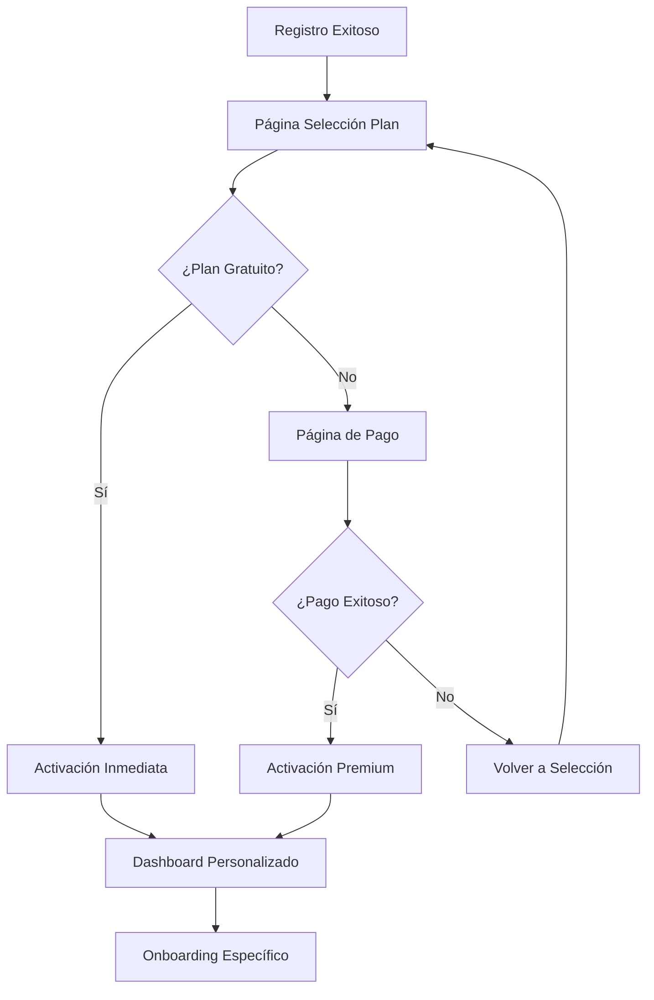

# Sistema de Selección de Planes Post-Registro

## 1. Descripción General

Sistema que permite a los usuarios recién registrados verificar y seleccionar su plan de suscripción antes de acceder al dashboard principal. Este flujo mejora la experiencia de onboarding y asegura que los usuarios comprendan las opciones disponibles.

## 2. Funcionalidades Principales

### 2.1 Roles de Usuario
| Rol | Método de Registro | Permisos Principales |
|-----|-------------------|---------------------|
| Usuario Gratuito | Registro estándar | Acceso limitado a herramientas básicas |
| Usuario Premium | Selección de plan premium | Acceso completo a todas las herramientas |
| Usuario Trial | Activación de prueba gratuita | Acceso temporal completo (30 días) |

### 2.2 Módulos del Sistema

El sistema de selección de planes consta de las siguientes páginas principales:

1. **Página de Selección de Plan**: Interfaz principal para elegir el plan deseado
2. **Página de Confirmación**: Verificación de la selección realizada
3. **Página de Procesamiento**: Estado de carga durante la actualización del plan
4. **Dashboard Personalizado**: Dashboard adaptado según el plan seleccionado

### 2.3 Detalles de Páginas

| Página | Módulo | Descripción de Funcionalidades |
|--------|--------|--------------------------------|
| Selección de Plan | Comparador de Planes | Mostrar tabla comparativa con características de cada plan. Destacar diferencias clave y beneficios |
| Selección de Plan | Selector de Plan | Permitir selección mediante cards interactivos con animaciones. Mostrar precio y características principales |
| Selección de Plan | Información Adicional | Mostrar FAQ, testimonios y garantías. Incluir chat de soporte en vivo |
| Confirmación | Resumen de Selección | Mostrar plan seleccionado, precio y características incluidas. Permitir modificación antes de confirmar |
| Confirmación | Procesamiento de Pago | Integrar pasarela de pago para planes premium. Manejar estados de éxito y error |
| Procesamiento | Estado de Carga | Mostrar progreso de activación del plan. Incluir mensajes informativos y animaciones |
| Dashboard | Bienvenida Personalizada | Mostrar mensaje de bienvenida específico según el plan. Destacar funcionalidades disponibles |

## 3. Flujo de Navegación

### 3.1 Flujo Principal del Usuario

1. **Registro Exitoso** → Usuario completa el formulario de registro
2. **Redirección Automática** → Sistema redirige a `/seleccionar-plan`
3. **Selección de Plan** → Usuario elige entre las opciones disponibles
4. **Confirmación** → Usuario confirma su selección
5. **Procesamiento** → Sistema actualiza el perfil del usuario
6. **Dashboard** → Acceso al dashboard personalizado según el plan

### 3.2 Diagrama de Flujo



## 4. Diseño de Interfaz

### 4.1 Estilo de Diseño

- **Colores Principales**: 
  - Primario: `#3B82F6` (Azul)
  - Secundario: `#10B981` (Verde)
  - Acento: `#F59E0B` (Amarillo)
- **Estilo de Botones**: Redondeados con sombras suaves y efectos hover
- **Tipografía**: 
  - Títulos: `Inter Bold` 24px-32px
  - Texto: `Inter Regular` 14px-16px
- **Layout**: Cards centrados con espaciado generoso y animaciones suaves
- **Iconos**: Lucide React con estilo minimalista

### 4.2 Diseño por Página

| Página | Módulo | Elementos UI |
|--------|--------|--------------|
| Selección de Plan | Comparador | Tabla responsive con highlights en hover. Colores diferenciados por plan. Iconos para características |
| Selección de Plan | Cards de Plan | Cards con bordes redondeados, sombras y animaciones. Botón CTA prominente. Badge para "Más Popular" |
| Selección de Plan | Header | Logo, título principal y subtítulo explicativo. Breadcrumb de progreso |
| Confirmación | Resumen | Card con fondo suave, lista de características y precio destacado. Botones de acción claros |
| Procesamiento | Loading | Spinner animado, barra de progreso y mensajes dinámicos. Colores del tema principal |
| Dashboard | Bienvenida | Banner personalizado con ilustraciones. Cards de funcionalidades disponibles según plan |

### 4.3 Responsividad

- **Desktop-first** con adaptación completa a móviles
- **Breakpoints**: 
  - Desktop: 1024px+
  - Tablet: 768px-1023px
  - Mobile: 320px-767px
- **Optimización táctil** para dispositivos móviles con botones de tamaño adecuado

## 5. Arquitectura Técnica

### 5.1 Estructura de Datos

#### Modelo de Usuario Extendido
```typescript
interface IUser extends Document {
  email: string;
  password: string;
  name?: string;
  isVerified: boolean;
  plan: 'free' | 'premium' | 'trial';
  planStartDate?: Date;
  planEndDate?: Date;
  planFeatures: string[];
  onboardingCompleted: boolean;
  verificationToken?: string;
  resetPasswordToken?: string;
  resetPasswordExpires?: Date;
  createdAt: Date;
  updatedAt: Date;
}
```

#### Modelo de Planes
```typescript
interface IPlan {
  id: string;
  name: string;
  displayName: string;
  price: number;
  currency: string;
  interval: 'monthly' | 'yearly';
  features: string[];
  limitations: {
    maxAnalyses: number;
    maxProjects: number;
    supportLevel: string;
  };
  popular: boolean;
  active: boolean;
}
```

### 5.2 API Endpoints

#### Obtener Planes Disponibles
```
GET /api/plans
```

Response:
| Parámetro | Tipo | Descripción |
|-----------|------|-------------|
| plans | IPlan[] | Lista de planes disponibles |
| userCurrentPlan | string | Plan actual del usuario |

#### Seleccionar Plan
```
POST /api/user/select-plan
```

Request:
| Parámetro | Tipo | Requerido | Descripción |
|-----------|------|-----------|-------------|
| planId | string | true | ID del plan seleccionado |
| paymentMethod | string | false | Método de pago (para planes premium) |

Response:
| Parámetro | Tipo | Descripción |
|-----------|------|-------------|
| success | boolean | Estado de la operación |
| user | IUser | Datos actualizados del usuario |
| redirectUrl | string | URL de redirección |

#### Procesar Pago
```
POST /api/payments/process
```

Request:
| Parámetro | Tipo | Requerido | Descripción |
|-----------|------|-----------|-------------|
| planId | string | true | ID del plan a activar |
| paymentToken | string | true | Token de pago de la pasarela |

### 5.3 Rutas del Frontend

| Ruta | Propósito |
|------|-----------|
| /seleccionar-plan | Página principal de selección de planes |
| /confirmar-plan | Confirmación de la selección realizada |
| /procesando-plan | Estado de carga durante la activación |
| /bienvenida | Página de bienvenida post-activación |
| /dashboard | Dashboard personalizado según el plan |

## 6. Validaciones y Estados

### 6.1 Validaciones del Cliente
- Verificar que el usuario esté autenticado
- Validar selección de plan antes de proceder
- Verificar información de pago para planes premium
- Confirmar términos y condiciones

### 6.2 Estados de Carga
- **Cargando planes**: Mientras se obtienen los planes disponibles
- **Procesando selección**: Durante la actualización del plan del usuario
- **Procesando pago**: Durante la transacción de pago
- **Activando plan**: Durante la activación de funcionalidades

### 6.3 Manejo de Errores
- Error de conexión con la API
- Error en el procesamiento de pago
- Plan no disponible
- Usuario ya tiene un plan activo
- Sesión expirada durante el proceso

## 7. Integraciones Requeridas

### 7.1 Pasarela de Pago
- **Stripe** para procesamiento de pagos
- Webhooks para confirmación de pagos
- Manejo de suscripciones recurrentes

### 7.2 Sistema de Notificaciones
- Emails de confirmación de plan
- Notificaciones push para cambios de plan
- Alertas de vencimiento de suscripción

### 7.3 Analytics
- Tracking de conversión por plan
- Métricas de abandono en el flujo
- Análisis de preferencias de usuario

## 8. Consideraciones de Seguridad

- Validación de tokens de autenticación en cada paso
- Encriptación de información de pago
- Logs de auditoría para cambios de plan
- Protección contra ataques de fuerza bruta
- Validación de integridad de datos del usuario