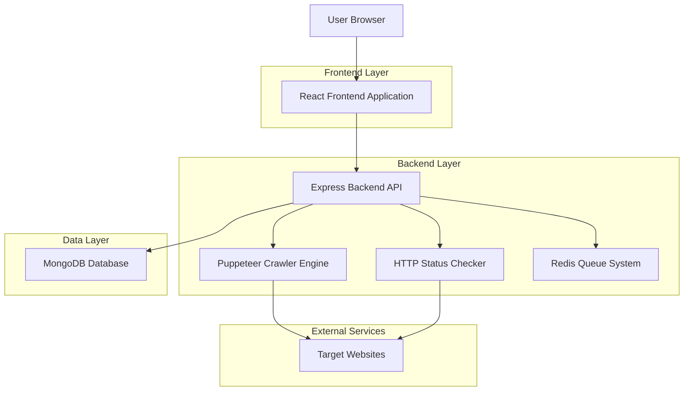
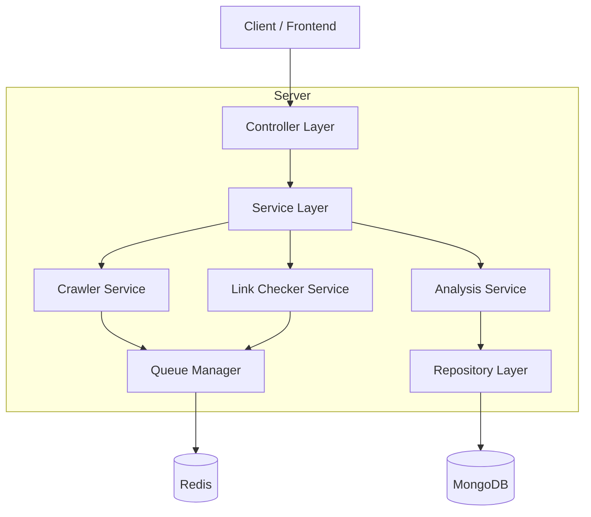
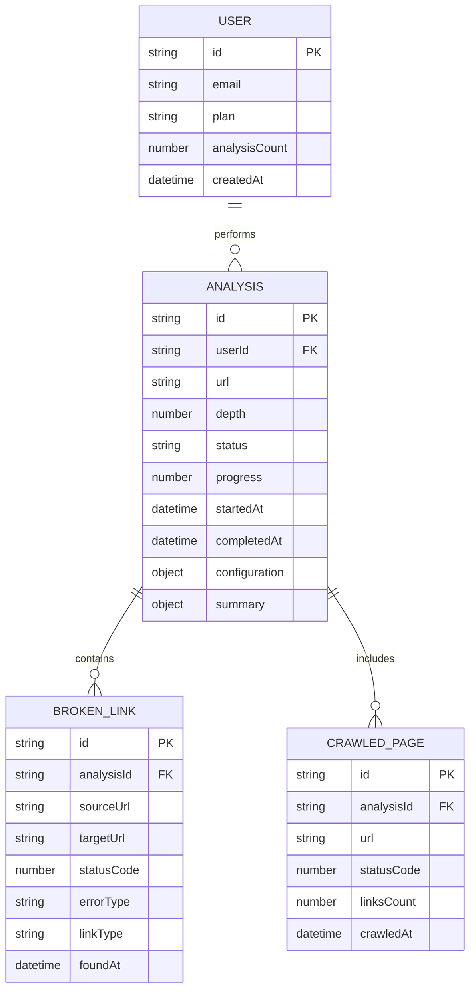

# Verificador de Enlaces Rotos - Documento de Arquitectura Técnica

## 1. Architecture design



## 2. Technology Description

- Frontend: React@18 + Next.js@14 + TailwindCSS@3 + Framer Motion
- Backend: Express@4 + Puppeteer@21 + Axios@1.6
- Database: MongoDB con Mongoose
- Queue System: Redis + Bull Queue
- File Processing: CSV export con fast-csv, PDF con jsPDF

## 3. Route definitions

| Route | Purpose |
|-------|---------|
| /verificador-enlaces | Página principal del verificador de enlaces rotos |
| /verificador-enlaces/analisis/[id] | Página de resultados de un análisis específico |
| /verificador-enlaces/historial | Historial de análisis realizados |

## 4. API definitions

### 4.1 Core API

**Iniciar análisis de enlaces**
```
POST /api/verificador-enlaces/analyze
```

Request:
| Param Name | Param Type | isRequired | Description |
|------------|------------|------------|-------------|
| url | string | true | URL del sitio web a analizar |
| depth | number | true | Profundidad de crawling (1-10) |
| excludePaths | string[] | false | Rutas a excluir del análisis |
| includeExternal | boolean | false | Incluir enlaces externos en el análisis |
| timeout | number | false | Timeout por request en ms (default: 5000) |

Response:
| Param Name | Param Type | Description |
|------------|------------|-------------|
| analysisId | string | ID único del análisis iniciado |
| status | string | Estado del análisis (pending, running, completed, failed) |
| estimatedTime | number | Tiempo estimado de completación en segundos |

Example:
```json
{
  "url": "https://example.com",
  "depth": 3,
  "excludePaths": ["/admin", "/private"],
  "includeExternal": true,
  "timeout": 10000
}
```

**Obtener estado del análisis**
```
GET /api/verificador-enlaces/analyze/:analysisId
```

Response:
| Param Name | Param Type | Description |
|------------|------------|-------------|
| analysisId | string | ID del análisis |
| status | string | Estado actual del análisis |
| progress | number | Porcentaje de progreso (0-100) |
| pagesAnalyzed | number | Número de páginas analizadas |
| linksFound | number | Total de enlaces encontrados |
| brokenLinks | number | Enlaces rotos detectados |
| results | object | Resultados detallados (solo cuando status = completed) |

**Obtener resultados del análisis**
```
GET /api/verificador-enlaces/results/:analysisId
```

Response:
| Param Name | Param Type | Description |
|------------|------------|-------------|
| summary | object | Resumen ejecutivo del análisis |
| brokenLinks | array | Lista detallada de enlaces rotos |
| categories | object | Categorización de errores por tipo |
| recommendations | array | Recomendaciones de corrección |

**Exportar resultados**
```
GET /api/verificador-enlaces/export/:analysisId?format=csv|pdf
```

**Obtener historial de análisis**
```
GET /api/verificador-enlaces/history
```

## 5. Server architecture diagram



## 6. Data model

### 6.1 Data model definition



### 6.2 Data Definition Language

**Analysis Table (link_analyses)**
```sql
-- create table
CREATE TABLE link_analyses (
    id UUID PRIMARY KEY DEFAULT gen_random_uuid(),
    user_id UUID REFERENCES users(id),
    url VARCHAR(2048) NOT NULL,
    depth INTEGER DEFAULT 1 CHECK (depth >= 1 AND depth <= 10),
    status VARCHAR(20) DEFAULT 'pending' CHECK (status IN ('pending', 'running', 'completed', 'failed', 'cancelled')),
    progress INTEGER DEFAULT 0 CHECK (progress >= 0 AND progress <= 100),
    started_at TIMESTAMP WITH TIME ZONE DEFAULT NOW(),
    completed_at TIMESTAMP WITH TIME ZONE,
    configuration JSONB DEFAULT '{}',
    summary JSONB DEFAULT '{}',
    created_at TIMESTAMP WITH TIME ZONE DEFAULT NOW(),
    updated_at TIMESTAMP WITH TIME ZONE DEFAULT NOW()
);

-- create indexes
CREATE INDEX idx_link_analyses_user_id ON link_analyses(user_id);
CREATE INDEX idx_link_analyses_status ON link_analyses(status);
CREATE INDEX idx_link_analyses_created_at ON link_analyses(created_at DESC);
```

**Broken Links Table (broken_links)**
```sql
-- create table
CREATE TABLE broken_links (
    id UUID PRIMARY KEY DEFAULT gen_random_uuid(),
    analysis_id UUID REFERENCES link_analyses(id) ON DELETE CASCADE,
    source_url VARCHAR(2048) NOT NULL,
    target_url VARCHAR(2048) NOT NULL,
    status_code INTEGER,
    error_type VARCHAR(50) NOT NULL,
    link_type VARCHAR(20) DEFAULT 'internal' CHECK (link_type IN ('internal', 'external')),
    found_at TIMESTAMP WITH TIME ZONE DEFAULT NOW(),
    created_at TIMESTAMP WITH TIME ZONE DEFAULT NOW()
);

-- create indexes
CREATE INDEX idx_broken_links_analysis_id ON broken_links(analysis_id);
CREATE INDEX idx_broken_links_error_type ON broken_links(error_type);
CREATE INDEX idx_broken_links_status_code ON broken_links(status_code);
```

**Crawled Pages Table (crawled_pages)**
```sql
-- create table
CREATE TABLE crawled_pages (
    id UUID PRIMARY KEY DEFAULT gen_random_uuid(),
    analysis_id UUID REFERENCES link_analyses(id) ON DELETE CASCADE,
    url VARCHAR(2048) NOT NULL,
    status_code INTEGER NOT NULL,
    links_count INTEGER DEFAULT 0,
    crawled_at TIMESTAMP WITH TIME ZONE DEFAULT NOW(),
    created_at TIMESTAMP WITH TIME ZONE DEFAULT NOW()
);

-- create indexes
CREATE INDEX idx_crawled_pages_analysis_id ON crawled_pages(analysis_id);
CREATE INDEX idx_crawled_pages_status_code ON crawled_pages(status_code);
CREATE INDEX idx_crawled_pages_crawled_at ON crawled_pages(crawled_at DESC);
```

**Initial Data**
```sql
-- init data for error types
INSERT INTO error_categories (type, description, severity) VALUES
('404', 'Página no encontrada', 'high'),
('500', 'Error interno del servidor', 'critical'),
('timeout', 'Tiempo de espera agotado', 'medium'),
('ssl_error', 'Error de certificado SSL', 'high'),
('redirect_loop', 'Bucle de redirecciones', 'medium'),
('dns_error', 'Error de resolución DNS', 'critical');
```