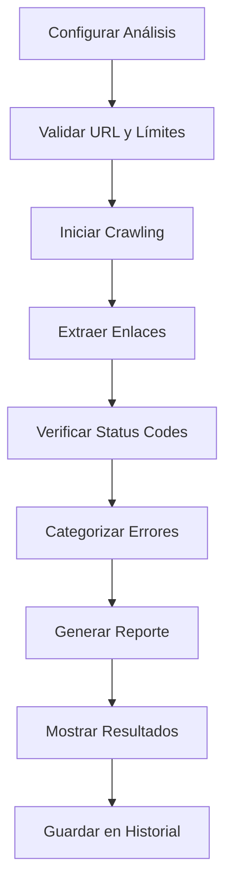

# Verificador de Enlaces Rotos - Documento de Requerimientos del Producto (PRD)

## 1. Product Overview

El Verificador de Enlaces Rotos es una herramienta SEO avanzada que permite analizar sitios web completos para detectar enlaces internos y externos que no funcionan correctamente, proporcionando reportes detallados para mejorar la salud técnica del sitio.

- Soluciona el problema crítico de enlaces rotos que afectan negativamente el SEO y la experiencia del usuario, dirigido a webmasters, especialistas SEO y desarrolladores web.
- Objetivo: Convertirse en la herramienta de referencia para auditorías técnicas de enlaces, procesando millones de URLs mensualmente y mejorando el ranking SEO de nuestros usuarios.

## 2. Core Features

### 2.1 User Roles

| Role | Registration Method | Core Permissions |
|------|---------------------|------------------|
| Free User | Email registration | Hasta 100 URLs por análisis, 3 análisis por mes, profundidad máxima 2 niveles |
| Pro User | Suscripción mensual | Hasta 5,000 URLs por análisis, análisis ilimitados, profundidad máxima 5 niveles, exportación PDF |
| Enterprise User | Suscripción anual | URLs ilimitadas, análisis ilimitados, profundidad máxima 10 niveles, API access, reportes personalizados |

### 2.2 Feature Module

Nuestro Verificador de Enlaces Rotos consta de las siguientes páginas principales:

1. **Página de Análisis**: configuración de crawling, inicio de análisis, monitoreo en tiempo real.
2. **Página de Resultados**: visualización detallada de enlaces rotos, categorización de errores, métricas de salud.
3. **Página de Historial**: gestión de análisis anteriores, comparación de resultados, tendencias temporales.

### 2.3 Page Details

| Page Name | Module Name | Feature description |
|-----------|-------------|---------------------|
| Página de Análisis | Configuración de URL | Ingresar URL del sitio web, validar formato y accesibilidad, mostrar vista previa del sitio |
| Página de Análisis | Configuración de Crawling | Seleccionar profundidad de análisis (1-10 niveles), configurar rutas a excluir, establecer timeout por request |
| Página de Análisis | Opciones Avanzadas | Incluir/excluir enlaces externos, configurar user-agent personalizado, establecer límites de velocidad |
| Página de Análisis | Inicio de Análisis | Validar configuración según plan del usuario, iniciar proceso de crawling, mostrar estimación de tiempo |
| Página de Análisis | Monitor en Tiempo Real | Mostrar progreso del análisis con barra de progreso, contador de páginas analizadas, enlaces encontrados y rotos detectados |
| Página de Resultados | Resumen Ejecutivo | Mostrar métricas clave: total de enlaces, enlaces rotos, porcentaje de salud, tiempo de análisis |
| Página de Resultados | Lista de Enlaces Rotos | Mostrar tabla detallada con URL origen, URL destino, código de error, tipo de enlace, categoría de error |
| Página de Resultados | Categorización de Errores | Agrupar errores por tipo (404, 500, timeout, SSL), mostrar distribución con gráficos, priorizar por severidad |
| Página de Resultados | Recomendaciones | Generar sugerencias automáticas de corrección, mostrar impacto SEO estimado, proporcionar guías de implementación |
| Página de Resultados | Exportación | Descargar resultados en formato CSV con todos los detalles, generar reporte PDF profesional (Pro/Enterprise) |
| Página de Historial | Lista de Análisis | Mostrar análisis anteriores con fecha, URL, estado, métricas básicas, opciones de re-análisis |
| Página de Historial | Comparación Temporal | Comparar resultados entre análisis, mostrar tendencias de mejora/deterioro, gráficos de evolución |
| Página de Historial | Gestión de Análisis | Eliminar análisis antiguos, marcar favoritos, organizar por proyectos, buscar y filtrar |

## 3. Core Process

**Flujo Principal del Usuario:**

1. **Configuración**: El usuario ingresa la URL del sitio web a analizar y configura los parámetros de crawling (profundidad, exclusiones, opciones avanzadas)
2. **Validación**: El sistema valida la URL, verifica los límites del plan del usuario y estima el tiempo de análisis
3. **Análisis**: Se inicia el proceso de crawling asíncrono, mostrando progreso en tiempo real mientras se analizan las páginas y enlaces
4. **Procesamiento**: El sistema verifica cada enlace encontrado, categoriza los errores y genera estadísticas detalladas
5. **Resultados**: Se presenta un reporte completo con enlaces rotos, recomendaciones y opciones de exportación
6. **Historial**: El análisis se guarda automáticamente para futuras consultas y comparaciones

**Flujo de Análisis Técnico:**

## 4. User Interface Design

### 4.1 Design Style

- **Colores Primarios**: Azul profesional (#2563eb) para elementos principales, rojo de alerta (#dc2626) para enlaces rotos
- **Colores Secundarios**: Verde éxito (#16a34a) para enlaces válidos, amarillo advertencia (#ca8a04) para timeouts
- **Estilo de Botones**: Botones redondeados con sombras sutiles, estados hover con transiciones suaves
- **Tipografía**: Inter para textos principales (16px), Mono para URLs y códigos técnicos (14px)
- **Layout**: Diseño de tarjetas con espaciado generoso, navegación lateral fija, área de contenido principal centrada
- **Iconos**: Lucide React con estilo outline, colores consistentes con la paleta, tamaño 20px para acciones principales

### 4.2 Page Design Overview

| Page Name | Module Name | UI Elements |
|-----------|-------------|-------------|
| Página de Análisis | Configuración de URL | Input field con validación en tiempo real, botón de vista previa, indicador de plan actual con límites |
| Página de Análisis | Configuración de Crawling | Slider para profundidad con etiquetas visuales, lista de exclusiones con chips removibles, toggle switches para opciones |
| Página de Análisis | Monitor en Tiempo Real | Barra de progreso animada con gradiente azul, contadores en tiempo real con iconos, log de actividad scrolleable |
| Página de Resultados | Resumen Ejecutivo | Cards con métricas destacadas, gráfico de dona para distribución de errores, indicador de salud general |
| Página de Resultados | Lista de Enlaces Rotos | Tabla responsive con sorting, filtros por tipo de error, badges de severidad con colores distintivos |
| Página de Resultados | Exportación | Botones de descarga con iconos, preview del reporte PDF, opciones de personalización para Enterprise |
| Página de Historial | Lista de Análisis | Cards de análisis con thumbnails, badges de estado, botones de acción rápida, paginación inteligente |

### 4.3 Responsiveness

Diseño mobile-first con breakpoints optimizados para tablet (768px) y desktop (1024px). En móviles, la tabla de resultados se convierte en cards apilables, los filtros se colapsan en un drawer lateral, y la navegación se adapta a un menú hamburguesa. Optimización táctil con botones de mínimo 44px y gestos de swipe para navegación entre secciones.